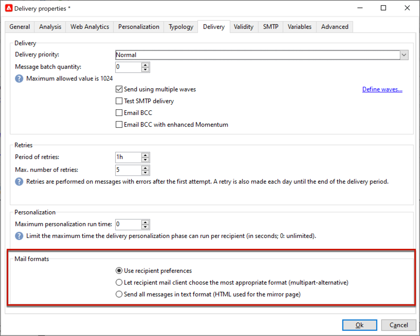

# Parametri e-mail {#email-parameters}

Questa sezione presenta le opzioni e i parametri disponibili nelle proprietà di consegna specifiche per la consegna e-mail.

## Usa Ccn e-mail {#email-bcc}

<!--
>[!NOTE]
>
>This capability is available starting Campaign v8.3. To check your version, refer to [this section](../start/compatibility-matrix.md#how-to-check-your-campaign-version-and-buildversion)-->

Puoi configurare Adobe Campaign per conservare una copia delle e-mail inviate dalla tua piattaforma.

Adobe Campaign stessa non gestisce i file archiviati. Consente di inviare i messaggi desiderati a un indirizzo e-mail Ccn (copia nascosta) dedicato, da cui possono essere elaborati e archiviati utilizzando un sistema esterno. I file .eml corrispondenti alle e-mail inviate possono quindi essere trasferiti su un server remoto, ad esempio un server e-mail SMTP.

>[!CAUTION]
>
>Per motivi di privacy, le e-mail in formato Ccn devono essere elaborate da un sistema di archiviazione in grado di memorizzare informazioni personali (PII) protette.

La destinazione di archiviazione è l’indirizzo e-mail Ccn scelto, che rimarrà invisibile ai destinatari della consegna.

  In qualità di utente di Managed Cloud Services, [Adobe di contatto](../start/campaign-faq.md#support){target="_blank"} per comunicare l&#39;indirizzo e-mail Ccn da utilizzare per l&#39;archiviazione.

Una volta definito l’indirizzo e-mail Ccn, devi abilitare l’opzione dedicata a livello di consegna.

>[!CAUTION]
>
>**[!UICONTROL Email BCC]** non è attivato per impostazione predefinita. Devi abilitarlo manualmente nel modello di consegna e-mail o.

A tale scopo, segui la procedura indicata di seguito:

1. Vai a **[!UICONTROL Campaign Management]** > **[!UICONTROL Deliveries]**, o **[!UICONTROL Resources]** > **[!UICONTROL Templates]** > **[!UICONTROL Delivery templates]**.
1. Seleziona la consegna desiderata o duplica la preconfigurata **[!UICONTROL Email delivery]** , quindi selezionare il modello duplicato.
1. Fai clic sul pulsante **[!UICONTROL Properties]**.
1. Seleziona la scheda **[!UICONTROL Delivery]**.
1. Seleziona l’opzione **[!UICONTROL Email BCC]**.

   

1. Seleziona **[!UICONTROL Ok]**.

Una copia di tutti i messaggi inviati per ogni consegna basata su questo modello verrà inviata all’indirizzo e-mail Ccn configurato.

Considera le seguenti specificità e raccomandazioni:

* È possibile utilizzare un solo indirizzo e-mail Ccn.

* Assicurati che l’indirizzo Ccn disponga di una capacità di ricezione sufficiente per archiviare tutte le e-mail inviate.

* CCN e-mail <!--with Enhanced MTA--> effettua la consegna all’indirizzo e-mail Ccn prima di effettuare la consegna ai destinatari; ciò può comportare l’invio di messaggi Ccn anche se le consegne originali potrebbero essere state non consegnate. Per ulteriori informazioni sui mancati recapiti, consulta [Errori di consegna](delivery-failures.md).

* Se le e-mail inviate all’indirizzo Ccn vengono aperte e cliccate attraverso, questo verrà preso in considerazione nel **[!UICONTROL Total opens]** e **[!UICONTROL Clicks]** dall’analisi di invio, che potrebbe causare alcuni errori di calcolo.

<!--Only successfully sent emails are taken in account, bounces are not.-->

## Seleziona i formati dei messaggi {#selecting-message-formats}

Puoi modificare il formato dei messaggi e-mail inviati. A questo scopo, modifica le proprietà di consegna e fai clic sul pulsante **[!UICONTROL Delivery]** scheda.

Seleziona il formato dell’e-mail nella sezione inferiore della finestra:

* **[!UICONTROL Use recipient preferences]** (modalità predefinita)

  Il formato del messaggio è definito in base ai dati memorizzati nel profilo del destinatario e memorizzati per impostazione predefinita nel **[!UICONTROL email format]** campo (@emailFormat). Se un destinatario desidera ricevere i messaggi in un determinato formato, questo sarà il formato inviato. Se il campo non è compilato, viene inviato un messaggio multipart-alternative (vedi sotto).

* **[!UICONTROL Let recipient mail client choose the most appropriate format]**

  Il messaggio contiene entrambi i formati: testo e HTML. Il formato visualizzato sulla ricezione dipende dalla configurazione del software di posta del destinatario (multipart-alternative).

  >[!IMPORTANT]
  >
  >Questa opzione include entrambe le versioni del documento. Di conseguenza, riduce la velocità effettiva di consegna, perché la dimensione del messaggio è maggiore.

* **[!UICONTROL Send all messages in text format]**

  Il messaggio viene inviato in formato testo. Il formato HTML non verrà inviato, ma verrà utilizzato per la pagina speculare solo quando il destinatario farà clic sul messaggio.

<!--
>[!NOTE]
>
>For more on defining the email content, see [this section]().-->

## Imposta codifica caratteri {#character-encoding}

In **[!UICONTROL SMTP]** dei parametri di consegna, la scheda **[!UICONTROL Character encoding]** consente di impostare una codifica specifica.

La codifica predefinita è UTF-8. Se alcuni provider di posta elettronica dei destinatari non supportano la codifica standard UTF-8, è possibile impostare una codifica specifica per visualizzare correttamente i caratteri speciali per i destinatari delle e-mail.

Ad esempio, desideri inviare un’e-mail contenente caratteri giapponesi. Per garantire che tutti i caratteri vengano visualizzati correttamente ai destinatari in Giappone, è possibile utilizzare una codifica che supporti i caratteri giapponesi anziché il formato UTF-8 standard.

A questo scopo, seleziona la **[!UICONTROL Force the encoding used for messages]** opzione in **[!UICONTROL Character encoding]** e scegliere una codifica dall&#39;elenco a discesa visualizzato.

## Gestire le e-mail non recapitate {#managing-bounce-emails}

Il **[!UICONTROL SMTP]** scheda delle proprietà di consegna consente inoltre di configurare la gestione dei messaggi non recapitati.

* **[!UICONTROL Errors-to-address]**: per impostazione predefinita, le e-mail non consegnate vengono ricevute nella casella di errore predefinita della piattaforma, ma puoi definire un indirizzo di errore specifico per una consegna.

* **[!UICONTROL Bounce address]**: puoi anche definire un altro indirizzo al quale vengono inoltrate le e-mail non elaborate non recapitate. Questo indirizzo consente di indagare i motivi di mancato recapito quando le e-mail non potevano essere qualificate automaticamente dall’applicazione.

Ognuno di questi campi può essere personalizzato utilizzando l’icona dedicata. Ulteriori informazioni sui campi di personalizzazione in [questa sezione](personalization-fields.md).

Per ulteriori informazioni sulla gestione della posta non recapitata, consulta [questa sezione](delivery-failures.md#bounce-mail-management).

## Aggiungi intestazioni SMTP {#adding-smtp-headers}

È possibile aggiungere intestazioni SMTP alle consegne. A questo scopo, utilizza la sezione pertinente del **[!UICONTROL SMTP]** nella consegna.

Lo script inserito in questa finestra deve fare riferimento a un&#39;intestazione per riga nel seguente modulo: **nome:valore**.

Se necessario, i valori vengono codificati automaticamente.

>[!IMPORTANT]
>
>L’aggiunta di uno script per l’inserimento di intestazioni SMTP aggiuntive è un’operazione riservata agli utenti avanzati.
>
>La sintassi di questo script deve essere conforme ai requisiti di questo tipo di contenuto: nessuno spazio inutilizzato, nessuna linea vuota e così via.

<!--
## Generate mirror page {#generating-mirror-page}

The mirror page is an HTML page accessible online via a web browser. Its content is identical to the email. It can be useful if your recipients are experiencing rendering issues or broken images when trying to view your email in their inbox.

Learn how to insert a link to the mirror page in [this section](mirror-page.md).-->