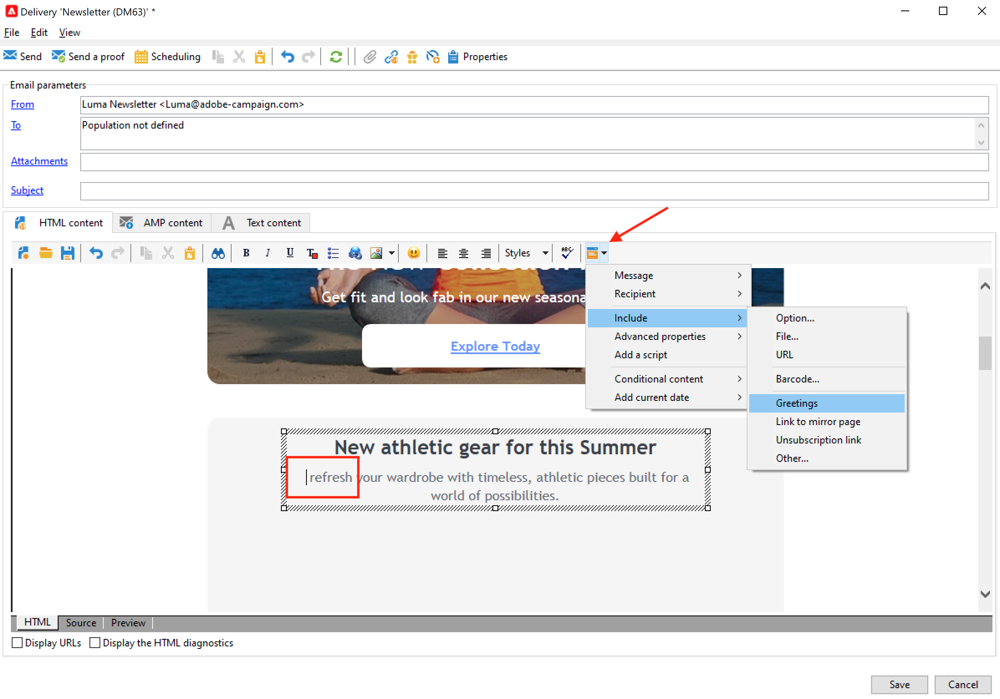

# Progettazione e invio di e-mail

Le consegne e-mail ti consentono di inviare e-mail personalizzate alla popolazione target.

 Ulteriori informazioni sono disponibili nella [documentazione di Campaign Classic v7](https://experienceleague.adobe.com/docs/campaign-classic/using/sending-messages/sending-emails/about-email-channel.html){target="_blank"}

## Creare la prima consegna e-mail

Crea e-mail personalizzate e contestualmente pertinenti, coerenti con il resto dell’esperienza del cliente.

Nell’esempio seguente, imparerai a progettare una consegna e-mail in Adobe Campaign che contiene dati personalizzati, collegamenti a un URL esterno e un collegamento alla pagina speculare.

1. **Creare la consegna**

   Per creare una nuova consegna, seleziona **Campagne** scheda , fai clic su **Consegne** e fai clic su **Crea** , sopra l’elenco delle consegne esistenti.

   

1. **Selezionare il modello**

   Seleziona un modello di consegna, quindi assegna un nome alla consegna. Questo nome sarà visibile solo agli utenti della console Adobe Campaign e non ai destinatari, tuttavia questa intestazione verrà visualizzata nell’elenco delle consegne. Fai clic su **[!UICONTROL Continue]**.

   

1. **Importare il contenuto**

   Fai clic sul pulsante **Origine** per incollare il contenuto di HTML.

   

1. **Personalizzare il messaggio**

   * Aggiungi il nome e il cognome dei destinatari

      Per inserire il nome e il cognome dei profili di destinazione nel contenuto del messaggio, posiziona il cursore nel punto in cui desideri inserirli, quindi fai clic sull’ultima icona nella barra degli strumenti, quindi fai clic su **[!UICONTROL Include]** e seleziona **[!UICONTROL Greetings]**.

      

      Passa alla scheda Anteprima per controllare la personalizzazione selezionando un destinatario.

      

   * Inserire un collegamento tracciato

      Per indirizzare i destinatari della consegna a un indirizzo esterno tramite un’immagine o un testo, selezionalo e fai clic sul pulsante **[!UICONTROL Add a link]** nella barra degli strumenti.

      Immetti l’URL del collegamento nel **URL** utilizzando il formato seguente **https://www.myURL.com**, quindi conferma.

      

   * Aggiungere una pagina speculare

      Per consentire ai destinatari di visualizzare il contenuto della consegna in un browser web, aggiungi un collegamento al [pagina speculare](../send/mirror-page.md) del tuo messaggio.

      Posiziona il cursore nel punto in cui desideri inserire il collegamento, fai clic sull’ultima icona nella barra degli strumenti, quindi fai clic su **[!UICONTROL Include]** e seleziona **[!UICONTROL link to mirror page]**.
   Quando il contenuto è pronto, fai clic su **Salva**: verrà ora visualizzato nell’elenco delle consegne, nel **[!UICONTROL Campaigns > Deliveries]** scheda . La tua prima consegna e-mail è pronta. Ora devi definire il pubblico, convalidare la consegna e inviarla.

Scopri come importare un contenuto e-mail in questo [caso d&#39;uso](https://experienceleague.adobe.com/docs/campaign/automation/workflows/use-cases/deliveries/load-delivery-content.html).

Ulteriori informazioni in queste sezioni di **Documentazione di Campaign Classic v7**:

* Progettazione di un’e-mail in Campaign
    [Scopri come progettare un’e-mail](https://experienceleague.adobe.com/docs/campaign-classic/using/sending-messages/sending-emails/defining-the-email-content.html?lang=it){target="_blank"}
* Creare e utilizzare un modello e-mail
    [Ulteriori informazioni sui modelli e-mail](https://experienceleague.adobe.com/docs/campaign-classic/using/sending-messages/using-delivery-templates/about-templates.html?lang=it){target="_blank"}
* Selezionare il pubblico dell’e-mail
    [Scopri come definire la popolazione target](https://experienceleague.adobe.com/docs/campaign-classic/using/sending-messages/key-steps-when-creating-a-delivery/steps-defining-the-target-population.html){target="_blank"}
* Convalidare una consegna e inviare bozze
    [Scopri i passaggi chiave per convalidare una consegna](https://experienceleague.adobe.com/docs/campaign-classic/using/sending-messages/key-steps-when-creating-a-delivery/steps-validating-the-delivery.html?lang=it){target="_blank"}
* Aggiungi [indirizzi di seed](https://experienceleague.adobe.com/docs/campaign-classic/using/sending-messages/using-seed-addresses/about-seed-addresses.html){target="_blank"}

## Verifica e-mail

Campaign offre diversi modi per testare e convalidare le e-mail prima di inviarle al pubblico.

 [Applicare le best practice elencate nella documentazione di Campaign Classic v7](https://experienceleague.adobe.com/docs/campaign-classic/using/sending-messages/key-steps-when-creating-a-delivery/delivery-bestpractices/check-before-sending.html){target="_blank"}

È possibile eseguire le seguenti operazioni:

* Controlla i registri di analisi della consegna
* Invia bozze
* Aggiungere indirizzi seed
* Utilizzare i gruppi di controllo
* Controllare il rendering delle e-mail

 [Ulteriori informazioni sono disponibili nella documentazione di Campaign Classic v7](https://experienceleague.adobe.com/docs/campaign-classic/using/sending-messages/key-steps-when-creating-a-delivery/steps-validating-the-delivery.html?lang=it){target="_blank"}
