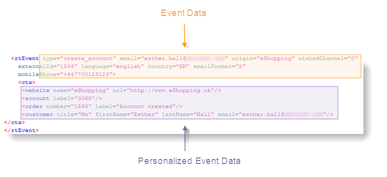
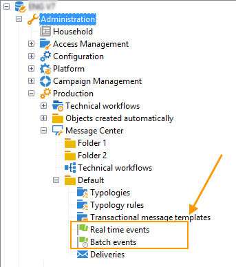
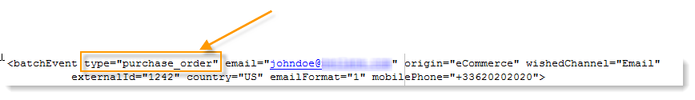
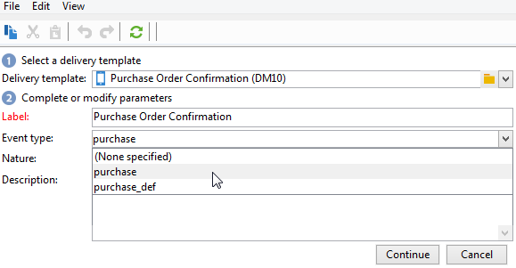

# Elaborazione di eventi {#event-processing}

Nel contesto dei messaggi transazionali, un evento viene generato da un sistema di informazioni esterno e inviato ad Adobe Campaign tramite i metodi **[!UICONTROL PushEvent]** e **[!UICONTROL PushEvents]**. Questi metodi sono descritti in [questa sezione](event-description.md).

Questo evento contiene dati collegati all’evento, ad esempio:

* il suo [tipo](transactional.md#create-event-types): conferma ordine, creazione account su un sito Web, ecc.,
* l’indirizzo e-mail o il numero di telefono,
* qualsiasi altra informazione per arricchire e personalizzare il messaggio transazionale prima della consegna: informazioni di contatto del cliente, lingua del messaggio, formato e-mail, ecc.

Esempio di dati evento:

Per elaborare gli eventi di messaggistica transazionale, alle istanze di esecuzione vengono applicati i seguenti passaggi:

1. [Raccolta di eventi](#event-collection)
1. [Trasferimento di eventi a un modello di messaggio](#routing-towards-a-template)
1. Arricchimento degli eventi con i dati di personalizzazione
1. [Esecuzione della consegna](delivery-execution.md)
1. [Riciclo di eventi](#event-recycling) con consegna collegata non riuscita (tramite un flusso di lavoro Adobe Campaign)

Una volta completati tutti i passaggi, ogni destinatario riceve un messaggio personalizzato.

## Raccogli eventi {#event-collection}

Gli eventi generati dal sistema di informazione possono essere raccolti utilizzando due modalità:

* Le chiamate ai metodi SOAP consentono di inviare eventi push in Adobe Campaign: il metodo PushEvent consente di inviare un evento alla volta, il metodo PushEvents consente di inviare diversi eventi alla volta. [Ulteriori informazioni](event-description.md).

* La creazione di un flusso di lavoro consente di ripristinare gli eventi importando file o tramite un gateway SQL con il modulo [Federated Data Access](../connect/fda.md).

Una volta raccolti, gli eventi vengono suddivisi per flussi di lavoro tecnici tra code in tempo reale e batch delle istanze di esecuzione, in attesa di essere collegati a un [modello di messaggio](transactional-template.md).

>[!NOTE]
>
>Nelle istanze di esecuzione, le cartelle **[!UICONTROL Real time events]** o **[!UICONTROL Batch events]** non devono essere impostate come viste, in quanto ciò potrebbe causare problemi di diritti di accesso. Per ulteriori informazioni sull&#39;impostazione di una cartella come visualizzazione, consulta [questa sezione](../audiences/folders-and-views.md#turn-a-folder-to-a-view).

## Trasferire un evento in un modello {#event-to-template}

Una volta pubblicato il modello di messaggio nelle istanze di esecuzione, vengono generati automaticamente due modelli: uno da collegare a un evento in tempo reale e uno da collegare a un evento batch.

La fase di instradamento consiste nel collegare un evento al modello di messaggio appropriato, in base a:

* Il tipo di evento specificato nelle proprietà dell’evento stesso:

  

* Tipo di evento specificato nelle proprietà del modello di messaggio:

  

Per impostazione predefinita, il ciclo si basa sulle seguenti informazioni:

* Tipo di evento
* Canale da utilizzare (per impostazione predefinita: e-mail)
* Modello di consegna più recente, in base alla data di pubblicazione

## Controllare lo stato dell’evento {#event-statuses}

Tutti gli eventi elaborati sono raggruppati in un&#39;unica visualizzazione, nella cartella **Event history** o in Explorer. Possono essere categorizzati per tipo di evento o per **stato**.

I possibili stati sono:

* **In sospeso**

   * Un evento in sospeso può essere un evento che è stato appena raccolto e che non è ancora stato elaborato. La colonna **[!UICONTROL Number of errors]** mostra il valore 0. Il modello e-mail non è ancora stato collegato.
   * Un evento in sospeso può anche essere un evento elaborato, ma la cui conferma è errata. La colonna **[!UICONTROL Number of errors]** mostra un valore diverso da 0. Per sapere quando verrà elaborato di nuovo questo evento, consulta la colonna **[!UICONTROL Process requested on]**.

* **Consegna in sospeso**
L’evento è stato elaborato e il modello di consegna è collegato. L’e-mail è in attesa di consegna e viene applicato il processo di consegna classico. Per ulteriori informazioni, puoi aprire la consegna.
* **Inviato**, **Ignorato** e **Errore di consegna**
Questi stati di consegna vengono recuperati tramite il flusso di lavoro **updateEventsStatus**. Per ulteriori informazioni, puoi aprire la consegna pertinente.
* **Evento non coperto**
Fase di routing della messaggistica transazionale non riuscita. Ad esempio, Adobe Campaign non ha trovato l’e-mail che funge da modello per l’evento.
* **Evento scaduto**
È stato raggiunto il numero massimo di tentativi di invio. L’evento è considerato nullo.

## Riciclare gli eventi {#event-recycling}

Se la consegna di un messaggio su un canale specifico non riesce, Adobe Campaign può inviarlo nuovamente utilizzando un canale diverso. Ad esempio, se una consegna sul canale SMS non riesce, il messaggio viene inviato nuovamente utilizzando il canale e-mail.

A questo scopo, devi configurare un flusso di lavoro che ricrea tutti gli eventi con lo stato **Errore di consegna** e assegna loro un canale diverso.

>[!CAUTION]
>
>Questo passaggio può essere eseguito solo utilizzando un flusso di lavoro ed è quindi riservato agli utenti esperti. Per ulteriori informazioni, contatta il tuo account executive di Adobe.
