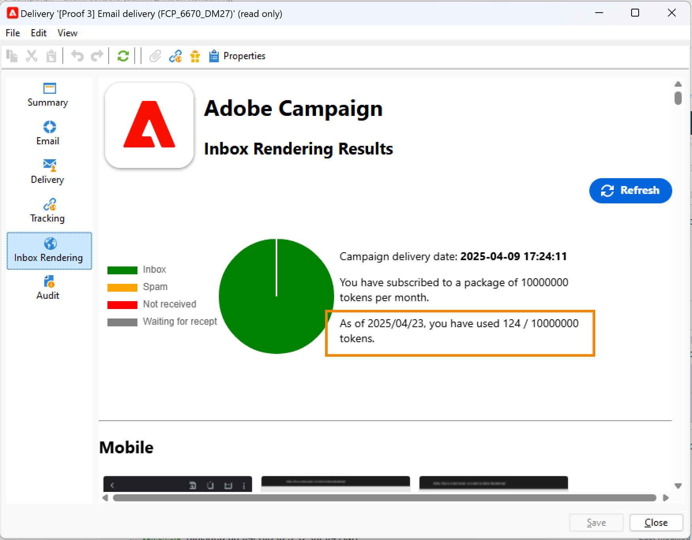

# Rendering della casella in entrata{#inbox-rendering}

## Informazioni sul rendering della casella in entrata {#about-inbox-rendering}

Prima di premere il pulsante **Invia**, assicurati che il messaggio venga visualizzato ai destinatari in modo ottimale in diversi client Web, servizi di posta sul Web e dispositivi.

Per consentire questa operazione, Adobe Campaign sfrutta la soluzione di test e-mail basata sul Web [Litmus](https://litmus.com/email-testing){target="_blank"} per acquisire i rendering e renderli disponibili in un report dedicato. Ciò consente di visualizzare in anteprima il messaggio inviato nei diversi contesti in cui può essere ricevuto e di verificare la compatibilità nei desktop e nelle applicazioni principali.

>[!CAUTION]
>Il rendering della casella in entrata non è compatibile con [consegne ricorrenti](../../automation/workflow/recurring-delivery.md).

Litmus è un’applicazione di convalida e anteprima delle e-mail ricca di funzioni. Consente ai creatori di contenuti e-mail di visualizzare in anteprima il contenuto dei messaggi in oltre 70 renderer e-mail, ad esempio la casella in entrata Gmail o il client Apple Mail.

I client per dispositivi mobili, di messaggistica e di posta sul Web disponibili per il **rendering Posta in arrivo** in Adobe Campaign sono elencati nel [sito Web Litmus](https://litmus.com/email-testing){target="_blank"} (fare clic su **Visualizza tutti i client di posta elettronica**).

>[!NOTE]
>
>Il rendering della casella in entrata non è necessario per testare la personalizzazione nelle consegne. Personalization può essere controllato con gli strumenti di Adobe Campaign come **[!UICONTROL Preview]** e [Bozze](preview-and-proof.md#send-proofs).

## Informazioni sui token Litmus {#about-litmus-tokens}

Poiché Litmus è un servizio di terze parti, funziona su un modello di credito per utilizzo. Ogni volta che un utente chiama la funzionalità Litmus, il credito viene dedotto.

In Adobe Campaign, il merito corrisponde al numero di rendering disponibili (noti come token).

>[!NOTE]
>
>Il numero di token Litmus disponibili dipende dalla licenza Campaign acquistata. Controllare il contratto di licenza.

Ogni volta che utilizzi la funzione **[!UICONTROL Inbox rendering]** in una consegna, ogni rendering generato diminuisce di uno i token disponibili.

>[!IMPORTANT]
>
>I token rappresentano ogni singolo rendering e non l’intero report di rendering della casella in entrata, il che significa che:
>
>* Ogni volta che viene generato il report di rendering della casella in entrata, viene dedotto un token per ogni client di messaggistica: un token per il rendering di Outlook 2000, uno per il rendering di Outlook 2010, uno per il rendering di Apple Mail 9 e così via.
>* Per la stessa consegna, se generi nuovamente il rendering della casella in entrata, il numero di token disponibili viene nuovamente diminuito del numero di rendering generati.
>

Il numero di token disponibili rimanenti viene visualizzato nel report di rendering della [casella in entrata](#inbox-rendering-report).

In genere, la funzione di rendering della casella in entrata viene utilizzata per testare il framework HTML di un messaggio e-mail di nuova progettazione. Ogni rendering richiede circa 70 token (a seconda del numero di ambienti generalmente testati su). Tuttavia, in alcuni casi potresti aver bisogno di più rapporti di rendering della casella in entrata per testare completamente la consegna. Potrebbero quindi essere necessari più token per completare diversi controlli.

## Accesso al report di rendering della casella in entrata {#accessing-the-inbox-rendering-report}

Dopo aver creato la consegna e-mail e averne definito il contenuto e la popolazione target, effettua le seguenti operazioni.

Per ulteriori informazioni sulla creazione, progettazione e targeting di una consegna, consulta questa [pagina](defining-the-email-content.md).

1. Nella barra superiore della consegna, fai clic sul pulsante **[!UICONTROL Inbox rendering]**.

1. Selezionare **[!UICONTROL Analyze]** per avviare il processo di acquisizione.

   

   Viene inviata una bozza. È possibile accedere alle miniature di rendering nella bozza pochi minuti dopo l’invio delle e-mail. Per ulteriori informazioni sull&#39;invio di bozze, consulta [questa sezione](preview-and-proof.md#send-proofs).

1. Dopo l’invio, la bozza viene visualizzata nell’elenco delle consegne. Fare doppio clic su di esso.

   

1. Passa alla scheda **Rendering casella in entrata** della bozza.

   

   Viene visualizzato il report di rendering della casella in entrata.

## Rapporto di rendering della casella in entrata {#inbox-rendering-report}

Questo report visualizza i rendering della casella in entrata così come vengono visualizzati al destinatario. I rendering possono variare a seconda di come il destinatario apre la consegna e-mail: in un browser, su un dispositivo mobile o tramite un’applicazione e-mail.

La sezione superiore presenta la ripartizione del numero di messaggi ricevuti, indesiderati (spam), non ricevuti o in attesa di ricezione tramite una rappresentazione grafica con codice colore.

{width="40%" align="left"}

Passa il puntatore del mouse sul grafico per visualizzare i dettagli di ciascun colore. Fare clic su un elemento dell&#39;elenco per nascondere o visualizzare la categoria corrispondente nel grafico.

Il corpo del report è diviso in tre parti: **[!UICONTROL Mobile]**, **[!UICONTROL Desktop]** e **[!UICONTROL Webmails]**. Per visualizzare tutti i rendering raggruppati in queste tre categorie, scorri il report verso il basso.

Per ottenere i dettagli di ciascun report, fai clic sulla scheda corrispondente. Viene visualizzato il rendering per il metodo di ricezione selezionato.

