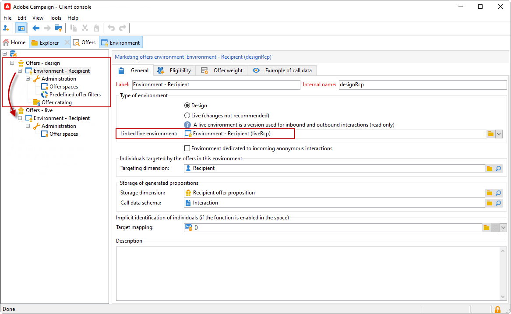

# Ambienti live e di progettazione{#live-design-environments}

L’interazione funziona con due tipi di ambienti di offerta:

* **[!UICONTROL Design]** ambienti di offerte che includono offerte in fase di modifica e che possono essere modificate. Queste offerte non hanno superato il ciclo di approvazione e non vengono consegnate ai contatti.
* **[!UICONTROL Live]** gli ambienti di offerte che includono offerte approvate mentre vengono presentate ai contatti. Le offerte in questo ambiente sono di sola lettura.

Ogni ambiente **[!UICONTROL Design]** è collegato a un ambiente **[!UICONTROL Live]**. Quando un&#39;offerta è completa, il suo contenuto e le sue regole di idoneità sono soggette a un ciclo di approvazione. Una volta completato questo ciclo, l&#39;offerta interessata viene distribuita automaticamente nell&#39;ambiente **[!UICONTROL Live]**. Da questo momento in poi sarà disponibile per la consegna.

Per impostazione predefinita, Campaign viene fornito con un ambiente **[!UICONTROL Design]** e un ambiente **[!UICONTROL Live]** ad esso collegato. Entrambi gli ambienti sono preconfigurati per eseguire il targeting della [tabella dei destinatari integrata](../dev/datamodel.md#ootb-profiles).

>[!NOTE]
>
>Per eseguire il targeting della tabella dei destinatari, è necessario utilizzare l’assistente di mappatura di destinazione per creare gli ambienti. [Ulteriori informazioni](#creating-an-offer-environment).

I responsabili della distribuzione possono visualizzare solo l’ ambiente **[!UICONTROL Live]** e sfruttare le offerte per consegnarle. I responsabili delle offerte possono visualizzare e utilizzare l’ambiente **[!UICONTROL Design]** e visualizzare l’ambiente **[!UICONTROL Live]**. [Ulteriori informazioni](interaction-operators.md)

## Creare un ambiente di offerta {#creating-an-offer-environment}

Per impostazione predefinita, Campaign viene fornito con un ambiente integrato per eseguire il targeting della tabella dei destinatari (offerte identificate). Per eseguire il targeting di un’altra tabella, segui i passaggi seguenti:

1. Passa a **[!UICONTROL Administration]** > **[!UICONTROL Campaign management]** > **[!UICONTROL Target mappings]**, fai clic con il pulsante destro del mouse sulla mappatura di destinazione che desideri utilizzare e seleziona **[!UICONTROL Actions]** > **[!UICONTROL Modify the options of the targeting dimension]**.

   

1. Fare clic su **[!UICONTROL Next]**, selezionare l&#39;opzione **[!UICONTROL Generate a storage schema for propositions]** e fare clic su **[!UICONTROL Save]**.

   

   >[!NOTE]
   >
   >Se l’opzione è già selezionata, deselezionala e ricontrolla.

1. Adobe Campaign crea due ambienti - **[!UICONTROL Design]** e **[!UICONTROL Live]** - con informazioni di targeting dalla mappatura di destinazione precedentemente abilitata. L’ambiente è preconfigurato con le informazioni di targeting.
