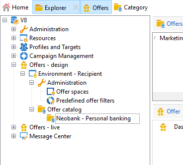

# Creare un catalogo di offerta

In qualità di **Gestione offerte**, sei responsabile della creazione del catalogo delle offerte.

Un catalogo di offerte è associato a un singolo ambiente preesistente. Le offerte in questo catalogo possono essere associate solo agli spazi specificati nello stesso ambiente.

Prima di creare le offerte, è necessario specificare un [ambiente](interaction-env.md) che contiene tutte le caratteristiche (idoneità, vincoli per la destinazione, regole di presentazione) di un set di offerte, ordinate in categorie e l’elenco dei relativi spazi.

## Creare categorie di offerta{#creating-offer-categories}

L’offerta è organizzata in categorie/sottocategorie. Le categorie vengono create nell’ambiente **[!UICONTROL Design]** e distribuite automaticamente nell’ambiente **[!UICONTROL Live]** (ovvero rese disponibili) quando le offerte in esse contenute vengono approvate. L’ambiente **[!UICONTROL Design]** contiene una categoria predefinita per la ricezione di tutte le offerte. È possibile creare sottocategorie per aggiungere una gerarchia alle offerte del catalogo.

Per ogni categoria, puoi definire **date di idoneità**, che è il periodo durante il quale le offerte contenute nella categoria possono essere presentate al relativo target. Puoi anche regolare il peso di una categoria per assegnare una priorità alla presentazione dell’offerta.

Per creare una nuova categoria, segui i passaggi seguenti:

1. Browser nella cartella **[!UICONTROL Offer catalog]**.

   

1. Fai clic con il pulsante destro del mouse e seleziona **[!UICONTROL Create a new "Offer category" folder]** dall’elenco a discesa.

   

1. Rinomina la categoria. Puoi modificare l’etichetta in un secondo momento utilizzando la scheda **[!UICONTROL General]** .

   

   >[!NOTE]
   >
   >Ripeti questi passaggi per creare tutte le categorie necessarie.

   Quindi, in base alle esigenze, puoi:

   * Assegna le date di idoneità dalla scheda **[!UICONTROL Eligibility]** .

      

   * Immetti le parole chiave che possono essere utilizzate per selezionare le offerte all’interno di questa categoria, utilizzando il campo **[!UICONTROL Themes]** .

      

      >[!NOTE]
      >
      >Quando si richiama il motore di offerta, viene selezionata solo la parte del catalogo in cui i temi o le categorie corrispondono ai parametri.

   * Aumenta temporaneamente il peso dell’offerta di una categoria per un dato periodo tramite il campo **[!UICONTROL Multiplier weight]** .

      

Nel dashboard delle offerte incluse nella categoria è disponibile un riepilogo delle regole di idoneità. Per visualizzarli, fai clic sul collegamento **[!UICONTROL Schedule and eligibility rules of the offer]** .

## Aggiungi una categoria di fallback

Per garantire che tutti i destinatari ricevano una proposta di offerta, è possibile aggiungere sistematicamente una o più categorie di offerta nelle raccomandazioni.

Queste offerte di fallback devono avere un peso basso (ma non nullo), in modo che vengano prese in considerazione solo se non sono idonee offerte con peso maggiore.

Inoltre, non deve essere applicata alcuna regola di presentazione a queste offerte per garantire che siano sempre incluse nelle raccomandazioni. Ciò significa che, durante una proposta, se non è disponibile un’offerta di peso più elevato, il destinatario riceverà almeno un’offerta da questa categoria.

Per includere una categoria di fallback nei consigli, segui i passaggi seguenti:

1. Sfoglia il catalogo delle offerte.
1. Fare clic sulla scheda **[!UICONTROL Eligibility]** e selezionare l&#39;opzione **[!UICONTROL Always include this category in the recommendations]**.
1. Fai clic su **[!UICONTROL Save]**.

   

