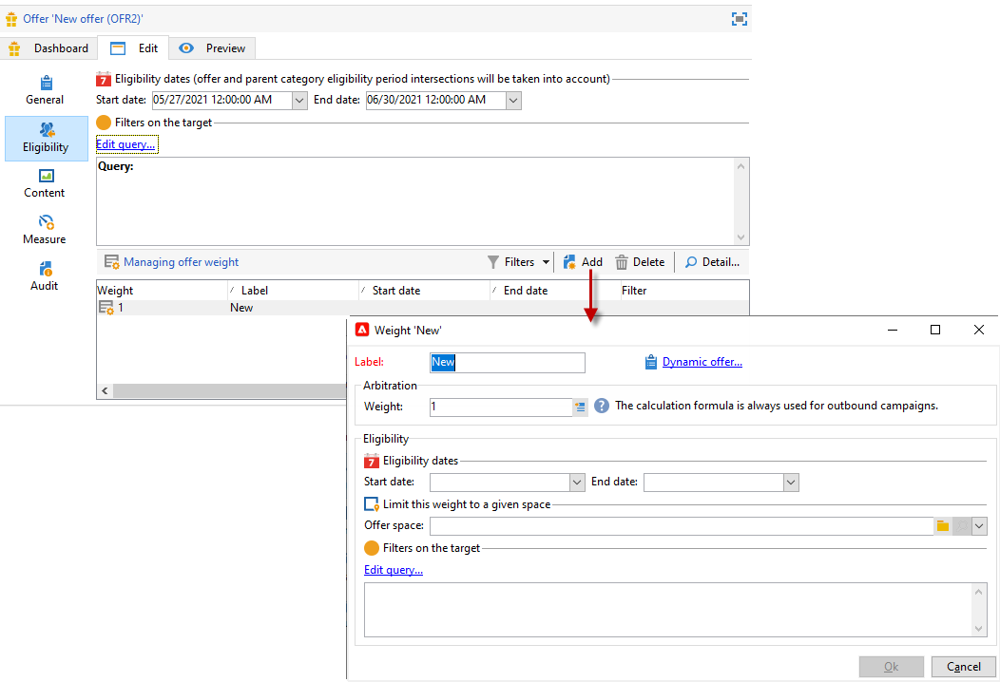
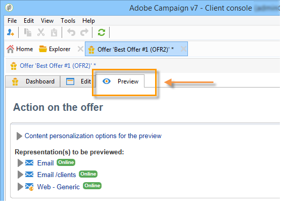
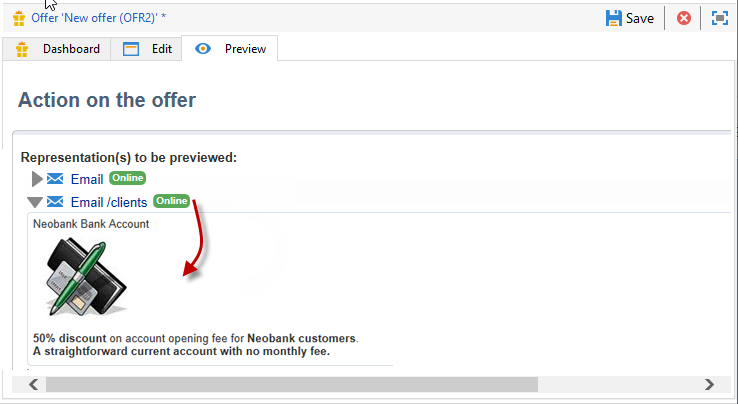

# Creare un’offerta

Per creare un’offerta, segui i passaggi seguenti:

1. Sfoglia il **[!UICONTROL Campaigns]** e fai clic su **[!UICONTROL Offers]** link.

1. Fai clic sul pulsante **[!UICONTROL Create]**.

1. Modifica l’etichetta e seleziona la categoria a cui deve appartenere l’offerta.

1. Fai clic su **[!UICONTROL Save]** per creare l’offerta.

   L’offerta è disponibile nella piattaforma e il relativo contenuto può essere configurato.

## Impostazioni di idoneità

Ora puoi utilizzare la **[!UICONTROL Eligibility]** scheda da definire:

* Periodo di ammissibilità dell&#39;offerta. [Ulteriori informazioni](#eligibility-period)
* Filtri per la popolazione target dell’offerta. [Ulteriori informazioni](#filters-on-the-target)
* Il peso dell&#39;offerta. [Ulteriori informazioni](#offer-weight)

### Periodo di ammissibilità dell’offerta{#eligibility-period}

In **[!UICONTROL Eligibility]** , definisci il periodo di idoneità dell’offerta. utilizza gli elenchi a discesa per selezionare una data di inizio e una data di fine nel calendario.


Al di fuori di questo periodo, l’offerta non verrà selezionata. Se hai configurato anche le date di idoneità per la categoria di offerta, verrà applicato il periodo più restrittivo.

### Aggiungere filtri nella destinazione {#filters-on-the-target}

In **[!UICONTROL Eligibility]** , applica i filtri alla destinazione dell’offerta.

A questo scopo, fai clic sul pulsante **[!UICONTROL Edit query]** e seleziona il filtro da applicare.


Se i filtri predefiniti sono già stati creati, puoi selezionarli dall’elenco dei filtri utente. [Ulteriori informazioni](interaction-predefined-filters.md)


### Imposta il peso dell’offerta {#offer-weight}

Per consentire al motore di decidere tra diverse offerte per le quali il target è idoneo, devi assegnare uno o più pesi all’offerta. Puoi anche applicare filtri al target se necessario o limitare lo spazio di offerta a cui verrà applicato il peso. Un&#39;offerta con un peso più significativo sarà preferita rispetto a un&#39;offerta con meno peso.

Puoi configurare più pesi per la stessa offerta, ad esempio per distinguere periodi secondari, target specifici o persino uno spazio di offerta.

Ad esempio, un&#39;offerta può avere un peso di A per i contatti di età compresa tra i 18 e i 25 anni e un peso di B per i contatti al di sopra di tale intervallo. Se un’offerta è idonea per tutta l’estate, può anche avere un peso di A in luglio e un peso di B in agosto.

>[!NOTE]
>
>Il peso assegnato può essere temporaneamente modificato in base ai parametri della categoria a cui appartiene l’offerta. [Ulteriori informazioni](interaction-offer-catalog.md#creating-offer-categories)

Per creare un peso in un’offerta, esegui i seguenti passaggi:

1. In **[!UICONTROL Eligibility]** scheda dell’offerta, fai clic su **[!UICONTROL Add]**.

   

1. Modificare l’etichetta e assegnare un peso. Il valore predefinito è 1.

   

   >[!CAUTION]
   >
   >Se non viene inserito alcun peso (0), il target non sarà considerato idoneo per l’offerta.

1. Se si desidera applicare il peso per un determinato periodo, definire le date di idoneità.

   

1. Se necessario, limita il peso a uno spazio di offerta specifico.

   

1. Applicare un filtro a una destinazione.

   

1. Fai clic su **[!UICONTROL OK]** per risparmiare il peso.

   

   >[!NOTE]
   >
   >Se un target è idoneo per più pesi per un’offerta selezionata, il motore mantiene il peso migliore (massimo). Quando si richiama il motore di offerta, un’offerta viene selezionata al massimo una volta per contatto.

### Riepilogo delle regole di idoneità delle offerte {#a-summary-of-offer-eligibility-rules}

Al termine della configurazione, un riepilogo delle regole di idoneità sarà disponibile sul dashboard delle offerte.

Per visualizzarlo, fai clic sul pulsante **[!UICONTROL Schedule and eligibility rules]** link.


## Creare il contenuto dell’offerta {#creating-the-offer-content}

Utilizza la **[!UICONTROL Content]** per definire il contenuto dell’offerta.


1. Definisci i vari parametri del contenuto dell’offerta.

   * **[!UICONTROL Title]** : Specifica il titolo da visualizzare nell’offerta. Avviso: non si tratta dell’etichetta dell’offerta, definita nella **[!UICONTROL General]** scheda .
   * **[!UICONTROL Destination URL]** : specifica l’URL dell’offerta. Deve iniziare con &quot;http://&quot; o &quot;https://&quot;.
   * **[!UICONTROL Image URL]** : specifica un URL o un percorso di accesso all’immagine dell’offerta.
   * **[!UICONTROL HTML content]** / **[!UICONTROL Text content]** : inserisci il corpo dell’offerta nella scheda desiderata. Per generare il tracciamento, **[!UICONTROL HTML content]** devono essere composti da elementi HTML che possono essere racchiusi in un `<div>` elemento type. Ad esempio, il risultato di un `<table>` nella pagina HTML verrà visualizzato il seguente elemento:

   ```
      <div> 
       <table>
        <tr>
         <th>Month</th>
         <th>Savings</th>   
        </tr>   
        <tr>    
         <td>January</td>
         <td>$100</td>   
        </tr> 
       </table> 
      </div>
   ```

   Scopri come definire l’URL di accettazione in [questa sezione](interaction-offer-spaces.md#configuring-the-status-when-the-proposition-is-accepted).

   

   Per trovare i campi obbligatori così come sono stati definiti durante la configurazione dello spazio di offerta, fai clic sul pulsante **[!UICONTROL Content definitions]** per visualizzare l’elenco. [Ulteriori informazioni](interaction-offer-spaces.md)

   

   In questo esempio, l’offerta deve includere un titolo, un’immagine, un contenuto HTML e un URL di destinazione.

## Anteprima dell’offerta {#previewing-the-offer}

Una volta configurato il contenuto dell’offerta, puoi visualizzarlo in anteprima per il destinatario.

Per eseguire questa operazione:

1. Fai clic sul pulsante **[!UICONTROL Preview]** scheda .

   

1. Seleziona la rappresentazione dell’offerta da visualizzare.

   

1. Se hai personalizzato il contenuto dell’offerta, seleziona la destinazione dell’offerta per visualizzare la personalizzazione.

<!--

## Create a hypothesis on an offer {#creating-a-hypothesis-on-an-offer}

You can create hypotheses on your offer propositions. This lets you determine the impact of your offers on purchases carried out for the product concerned.

>[!NOTE]
>
>These hypotheses are carried out via Response Manager. Please check your license agreement.

Hypotheses carried out on an offer proposition are referenced in their **[!UICONTROL Measure]** tab.

Creating hypotheses is detailed in [this page](../../campaign/using/about-response-manager.md).

-->

## Approvare e attivare un’offerta{#approve-offers}

Ora puoi approvare e attivare l’offerta per renderla disponibile nel **Live** ambiente.

 Per ulteriori informazioni, consulta la [documentazione di Campaign Classic v7](https://experienceleague.adobe.com/docs/campaign-classic/using/managing-offers/managing-an-offer-catalog/approving-and-activating-an-offer.html?lang=en#approving-offer-content)

## Gestire la presentazione delle offerte{#offer-presentation}

Campaign ti consente di controllare il flusso di proposte di offerta utilizzando le regole di presentazione. Queste regole, specifiche per l’interazione con Campaign, sono **regole di tipologia**. Ti consentono di escludere le offerte in base alla cronologia delle proposte già effettuate a un destinatario. Si fa riferimento ad essi nell’ambiente.

 Per ulteriori informazioni, consulta la [documentazione di Campaign Classic v7](https://experienceleague.adobe.com/docs/campaign-classic/using/managing-offers/managing-an-offer-catalog/managing-offer-presentation.html?lang=en#managing-offers)

## Simulazione dell’offerta

La **Simulazione** Il modulo ti consente di verificare la distribuzione delle offerte appartenenti a una categoria o a un ambiente prima di inviare la proposta ai destinatari.

La simulazione tiene conto dei contesti e delle regole di idoneità precedentemente applicati alle offerte e alle relative regole di presentazione. Questo ti consente di testare e perfezionare diverse versioni della proposta di offerta senza utilizzare effettivamente un’offerta o sollecitare più o meno una destinazione, poiché la simulazione non ha alcun impatto sui destinatari target.

 Per ulteriori informazioni sulla simulazione dell’offerta, consulta [Documentazione di Campaign Classic v7](https://experienceleague.adobe.com/docs/campaign-classic/using/managing-offers/simulating-offers/about-offers-simulation.html?lang=en)
