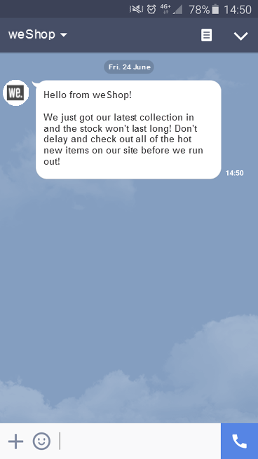

# Creare consegne LINE

LINE è un’applicazione per la messaggistica istantanea gratuita, chiamate vocali e video, disponibile su tutti i dispositivi mobili e su PC. Puoi utilizzare Adobe Campaign per inviare messaggi LINE.

È inoltre possibile combinare [!DNL LINE] con il modulo dei messaggi transazionali per inviare messaggi in tempo reale sull&#39;app [!DNL LINE] installata nei dispositivi mobili di consumo. Per ulteriori informazioni, consulta questa [pagina](https://experienceleague.adobe.com/en/docs/campaign-classic/using/transactional-messaging/configure-transactional-messaging/transactional-messaging-architecture#transactional-messaging-and-line) nella documentazione di Campaign Classic v7.

I passaggi per l&#39;utilizzo del canale [!DNL LINE] sono i seguenti:

1. [Configura canale LINE](#setting-up-line-channel)
1. [Creare una consegna](#creating-the-delivery)
1. [Configurare il tipo di contenuto](#defining-the-content)
1. [Monitoraggio della consegna (tracciamento, quarantena, rapporti, ecc.)](#accessing-reports)

## Configura canale LINE {#setting-up-line-channel}

Prima di creare un account [!DNL LINE] e un account esterno, è necessario installare il pacchetto LINE nell&#39;istanza. Contatta il tuo rappresentante Adobe.

È innanzitutto necessario creare un account [!DNL LINE], in modo da poterlo quindi collegare ad Adobe Campaign. Quindi, puoi inviare [!DNL LINE] messaggi agli utenti che hanno aggiunto il tuo account [!DNL LINE] nella loro app mobile. Gli account esterni e [!DNL LINE] possono essere gestiti solo dall&#39;amministratore funzionale della piattaforma.

Per creare e configurare un account [!DNL LINE], vedere la [documentazione per gli sviluppatori LINE](https://developers.line.me/).

### Creare e configurare il servizio LINE {#configure-line-service}

Per creare il servizio [!DNL LINE]:

1. Dalla home page di Adobe Campaign Classic, selezionare la scheda **[!UICONTROL Profiles and Targets]**.

1. Nel menu a sinistra, selezionare **[!UICONTROL Services and Subscriptions]** e fare clic su **[!UICONTROL Create]**.

   

1. Aggiungi **[!UICONTROL Label]** e **[!UICONTROL Internal name]** al nuovo servizio.

1. Selezionare **[!UICONTROL LINE]** dal menu a discesa **[!UICONTROL Type]**.

   

1. Fai clic su **[!UICONTROL Save]**.

Per ulteriori informazioni sugli abbonamenti e i servizi, vedere [Gestione degli abbonamenti](../../start/subscriptions.md).

### Configurare l’account esterno LINE {#configure-line-external}

Dopo aver creato il servizio [!DNL LINE], devi configurare l&#39;account esterno [!DNL LINE] su Adobe Campaign:

1. Nella struttura ad albero **[!UICONTROL Administration]** > **[!UICONTROL Platform]**, fare clic sulla scheda **[!UICONTROL External Accounts]**.

1. Selezionare l&#39;account esterno predefinito **[!UICONTROL LINE V2 routing]**.

   

1. Fai clic sulla scheda **[!UICONTROL LINE]** dall&#39;account esterno per iniziare a configurare l&#39;account esterno. Compila i campi seguenti:

   

   * **[!UICONTROL Channel Alias]**: viene fornito tramite l&#39;account [!DNL LINE] nella scheda **[!UICONTROL Channels]** > **[!UICONTROL Technical configuration]**.
   * **[!UICONTROL Channel ID]**: viene fornito tramite l&#39;account [!DNL LINE] nella scheda **[!UICONTROL Channels]** > **[!UICONTROL Basic Information panel]**.
   * **[!UICONTROL Channel secret key]**: viene fornito tramite l&#39;account [!DNL LINE] nella scheda **[!UICONTROL Channels]** > **[!UICONTROL Basic Information panel]**.
   * **[!UICONTROL Access token]**: viene fornito tramite l&#39;account [!DNL LINE] nel portale per sviluppatori o facendo clic sul pulsante **[!UICONTROL Get access token]**.
   * **[!UICONTROL Access token expiration date]**: consente di specificare la data di scadenza del token di accesso.
   * **[!UICONTROL LINE subscription service]**: consente di specificare i servizi a cui gli utenti saranno abbonati.

1. Al termine della configurazione, fai clic su **[!UICONTROL Save]**.

1. Da **[!UICONTROL Explorer]**, selezionare **[!UICONTROL Administration]** > **[!UICONTROL Production]** > **[!UICONTROL Technical workflows]** > **[!UICONTROL LINE workflows]** per verificare se i flussi di lavoro **[!UICONTROL LINE V2 access token update (updateLineAccessToken)]** e **[!UICONTROL Delete blocked LINE users (deleteBlockedLineUsers)]** sono stati avviati.

[!DNL LINE] è ora configurato in Adobe Campaign. È possibile iniziare a creare e inviare consegne LINE agli abbonati.

## Creare una consegna LINE {#creating-the-delivery}

>[!NOTE]
>
>Quando invii una consegna [!DNL LINE] a un nuovo destinatario per la prima volta, devi aggiungere alla consegna il messaggio LINE ufficiale relativo ai termini di utilizzo e di consenso. Il messaggio ufficiale è disponibile al [collegamento seguente](https://terms.line.me/OA_privacy/).

Per creare una consegna [!DNL LINE], è necessario seguire questi passaggi:

1. Dalla scheda **[!UICONTROL Campaigns]**, selezionare **[!UICONTROL Deliveries]**, quindi fare clic sul pulsante **[!UICONTROL Create]**.

   

1. Seleziona il modello di consegna **[!UICONTROL LINE V2 delivery]**.

   

1. Identifica la consegna con **[!UICONTROL Label]**, **[!UICONTROL Delivery code]** e **[!UICONTROL Description]**. Per ulteriori informazioni al riguardo, consulta [questa sezione](../../start/create-message.md#create-the-delivery).

1. Fai clic su **[!UICONTROL Continue]** per creare la consegna.

1. Nell&#39;editor di consegna, selezionare **[!UICONTROL To]** per eseguire il targeting dei destinatari della consegna [!DNL LINE]. Targeting eseguito il **[!UICONTROL Visitor subscriptions (nms:visitorSub)]**.

   Per ulteriori informazioni, consulta [questa pagina](../../audiences/target-mappings.md).

   

1. Fai clic su **[!UICONTROL Add]** per selezionare **[!UICONTROL Delivery target population]**.

   

1. Scegliere se si desidera eseguire il targeting diretto di [!DNL LINE] sottoscrittori o se si desidera eseguire il targeting degli utenti in base alla sottoscrizione di [!DNL LINE] e fare clic su **[!UICONTROL Next]**. In questo esempio abbiamo selezionato **[!UICONTROL By LINE V2 subscription]**.

1. Seleziona **[!UICONTROL Line-V2]** nel menu a discesa **[!UICONTROL Folder]** e quindi il tuo servizio [!DNL LINE]. Fai clic su **[!UICONTROL Finish]** e quindi su **[!UICONTROL Ok]** per iniziare a personalizzare la consegna.

   

1. Dall&#39;editor di consegna, fare clic su **[!UICONTROL Add]** per aggiungere uno o più messaggi e selezionare **[!UICONTROL Content type]**.

   Per ulteriori informazioni sui diversi **[!UICONTROL Content type]** disponibili, vedere [Definire il tipo di contenuto](#defining-the-content).

   

1. Una volta creata e configurata correttamente la consegna, puoi inviarla al target definito in precedenza.

   Per ulteriori informazioni sull&#39;invio di una consegna, fare riferimento a [Invia messaggi](../configure-and-send.md).

1. Dopo aver inviato il messaggio, accedi al rapporto per misurare l’efficacia della consegna.

   Per ulteriori informazioni su [!DNL LINE] report, fare riferimento a [Report di accesso](#accessing-reports).

## Definire il tipo di contenuto {#defining-the-content}

Per definire il contenuto di una consegna [!DNL LINE], devi innanzitutto aggiungere il tipo di messaggio alla consegna. Ogni consegna [!DNL LINE] può contenere fino a 5 messaggi.

Puoi scegliere tra tre tipi di messaggi:

* [Messaggio di testo](#configuring-a-text-message-delivery)
* [Immagine e collegamento](#configuring-an-image-and-link-delivery)
* [Messaggio video](#configuring-a-video-message-delivery)

### Configurazione di una consegna di messaggi di testo {#configuring-a-text-message-delivery}

>[!NOTE]
>
>La sintassi `<%@ include option='NmsServer_URL' %>/webApp/APP3?id=<%=escapeUrl(cryptString(visitor.id))%>` consente di includere un collegamento a un&#39;app Web in un messaggio LINE.

Una consegna **[!UICONTROL Text message]** [!DNL LINE] è un messaggio inviato ai destinatari in formato testo.

La configurazione per questo tipo di messaggio è simile a quella di **[!UICONTROL Text]** in un messaggio e-mail. Per ulteriori informazioni, consulta questa [pagina](../defining-the-email-content.md#message-content).

### Configurazione di una consegna di immagini e collegamenti {#configuring-an-image-and-link-delivery}

Una consegna **[!UICONTROL Image and link]** [!DNL LINE] è un messaggio inviato ai destinatari sotto forma di un&#39;immagine che può contenere uno o più URL.

Puoi utilizzare:

* un **[!UICONTROL Personalized image]**,

  >[!NOTE]
  >
  >È possibile utilizzare la variabile **%SIZE%** per ottimizzare la visualizzazione dell&#39;immagine in base alle dimensioni dello schermo del dispositivo mobile del destinatario.

  

* una dimensione di **[!UICONTROL Image URL]** per schermo dispositivo,

  

  L&#39;opzione **[!UICONTROL Define images per device screen size]** consente di utilizzare risoluzioni immagine diverse per ottimizzare la visibilità della consegna su dispositivi mobili. Sono supportate solo le immagini con la stessa altezza e larghezza.

  Le immagini possono essere definite in base alle dimensioni dello schermo:

   * 1040 px
   * 700 px
   * 460 px
   * 300 px
   * 240 px

  >[!CAUTION]
  >
  >La dimensione di 1040x1040 px è obbligatoria per ogni immagine LINE con collegamento.

  Quindi devi aggiungere testo alternativo che verrà visualizzato sul dispositivo mobile del destinatario.

* e **[!UICONTROL Links]**.

  La sezione **[!UICONTROL Links]** consente di scegliere tra diversi layout che divideranno l&#39;immagine in più aree selezionabili. È quindi possibile assegnare a ciascuno di essi un **[!UICONTROL Link URL]** dedicato.

  

### Configurazione della consegna di un messaggio video {#configuring-a-video-message-delivery}

Una consegna **[!UICONTROL Video message]** [!DNL LINE] è un messaggio inviato ai destinatari sotto forma di video che può contenere un URL.

Il campo **[!UICONTROL Preview Image URL]** consente di aggiungere l&#39;URL di un&#39;immagine di anteprima con un limite di caratteri di 1000. JPEG e PNG sono supportati con un limite di dimensione file di 1 MB.

Il campo **[!UICONTROL Video Image URL]** consente di aggiungere l&#39;URL del file video con un limite di caratteri di 1000. È supportato solo il formato mp4 con un limite di dimensione file di 200 MB.

Tieni presente che i video larghi o alti possono essere ritagliati quando vengono riprodotti su alcuni dispositivi.

## Accesso ai rapporti {#accessing-reports}

Dopo aver inviato la consegna, puoi visualizzare i tuoi report [!DNL LINE] tramite il menu **[!UICONTROL Campaign Management]** > **[!UICONTROL Deliveries]** da **[!UICONTROL Explorer]**.

>[!NOTE]
>
>I rapporti di tracciamento indicano il tasso di click-through. [!DNL LINE] non tiene conto del tasso di apertura.

Per i report del servizio [!DNL LINE], accedere al menu **[!UICONTROL Profiles and Targets]** > **[!UICONTROL Services and Subscriptions]** > **[!UICONTROL LINE-V2]** dalla scheda **[!UICONTROL Explorer]**. Quindi fare clic sull&#39;icona **[!UICONTROL Reports]** nel servizio [!DNL LINE].

## Esempio: creare e inviare un messaggio LINE personalizzato {#example--create-and-send-a-personalized-line-message}

In questo esempio creeremo e configureremo un messaggio di testo e un’immagine contenenti dati che verranno personalizzati in base al destinatario.

1. Crea la consegna [!DNL LINE] facendo clic sul pulsante **[!UICONTROL Create]** nella scheda **[!UICONTROL Campaign]**.

   

1. Seleziona il modello di consegna **[!UICONTROL LINE V2 delivery]** e assegna un nome alla consegna.

   

1. Nella finestra di configurazione della consegna, seleziona la popolazione target.

   Per ulteriori informazioni, vedere [Identificazione delle popolazioni target](../../start/create-message.md#target-population).

   

1. Fare clic su **[!UICONTROL Add]** per creare il messaggio e selezionare **[!UICONTROL Content type]**.

   In questo caso, si desidera innanzitutto creare **[!UICONTROL Text message]**.

   

1. Posizionare il cursore nel punto in cui si desidera inserire il testo personalizzato e fare clic sull&#39;icona a discesa, quindi selezionare **[!UICONTROL Visitor]** > **[!UICONTROL First name]**.

   

1. Seguire la stessa procedura per aggiungere un&#39;immagine, selezionando **[!UICONTROL Image and links]** nel menu a discesa **[!UICONTROL Message type]**.

   Aggiungi **[!UICONTROL Image URL]**.

   

1. Nella sezione **[!UICONTROL Links]**, seleziona il layout che dividerà l&#39;immagine in più aree selezionabili.

1. Assegna un URL a ogni area dell&#39;immagine.

   

1. Salva la consegna, quindi fai clic su **[!UICONTROL Send]** per analizzarla e inviarla alla destinazione.

   La consegna viene inviata al target.

   

