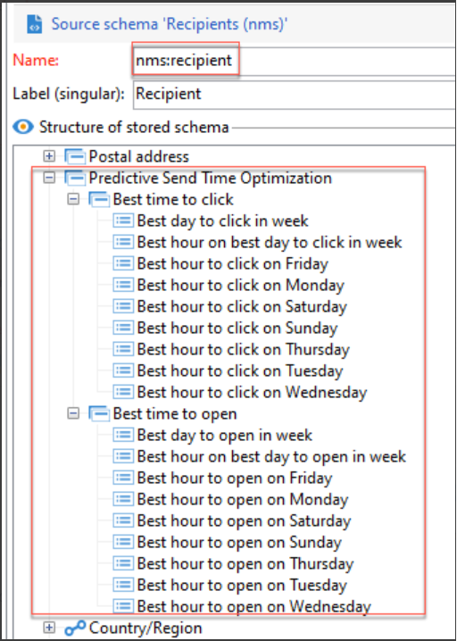

# Ottimizzazione del tempo di invio e punteggio di coinvolgimento predittivo{#optimize-message-delivery}

Grazie all’intelligenza artificiale e all’apprendimento automatico, l’ottimizzazione del tempo di invio e il punteggio di coinvolgimento predittivo di Adobe Campaign possono analizzare e prevedere i tassi di apertura, i tempi di invio ottimali e i tassi di abbandono probabili in base a metriche di coinvolgimento storiche.

Adobe Campaign offre due nuovi modelli di apprendimento automatico: [Ottimizzazione predittiva del tempo di invio](#predictive-send) e [Punteggio predittivo di coinvolgimento](#predictive-scoring). Questi due modelli sono modelli di apprendimento automatico specifici per la progettazione e la fornitura di percorsi di clienti migliori.

>[!CAUTION]
>
>Questa funzionalità non è disponibile come funzione predefinita del prodotto. È disponibile solo per i clienti Adobe Campaign Managed Cloud Services che eseguono Adobe Campaign Classic v7 o Adobe Campaign v8.
>
>La sua implementazione richiede l’intervento della Consulenza Adobe. Per ulteriori informazioni, contatta il tuo rappresentante Adobe.
>

## Ottimizzazione del tempo di invio predittivo{#predictive-send}

L’ottimizzazione predittiva del tempo di invio prevede qual è il tempo di invio migliore per ciascun profilo destinatario per quanto riguarda l’apertura delle e-mail o i clic e l’apertura dei messaggi push. Per ciascun profilo destinatario, i punteggi indicano il tempo di invio migliore per ogni giorno feriale e in quale giorno feriale si possono ottenere risultati ottimali.

Nel modello Ottimizzazione predittiva del tempo di invio sono presenti due modelli secondari:

* Il tempo di invio predittivo per l’apertura è il momento migliore per inviare una comunicazione al cliente in modo da massimizzare l’apertura dei messaggi

* Il tempo di invio predittivo per il clic è il momento migliore per inviare una comunicazione al cliente per massimizzare i clic

**Modello entrata**: registri di consegna, registri di tracciamento e attributi di profilo (non PII)

**Output modello**: momento migliore per inviare un messaggio (per aperture e clic)

Dettagli di output:

* Calcola l’orario del giorno migliore per l’invio di un’e-mail nei 7 giorni della settimana con intervalli di 1 ora (ad esempio: 9:00 am, 10:00 am, 11:00 am)
* Il modello indica il giorno migliore della settimana e l’ora migliore di quel determinato giorno
* Ogni tempo ottimale viene calcolato due volte: una volta per massimizzare il tasso di apertura e una per massimizzare il click rate
* Sono forniti 16 campi (14 per ogni giorno della settimana e 2 per l’intera settimana):
   * l’orario migliore per inviare un’e-mail in modo da ottimizzare i clic di lunedì - valori compresi tra 0 e 23
   * l’orario migliore per inviare un’e-mail in modo da ottimizzare l’apertura dei messaggi di lunedì - valori compresi tra 0 e 23
   * ...
   * l’orario migliore per inviare un’e-mail in modo da ottimizzare i clic di domenica - valori compresi tra 0 e 23
   * l’orario migliore per inviare un’e-mail in modo da ottimizzare l’apertura dei messaggi di domenica - valori compresi tra 0 e 23
   * ...
   * Il giorno migliore per inviare un’e-mail in modo da ottimizzare l’apertura dei messaggi per tutta la settimana - da lunedì a domenica
   * l’orario migliore per inviare un’e-mail in modo da ottimizzare l’apertura dei messaggi per tutta la settimana - valori compresi tra 0 e 23

L’ottimizzazione predittiva del tempo di invio è memorizzata a livello di profilo:

>[!NOTE]
>
>Il modello necessita di almeno un mese di dati per produrre risultati significativi. Queste funzionalità predittive si applicano solo ai canali e-mail e push.
>

## Valutazione del coinvolgimento predittivo {#predictive-scoring}

Il punteggio di coinvolgimento predittivo prevede la probabilità che un destinatario sia interessato a un messaggio, ma anche la probabilità che questo annulli l’abbonamento entro i 7 giorni successivi al prossimo invio dell’e-mail. Le probabilità sono ulteriormente suddivise in contenitori in base al livello di coinvolgimento previsto con il contenuto: alto, medio o basso. Questi modelli forniscono anche il livello percentile di rischio di annullamento dell’abbonamento affinché i clienti possano capire qual è il livello di un determinato cliente in relazione agli altri.

Il punteggio predittivo di coinvolgimento consente di:

* **Selezionare un pubblico**: utilizzando l’attività di query, puoi selezionare il pubblico con cui interagire con un messaggio specifico
* **Escludere un pubblico**: utilizzando l’attività di query, puoi rimuovere un pubblico per non inviargli il messaggio
* **Personalizzare**: personalizza i messaggi in base al livello di coinvolgimento (gli utenti altamente coinvolti riceveranno un messaggio diverso da quelli non coinvolti)

Questo modello utilizza più punteggi per indicare:

* **Punteggio di coinvolgimento per apertura/Punteggio di coinvolgimento per clic**: questo valore corrisponde alla probabilità che un utente iscritto sia interessato a un messaggio specifico (apertura o clic). I valori sono compresi tra 0,0 e 1,0.
* **Probabilità di annullamento abbonamento**: questo valore corrisponde alla probabilità che il destinatario annulli l’iscrizione al canale e-mail a causa di un messaggio e-mail aperto. I valori sono compresi tra 0,0 e 1,0.
* **Livello di mantenimento**: questo valore classifica gli utenti in tre livelli: basso, medio e alto. Con un valore alto, è molto probabile che il cliente sia interessato al marchio, mentre un valore basso implica la possibilità che annulli l’abbonamento.
* **Grado percentile di mantenimento**: classificazione del profilo in termini di probabilità di annullamento dell’iscrizione. I valori sono compresi tra 0,0 e 1,0. Ad esempio, se il livello di fidelizzazione è 0,953, è più probabile che il destinatario rimanga con il marchio e meno probabile che annulli l’abbonamento rispetto al 95,3% di tutti i destinatari.

>[!NOTE]
>
>Queste funzionalità predittive si applicano solo alle consegne delle e-mail.
>
>Il modello necessita di almeno un mese di dati per produrre risultati significativi.

**Modello entrata**: registri di consegna, registri di monitoraggio e attributi di profilo specifici

**Modello uscita**: un attributo di profilo che descrive la valutazione e la categoria del profilo
