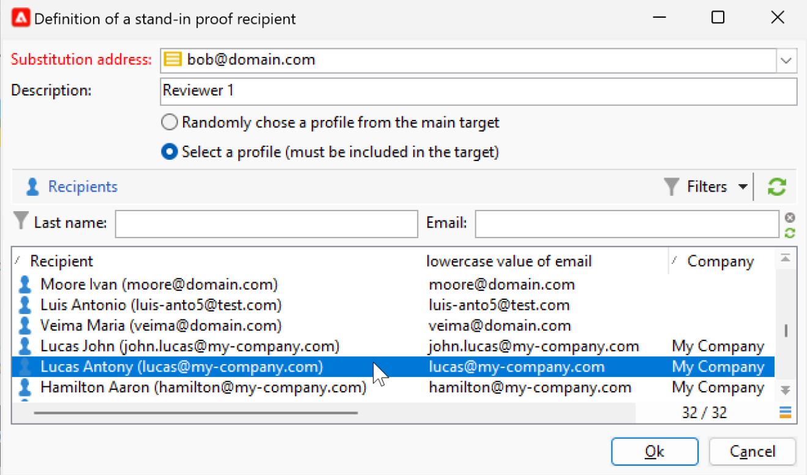

# Anteprima e test dell’e-mail {#preview-test}

Una volta definito il contenuto del messaggio, puoi utilizzare i profili di test per visualizzarlo in anteprima e testarlo. Se hai inserito [contenuti personalizzati](personalize.md), puoi controllare come questo contenuto viene visualizzato nel messaggio, utilizzando i dati del profilo di test. Inoltre, per rilevare eventuali errori nel contenuto del messaggio o nelle impostazioni di personalizzazione, invia delle bozze ai profili di test. È necessario inviare una prova ogni volta che viene apportata una modifica per convalidare il contenuto più recente.

## Anteprima contenuto{#preview-content}

Prima di inviare le bozze, è consigliabile controllare il contenuto del messaggio nella sezione di anteprima della finestra di consegna.

Per visualizzare l’anteprima del contenuto del messaggio, effettua le seguenti operazioni:

1. Sfoglia il **Anteprima** scheda della consegna.
1. Fai clic sul pulsante **[!UICONTROL Test personalization]** per selezionare un profilo per compilare i dati di personalizzazione. Puoi scegliere un destinatario specifico nel database, un indirizzo di seed o selezionare un profilo dalla popolazione target, se è già stato definito. Puoi anche controllare il contenuto senza personalizzazione.

   

1. L’anteprima viene generata in modo da poter controllare il rendering del messaggio. Nell’anteprima dei messaggi, gli elementi personalizzati vengono sostituiti dai dati del profilo di test selezionati.

   

1. Seleziona altri profili di test per visualizzare in anteprima il rendering delle e-mail per ogni variante del messaggio.

## Invia bozze {#send-proofs}

Per le consegne e-mail, puoi inviare bozze per convalidare il contenuto del messaggio. L’invio di bozze consente di controllare il collegamento di rinuncia, la pagina speculare e qualsiasi altro collegamento, convalidare il messaggio, verificare che le immagini siano visualizzate, rilevare eventuali errori e così via. Puoi anche controllare la progettazione e il rendering su diversi dispositivi.

Una bozza è un messaggio specifico che ti consente di testare un messaggio prima di inviarlo al pubblico principale. I destinatari della bozza hanno il compito di approvare il messaggio: rendering, contenuto, impostazioni di personalizzazione, configurazione.

### Destinatari di prova {#proofs-recipients}

Il target della bozza può essere definito nel modello di consegna o specifico per una consegna. In entrambi i casi, passa alla schermata di definizione del target dal **[!UICONTROL To]** e seleziona il **[!UICONTROL Target of the proofs]** scheda .

Il tipo di destinazione della bozza viene selezionato dalla **[!UICONTROL Targeting mode]** elenco a discesa.

* Utilizza la **[!UICONTROL Definition of a specific proof target]** per selezionare i destinatari nel database come destinazione della bozza.
* Utilizza la **[!UICONTROL Substitution of the address]** per immettere gli indirizzi e-mail e utilizzare i dati del destinatario per convalidare il contenuto. Gli indirizzi di sostituzione possono essere immessi manualmente o selezionati dall’elenco a discesa. L&#39;enumerazione associata è Indirizzo di sostituzione (rcpAddress).
Per impostazione predefinita, la sostituzione viene eseguita in modo casuale, ma puoi selezionare un destinatario specifico dal target principale, tramite il  **[!UICONTROL Detail]** icona.

   {width="800" align="left"}

   Scegli la **[!UICONTROL Select a profile (must be included in the target)]** e seleziona un destinatario.

   {width="800" align="left"}

* Utilizza la **[!UICONTROL Seed addresses]**  per utilizzare gli indirizzi di seed come destinazione della bozza. Questi indirizzi possono essere importati da un file o immessi manualmente.

   >[!NOTE]
   >
   >Gli indirizzi di seed non appartengono alla tabella dei destinatari predefinita (nms:recipient) ma vengono creati in una tabella separata. Se estendi la tabella dei destinatari con nuovi dati, devi estendere anche la tabella degli indirizzi di seed con gli stessi dati.

   Ulteriori informazioni sugli indirizzi di seed in [Documentazione di Campaign Classic v7](https://experienceleague.adobe.com/docs/campaign-classic/using/sending-messages/using-seed-addresses/about-seed-addresses.htmll){target="_blank"}.

* Utilizza la **[!UICONTROL Specific target and Seed addresses]** per combinare indirizzi di seed e indirizzi e-mail specifici. Le configurazioni correlate vengono quindi definite in due schede secondarie separate.

### Inviare una bozza{#proofs-send}

Per inviare le bozze dei messaggi, effettua le seguenti operazioni:

1. Nella schermata di definizione del messaggio, fai clic su **[!UICONTROL Send a proof]** pulsante .
1. Da **[!UICONTROL Send a proof]** controlla i destinatari della bozza.
1. Fai clic su **[!UICONTROL Analyze]** per avviare la preparazione dei messaggi di bozza.

   {width="800" align="left"}

1. Una volta completata la preparazione della consegna, utilizza **[!UICONTROL Confirm delivery]** per iniziare a inviare messaggi di bozza.

Sfoglia il **[!UICONTROL Audit]** scheda della consegna per controllare la consegna delle copie di prova.

È consigliabile inviare bozze dopo ogni modifica al contenuto del messaggio.

>[!NOTE]
>
>Nella bozza inviata, il collegamento alla pagina speculare non è attivo. Viene attivato solo nei messaggi finali.

### Proprietà delle prove{#proofs-properties}

Le proprietà di bozza sono impostate in **[!UICONTROL Advanced]** scheda delle finestre delle proprietà di consegna. Sfoglia il **[!UICONTROL Proof properties...]** per definire i parametri e l’etichetta delle bozze. Puoi scegliere di mantenere:

* Indirizzi duplicati nella bozza
* Indirizzi Inserita nell&#39;elenco Bloccati nella bozza
* Indirizzi in quarantena nella bozza

Per impostazione predefinita, i messaggi di bozza sono identificati dai `Proof #N` menzione nell&#39;oggetto, dove `N` è il numero della bozza. Questo numero viene incrementato con ogni analisi della consegna delle prove. È possibile modificare le `proof` , in base alle esigenze.

{width="800" align="left"}

## Video introduttivo {#video-proof}

Scopri come inviare e convalidare una bozza per una consegna e-mail.

>[!VIDEO](https://video.tv.adobe.com/v/333404)
