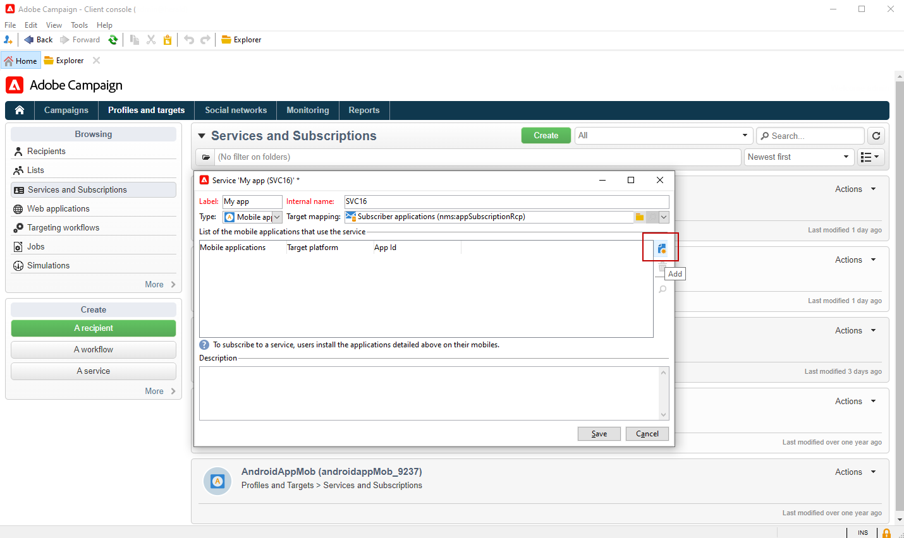
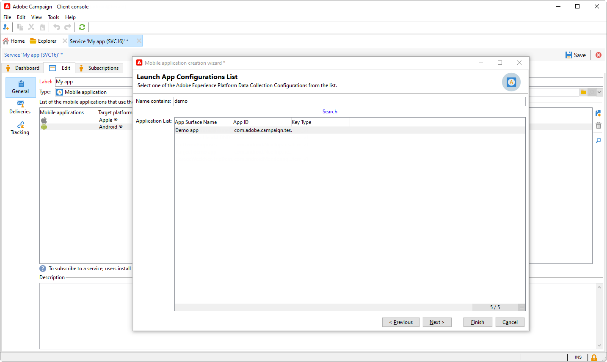

# Configurazione della notifica push rivista {#push-notifications-config}

Campaign v8.5 introduce il servizio di notifica push più recente, basato su un solido framework basato su una tecnologia all’avanguardia. Questo servizio è progettato per sbloccare nuovi livelli di scalabilità, garantendo che le notifiche possano raggiungere un pubblico più ampio con una perfetta efficienza. Con la nostra infrastruttura migliorata e i nostri processi ottimizzati, puoi aspettarti maggiore scalabilità e affidabilità, consentendoti di interagire e connettersi con gli utenti delle app mobili come mai prima d’ora.

>[!AVAILABILITY]
>
> Questa funzione è accessibile esclusivamente ai nuovi clienti a partire da Campaign v8.5 e viene implementata progressivamente per un set di clienti selezionati. Se il provisioning dell&#39;ambiente è stato eseguito prima di giugno 2023, questa pagina non è applicabile e devi seguire le procedure dettagliate [in questa pagina](push-settings.md).

Nel contesto di questa implementazione aggiornata, per inviare notifiche push in Adobe Campaign, segui questi passaggi:

1. [Creare una superficie app in Raccolta dati di Adobe Experience Platform](#create-app-surface)

1. [Configurare le impostazioni dell’applicazione in Adobe Campaign](#push-config-campaign)

1. [Creare e configurare una proprietà mobile in Raccolta dati di Adobe Experience Platform](#create-mobile-property)

1. [Aggiungi estensione Adobe Adobe Experience Platform Assurance](https://developer.adobe.com/client-sdks/documentation/platform-assurance-sdk/){target="_blank"}(consigliato)

1. [Aggiungere Campaign Classic alla tua app mobile](#campaign-mobile-ap)

1. [Creare una consegna per iOS e Android](##push-create)

>[!NOTE]
>
> FCM e APNS p12 legacy non sono supportati con la raccolta dati.

## Creare una superficie app in Raccolta dati di Adobe Experience Platform {#create-app-surface}

È necessario aggiungere le credenziali push dell&#39;app mobile in [!DNL Adobe Experience Platform Data Collection].

La registrazione delle credenziali push dell’app mobile è necessaria per autorizzare Adobe a inviare notifiche push per tuo conto. Consulta i passaggi descritti di seguito:

1. Da [!DNL Adobe Experience Platform Data Collection], selezionare la scheda **[!UICONTROL App Surfaces]** nel pannello a sinistra.

1. Fare clic su **[!UICONTROL Create App Surface]** per creare una nuova configurazione.

   

1. Immettere **[!UICONTROL Name]** per la configurazione.

1. Da **[!UICONTROL Mobile Application Configuration]**, selezionare il sistema operativo:

>[!BEGINTABS]

>[!TAB iOS]

1. Immetti l&#39;ID **bundle** dell&#39;app mobile nel campo **[!UICONTROL App ID (iOS Bundle ID)]**.

   L&#39;ID del bundle dell&#39;app si trova nella scheda **General** della destinazione primaria in **XCode** del tuo account sviluppatore Apple.

1. Attiva **[!UICONTROL Push Credentials]** per aggiungere le tue credenziali.

1. Trascina e rilascia il file .p8 Apple Push Notification Authentication Key.

   Questa chiave può essere acquisita dalla pagina **Certificati**, **Identificatori** e **Profili** del tuo account sviluppatore Apple.

1. Fornisci l&#39;**ID chiave**. Si tratta di una stringa di 10 caratteri assegnata durante la creazione del tasto di autenticazione p8.

       Si trova nella scheda **Chiavi** della pagina **Certificati**, **Identificatori** e **Profili** del tuo account sviluppatore Apple.
   
1. Fornisci **ID team**. Questo è un valore stringa che si trova nella scheda **Appartenenza**.

1. Fai clic su **[!UICONTROL Save]** per creare la configurazione dell&#39;app.

>[!TAB Android]

1. Fornisci **[!UICONTROL App ID (Android package name)]**. In genere il nome del pacchetto corrisponde all&#39;ID app nel file `build.gradle`.

1. Passa a **[!UICONTROL Push Credentials]** per aggiungere le tue credenziali.

1. Trascina e rilascia le credenziali push FCM. Per ulteriori dettagli su come ottenere le credenziali push, consulta la [documentazione di Google](https://firebase.google.com/docs/admin/setup#initialize-sdk){target="_blank"}.

1. Fai clic su **[!UICONTROL Save]** per creare la configurazione dell&#39;app.

>[!ENDTABS]

## Configurare le impostazioni dell’applicazione in Adobe Campaign{#push-config-campaign}

### Creare un servizio {#create-service}

Prima di inviare le notifiche push, devi definire le impostazioni delle app iOS e Android in Adobe Campaign.

Le notifiche push vengono inviate agli utenti dell’app tramite un servizio dedicato. Quando gli utenti installano l’app, si abbonano a questo servizio: Adobe Campaign si basa su questo servizio per eseguire il targeting solo per gli abbonati dell’app. In questo servizio, devi aggiungere le app iOS e Android da inviare su dispositivi iOS e Android.

Per creare un servizio per l’invio di notifiche push, effettua le seguenti operazioni:

1. Passare alla scheda **[!UICONTROL Profiles and Targets > Services and Subscriptions]** e fare clic su **[!UICONTROL Create]**.

   {width="800" align="left"}

1. Immettere **[!UICONTROL Label]** e **[!UICONTROL Internal name]** e selezionare un tipo **[!UICONTROL Mobile application]**.

   >[!NOTE]
   >
   >Il mapping di destinazione predefinito **[!UICONTROL Subscriber applications (nms:appSubscriptionRcp)]** è collegato alla tabella dei destinatari. Se si desidera utilizzare una mappatura di destinazione diversa, è necessario creare una nuova mappatura di destinazione e immetterla nel campo **[!UICONTROL Target mapping]** del servizio. Ulteriori informazioni sulle mappature di destinazione in [questa pagina](../audiences/target-mappings.md).

1. Quindi utilizza l&#39;icona **[!UICONTROL Add]** a destra per definire le applicazioni mobili che utilizzano questo servizio.

   

### Creare un’app mobile {#create-sapp}

Dopo aver creato il servizio, è ora necessario definire le applicazioni mobili che lo utilizzeranno.

>[!BEGINTABS]

>[!TAB iOS]

Per creare un&#39;app per dispositivi iOS, effettua le seguenti operazioni:

1. Dal tuo servizio, fai clic su **[!UICONTROL Add]**, quindi seleziona **[!UICONTROL Create an iOS application]**. Fai clic su **[!UICONTROL Next]**.

   

1. Dalla finestra **[!UICONTROL Launch app configurations list]**, seleziona la superficie dell&#39;app creata in precedenza in questa sezione. Fai clic su **[!UICONTROL Next]**.

   

1. (facoltativo) È possibile arricchire il contenuto di un messaggio push con alcuni **[!UICONTROL Application variables]**. Questi sono completamente personalizzabili e fanno parte del payload del messaggio inviato al dispositivo mobile.

   Nell&#39;esempio seguente, le variabili **mediaURl** e **mediaExt** vengono aggiunte per creare notifiche push potenziate e quindi forniscono all&#39;applicazione l&#39;immagine da visualizzare all&#39;interno della notifica.

   

1. Passare alla scheda **[!UICONTROL Subscription parameters]** per definire il mapping con un&#39;estensione dello schema **[!UICONTROL Subscriber applications (nms:appsubscriptionRcp)]**.

1. Passare alla scheda **[!UICONTROL Sounds]** per definire un suono da riprodurre. Fare clic su **[!UICONTROL Add]** e compilare il campo **[!UICONTROL Internal name]** che deve contenere il nome del file incorporato nell&#39;applicazione o il nome del suono di sistema.

1. Fare clic su **[!UICONTROL Next]** per avviare la configurazione dell&#39;applicazione di sviluppo.

1. **[!UICONTROL Integration key]** è specifico per ogni applicazione. Collega l’app mobile ad Adobe Campaign e verrà utilizzata per configurare l’estensione Campaign.

   Assicurati che lo stesso **[!UICONTROL Integration key]** sia definito in Adobe Campaign e nel codice dell&#39;applicazione tramite SDK.

   Ulteriori informazioni sono disponibili nella [documentazione per sviluppatori](https://developer.adobe.com/client-sdks/documentation/adobe-campaign-classic/#configuration-keys){target="_blank"}

   >[!NOTE]
   >
   > **[!UICONTROL Integration key]** è completamente personalizzabile con valore stringa, ma deve essere esattamente lo stesso specificato in SDK.
   >
   > Non è possibile utilizzare lo stesso certificato per la versione di sviluppo (sandbox) e la versione di produzione dell’applicazione.

   

1. Seleziona l&#39;icona dal campo **[!UICONTROL Application icon]** per personalizzare l&#39;app mobile nel servizio.

1. Fare clic su **[!UICONTROL Next]** per avviare la configurazione dell&#39;applicazione di produzione e seguire gli stessi passaggi descritti in precedenza. Non è possibile utilizzare lo stesso **[!UICONTROL Integration key]** per la versione di sviluppo (sandbox) e la versione di produzione dell&#39;applicazione.

1. Fai clic su **[!UICONTROL Finish]**.

L’applicazione iOS è ora pronta per essere utilizzata in Campaign.

>[!TAB Android]

Per creare un&#39;app per dispositivi Android, effettua le seguenti operazioni:

1. Dal tuo servizio, fai clic su **[!UICONTROL Add]**, quindi seleziona **[!UICONTROL Create an Android application]**. Fai clic su **[!UICONTROL Next]**.

   

1. Dalla finestra **[!UICONTROL Launch app configurations list]**, seleziona la superficie app creata in questa sezione e fai clic su **[!UICONTROL Next]**.

   

1. La chiave di integrazione è specifica per ogni applicazione. Collega l’app mobile ad Adobe Campaign e verrà utilizzata per configurare l’estensione Campaign.

   Assicurati che lo stesso **[!UICONTROL Integration key]** sia definito in Adobe Campaign e nel codice dell&#39;applicazione tramite SDK.

   Ulteriori informazioni sono disponibili nella [documentazione per sviluppatori](https://developer.adobe.com/client-sdks/documentation/adobe-campaign-classic/#configuration-keys){target="_blank"}

   >[!NOTE]
   >
   > **[!UICONTROL Integration key]** è completamente personalizzabile con valore stringa, ma deve essere esattamente lo stesso specificato in SDK.

   

1. Seleziona l&#39;icona dal campo **[!UICONTROL Application icon]** per personalizzare l&#39;app mobile nel servizio.

1. (facoltativo) Se necessario, puoi arricchire il contenuto di un messaggio push con alcuni **[!UICONTROL Application variables]**. Questi sono completamente personalizzabili e fanno parte del payload del messaggio inviato al dispositivo mobile.

1. Passare alla scheda **[!UICONTROL Subscription parameters]** per definire il mapping con un&#39;estensione dello schema **[!UICONTROL Subscriber applications (nms:appsubscriptionRcp)]**.

1. Fai clic su **[!UICONTROL Finish]**, quindi su **[!UICONTROL Save]**.

L’applicazione Android è ora pronta per essere utilizzata in Campaign.

>[!ENDTABS]

Di seguito sono riportati i nomi del payload FCM per personalizzare ulteriormente la notifica push:

| Tipo di messaggio | Elemento del messaggio configurabile (nome del payload FCM) | Opzioni configurabili (nome payload FCM) |
|:-:|:-:|:-:|
| messaggio dati | N/D | validate_only |
| messaggio di notifica | titolo, corpo, android_channel_id, icona, suono, tag, colore, click_action, immagine, ticker, fisso, visibilità, notification_priority, notification_count   | validate_only |

## Configurare una proprietà mobile in Raccolta dati di Adobe Experience Platform {#create-mobile-property}

1. Dalla home page di Data Collection, accedi al menu Tag.

1. Fai clic su **[!UICONTROL New Property]**.

   

1. Digitare un nome per la proprietà e selezionare **[!UICONTROL Mobile]** come piattaforma.

   

1. Fare clic su **[!UICONTROL Save]** per creare la proprietà mobile.

1. Accedi alla proprietà mobile appena creata.

1. Dalla dashboard delle proprietà mobili, accedi al menu **[!UICONTROL Extensions]** e quindi alla scheda **[!UICONTROL Catalog]**.

   

1. Installa l&#39;estensione **[!DNL Adobe Campaign Classic]**. [Ulteriori informazioni sull&#39;estensione Campaign](https://developer.adobe.com/client-sdks/documentation/adobe-campaign-classic/#configure-campaign-classic-extension)

   

1. Inserisci i dettagli dell’istanza:

   * Gli URL **[!UICONTROL Registration endpoint]** o **[!UICONTROL Tracking endpoint]** si trovano nel menu **[!UICONTROL Tools]** > **[!UICONTROL Advanced]** > **[!UICONTROL Deployment wizard]** in Campaign.
   * **[!UICONTROL Integration keys]** si trova nell&#39;app mobile configurata in [questa sezione](#create-app).

   

1. Fai clic su **[!UICONTROL Save]**.

1. È ora necessario pubblicare la configurazione dal menu **[!UICONTROL Publishing flow]**. [Ulteriori informazioni](https://developer.adobe.com/client-sdks/documentation/getting-started/create-a-mobile-property/#publish-the-configuration)

La proprietà mobile verrà sincronizzata automaticamente con il flusso di lavoro tecnico **[!UICONTROL Adobe Experience Platform Data Collection]**. [Ulteriori informazioni](../../automation/workflow/technical-workflows.md#list-technical-workflows)

## Aggiungere Campaign Classic alla tua app mobile {#campaign-mobile-app}

L’SDK di Adobe Experience Platform Mobile aiuta ad potenziare soluzioni e servizi di Experience Cloud di Adobe nelle app mobili. La configurazione degli SDK viene gestita tramite l’interfaccia utente di Data Collection per una configurazione flessibile e integrazioni estensibili basate su regole.

[Ulteriori informazioni nella documentazione di Adobe Developer](https://developer.adobe.com/client-sdks/documentation/adobe-campaign-classic/#add-campaign-classic-to-your-app){target="_blank"}.

## Creare la notifica push{#push-create}

Dopo aver configurato correttamente l’app mobile in Raccolta dati, ora puoi creare e inviare notifiche push in Adobe Campaign.

Fai riferimento a [questa pagina](push.md#push-create) per gli elementi dettagliati specifici per la consegna delle notifiche iOS e Android.
