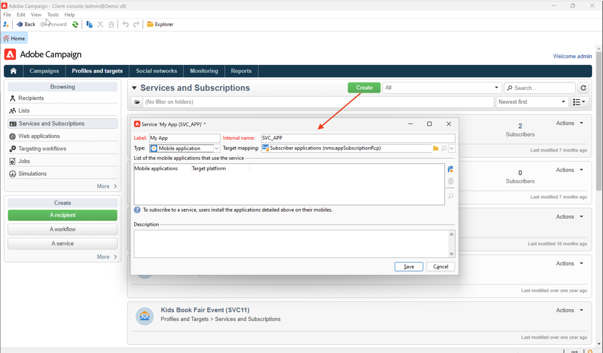
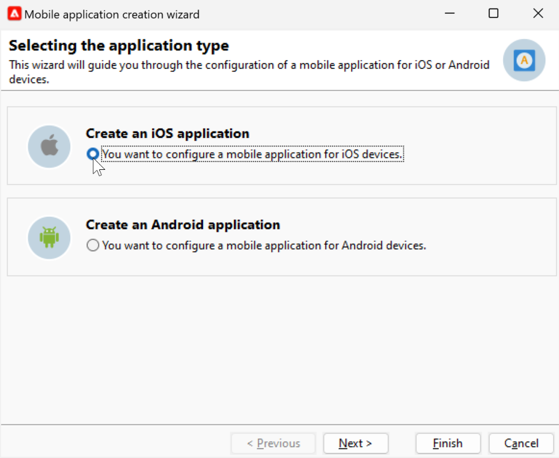
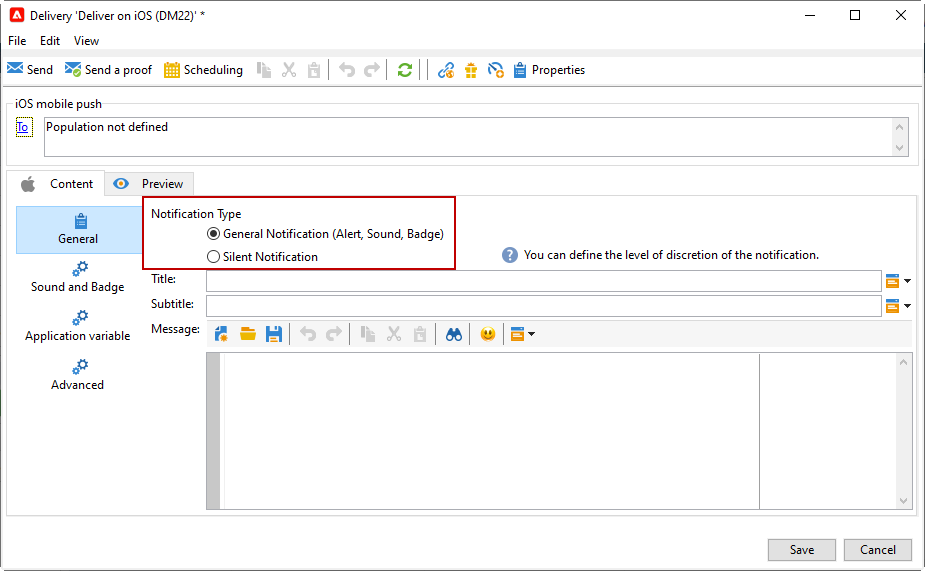

# Creare e inviare notifiche push{#push-notifications-create}

Le consegne di app mobili ti consentono di inviare notifiche ai dispositivi iOS e Android.

Per inviare notifiche push in Adobe Campaign, devi:

1. Integra l&#39;SDK con la tua app. [Ulteriori informazioni](#push-sdk)
1. Crea un servizio di informazioni di tipo app mobile per la tua app mobile e aggiungi al servizio le versioni iOS e Android dell&#39;applicazione. [Ulteriori informazioni](#push-config)
1. Crea una consegna per iOS e Android. [Ulteriori informazioni](#push-create)

## Integrare l&#39;SDK {#push-sdk}

Puoi usare l’SDK di Adobe Experience Platform Mobile configurando l’estensione Adobe Campaign nell’interfaccia utente di raccolta dati. L&#39;SDK di Adobe Experience Platform Mobile consente di sviluppare soluzioni e servizi di Experience Cloud nelle app mobili. La configurazione degli SDK viene gestita tramite l’interfaccia utente di raccolta dati per una configurazione flessibile e integrazioni estensibili basate su regole. [Ulteriori informazioni nella documentazione di Adobe Developer](https://developer.adobe.com/client-sdks/documentation/adobe-campaign-classic){target="_blank"}.

Puoi anche integrare Campaign SDK per facilitare l’integrazione dell’app mobile nella piattaforma Adobe Campaign. Le versioni SDK compatibili sono elencate in [Matrice di compatibilità di Campaign](../start/compatibility-matrix.md#MobileSDK).

Scopri come integrare gli SDK di Campaign Android e iOS con la tua app in [questa pagina](../config/push-config.md)

## Configurare le impostazioni dell’app in Campaign{#push-config}

Prima di inviare notifiche push, devi definire le impostazioni delle app iOS e Android in Adobe Campaign.

Le notifiche push vengono inviate agli utenti dell’app tramite un servizio dedicato. Quando gli utenti installano la tua app, si abbonano a questo servizio: Adobe Campaign si basa su questo servizio per eseguire il targeting solo degli abbonati all’app. In questo servizio, devi aggiungere le tue app iOS e Android da inviare su dispositivi iOS e Android.

Per creare un servizio per l’invio di notifiche push, segui i passaggi seguenti:

1. Sfoglia per **[!UICONTROL Profiles and Targets > Services and Subscriptions]** e fai clic su **[!UICONTROL Create]**.

   {width="800" align="left"}

1. Inserisci un **[!UICONTROL Label]** e **[!UICONTROL Internal name]**, quindi seleziona un **[!UICONTROL Mobile application]** digitare.

   >[!NOTE]
   >
   >Il valore predefinito **[!UICONTROL Subscriber applications (nms:appSubscriptionRcp)]** la mappatura di destinazione è collegata alla tabella dei destinatari. Se desideri utilizzare una mappatura di destinazione diversa, devi creare una nuova mappatura di destinazione e inserirla nel **[!UICONTROL Target mapping]** campo del servizio. Ulteriori informazioni sulle mappature target in [questa pagina](../audiences/target-mappings.md).

1. Quindi utilizza il **[!UICONTROL Add]** a destra per definire le applicazioni mobili che utilizzano questo servizio.

>[!BEGINTABS]

>[!TAB iOS]

Per creare un’app per dispositivi iOS, effettua le seguenti operazioni:

1. Seleziona **[!UICONTROL Create an iOS application]** e fai clic su **[!UICONTROL Next]**.

   {width="600" align="left"}

1. Immetti il nome dell&#39;app nella **[!UICONTROL Label]** campo .
1. (Facoltativo) Puoi arricchire il contenuto di un messaggio push con alcuni **[!UICONTROL Application variables]**. Sono completamente personalizzabili e una parte del payload del messaggio inviato al dispositivo mobile.

   Nell’esempio seguente, la variabile **mediaURl** e **mediaExt** vengono aggiunte delle variabili per creare una notifica push potenziata e quindi forniscono all’applicazione l’immagine da visualizzare all’interno della notifica.

   {width="600" align="left"}

1. Sfoglia il **[!UICONTROL Subscription parameters]** per definire la mappatura con un&#39;estensione del **[!UICONTROL Subscriber applications (nms:appsubscriptionRcp)]** schema.

1. Sfoglia il **[!UICONTROL Sounds]** per definire un suono da riprodurre. Fai clic su **[!UICONTROL Add]** e riempire **[!UICONTROL Internal name]** campo che deve contenere il nome del file incorporato nell&#39;applicazione o il nome dell&#39;audio di sistema.

1. Fai clic su **[!UICONTROL Next]** per iniziare a configurare l&#39;applicazione di sviluppo.

1. La chiave di integrazione è specifica per ogni applicazione. Collega l’app mobile ad Adobe Campaign.

   Assicurati che sia lo stesso **[!UICONTROL Integration key]** è definito in Adobe Campaign e nel codice dell&#39;applicazione tramite l&#39;SDK.

   Se utilizzi l’SDK di Campaign, ulteriori informazioni in[questa pagina](../config/push-config.md).

   Se utilizzi Adobe Experience Platform SDK (raccolta dati), ulteriori informazioni in [questa pagina](https://developer.adobe.com/client-sdks/documentation/adobe-campaign-classic/#configuration-keys){target="_blank"}

   >[!NOTE]
   >
   > La **[!UICONTROL Integration key]** è completamente personalizzabile con il valore stringa, ma deve essere esattamente uguale a quello specificato nell&#39;SDK.
   >
   > Non puoi utilizzare lo stesso certificato per la versione di sviluppo (sandbox) e la versione di produzione dell’applicazione.

1. Seleziona l’icona dalla **[!UICONTROL Application icon]** per personalizzare l’app mobile nel servizio.

1. Seleziona **[!UICONTROL Authentication mode]**. Sono disponibili due modalità:

   * (Consigliato) **[!UICONTROL Token-based authentication]**: Inserisci le impostazioni di connessione APN **[!UICONTROL Key Id]**, **[!UICONTROL Team Id]** e **[!UICONTROL Bundle Id]** quindi seleziona il certificato p8 facendo clic su **[!UICONTROL Enter the private key...]**. Per ulteriori informazioni **[!UICONTROL Token-based authentication]**, fare riferimento a [Documentazione di Apple](https://developer.apple.com/documentation/usernotifications/setting_up_a_remote_notification_server/establishing_a_token-based_connection_to_apns){target="_blank"}.

   * **[!UICONTROL Certificate-based authentication]**: Fai clic su **[!UICONTROL Enter the certificate...]**  quindi seleziona la tua chiave p12 e immetti la password fornita dallo sviluppatore di applicazioni mobili.
   Puoi modificare la modalità di autenticazione in un secondo momento nella **[!UICONTROL Certificate]** scheda della tua app mobile.

1. Utilizza la **[!UICONTROL Test the connection]** per convalidare la configurazione.

1. Fai clic su **[!UICONTROL Next]** per iniziare a configurare l&#39;applicazione di produzione e seguire gli stessi passaggi descritti in precedenza.

1. Fai clic su **[!UICONTROL Finish]**.

L’applicazione iOS è ora pronta per essere utilizzata in Campaign.

>[!TAB Android]

Per creare un’app per dispositivi Android, effettua le seguenti operazioni:

1. Seleziona **[!UICONTROL Create an Android application]** e fai clic su **[!UICONTROL Next]**.

   {width="600" align="left"}

1. Immetti il nome dell&#39;app nella **[!UICONTROL Label]** campo .
1. La chiave di integrazione è specifica per ogni applicazione. Collega l’app mobile ad Adobe Campaign.

   Assicurati che sia lo stesso **[!UICONTROL Integration key]** è definito in Adobe Campaign e nel codice dell&#39;applicazione tramite l&#39;SDK.

   Se utilizzi l’SDK di Campaign, ulteriori informazioni in [questa pagina](../config/push-config.md).

   Se utilizzi Adobe Experience Platform SDK (raccolta dati), ulteriori informazioni in [questa pagina](https://developer.adobe.com/client-sdks/documentation/adobe-campaign-classic/#configuration-keys){target="_blank"}

   >[!NOTE]
   >
   > La **[!UICONTROL Integration key]** è completamente personalizzabile con il valore stringa, ma deve essere esattamente uguale a quello specificato nell&#39;SDK.

1. Seleziona l’icona dalla **[!UICONTROL Application icon]** per personalizzare l’app mobile nel servizio.
1. Seleziona **HTTP v1** in  **[!UICONTROL API version]** elenco a discesa.
1. Fai clic su **[!UICONTROL Load project json file to extract project details...]** per caricare il file della chiave JSON. Per ulteriori informazioni su come estrarre il file JSON, consulta [Documentazione di Google Firebase](https://firebase.google.com/docs/admin/setup#initialize-sdk){target="_blank"}.

   Puoi anche immettere manualmente i seguenti dettagli:
   * **[!UICONTROL Project Id]**
   * **[!UICONTROL Private Key]**
   * **[!UICONTROL Client Email]**

1. Utilizza la **[!UICONTROL Test the connection]** per convalidare la configurazione.

   >[!CAUTION]
   >
   >La **[!UICONTROL Test connection]** Il pulsante non controlla se il server MID ha accesso al server FCM.

1. (Facoltativo) Puoi arricchire il contenuto di un messaggio push con alcuni **[!UICONTROL Application variables]** se necessario. Sono completamente personalizzabili e una parte del payload del messaggio inviato al dispositivo mobile.

1. Fai clic su **[!UICONTROL Finish]**, quindi su **[!UICONTROL Save]**. L’applicazione Android è ora pronta per essere utilizzata in Campaign.

Di seguito sono riportati i nomi dei payload FCM per personalizzare ulteriormente la notifica push:

| Tipo di messaggio | Elemento messaggio configurabile (nome payload FCM) | Opzioni configurabili (nome payload FCM) |
|:-:|:-:|:-:|
| messaggio dati | N/D | validate_only |
| messaggio di notifica | titolo, corpo, android_channel_id, icona, suono, tag, colore, click_action, immagine, ticker, persistente, visibilità, notification_priority, notification_count   | validate_only |

>[!ENDTABS]

## Creare la prima notifica push{#push-create}

Questa sezione descrive gli elementi specifici per la consegna delle notifiche iOS e Android.

>[!CAUTION]
>
>Nel contesto di un [Distribuzione aziendale (FFDA)](../architecture/enterprise-deployment.md), la registrazione mobile è ora **asincrono**. [Ulteriori informazioni](../architecture/staging.md)

Per creare una nuova consegna, seleziona **[!UICONTROL Campaigns]** scheda , fai clic su **[!UICONTROL Deliveries]** e fai clic su **[!UICONTROL Create]** , sopra l’elenco delle consegne esistenti.

>[!BEGINTABS]

>[!TAB iOS]

Per inviare notifiche sui dispositivi iOS, effettua le seguenti operazioni:

1. Seleziona la **[!UICONTROL Deliver on iOS]** modello di consegna.

   

1. Per definire il target della notifica, fai clic sul pulsante **[!UICONTROL To]** collegamento, quindi fai clic su **[!UICONTROL Add]**.

   

1. Seleziona **[!UICONTROL Subscribers of an iOS mobile application (iPhone, iPad)]**, seleziona il servizio pertinente alla tua app mobile, quindi seleziona la versione iOS dell’applicazione.

   

1. Scegli la tua **[!UICONTROL Notification type]** tra **[!UICONTROL General notification (Alert, Sound, Badge)]** o **[!UICONTROL Silent notification]**.

   

   >[!NOTE]
   >
   >La **Push silenzioso** consente di inviare una notifica &quot;silenziosa&quot; a un’app mobile. L&#39;utente non viene informato dell&#39;arrivo della notifica. Viene trasferito direttamente all&#39;applicazione.

1. In **[!UICONTROL Title]** immettere l&#39;etichetta del titolo che si desidera visualizzare nell&#39;elenco delle notifiche disponibili dal centro notifiche.

   Questo campo ti consente di definire il valore del **title** del payload di notifica iOS.

1. Puoi aggiungere una **[!UICONTROL Subtitle]**, il valore **sottotitolo** del payload di notifica iOS.

1. Immetti il contenuto del messaggio nel **[!UICONTROL Message content]** della procedura guidata.

1. Da **[!UICONTROL Sound and Badge]** è possibile modificare le seguenti opzioni:

   * **[!UICONTROL Clean Badge]**: abilita queste opzioni per aggiornare il valore del badge.

   * **[!UICONTROL Value]**: imposta un numero che verrà utilizzato per visualizzare direttamente sull&#39;icona dell&#39;applicazione il numero di nuove informazioni non lette.

   * **[!UICONTROL Critical alert mode]**: abilitare questa opzione per aggiungere l&#39;audio alla notifica anche se il telefono dell&#39;utente è impostato in modalità di attivazione o se l&#39;iPhone è disattivato.

   * **[!UICONTROL Name]**: selezionare l&#39;audio che deve essere riprodotto dal terminale mobile quando viene ricevuta la notifica.

   * **[!UICONTROL Volume]**: volume del suono da 0 a 100.

      >[!NOTE]
      > 
      >I suoni devono essere inclusi nell&#39;applicazione e definiti al momento della creazione del servizio.
   

1. Da **[!UICONTROL Application variables]** scheda **[!UICONTROL Application variables]** vengono aggiunti automaticamente. Consentono di definire il comportamento di notifica, ad esempio, di configurare una schermata specifica dell’applicazione da visualizzare quando l’utente attiva la notifica.

1. Da **[!UICONTROL Advanced]** è possibile modificare le seguenti opzioni generali:

   * **[!UICONTROL Mutable content]**: abilita questa opzione per consentire all’app mobile di scaricare contenuti multimediali.

   * **[!UICONTROL Thread-id]**: identificatore utilizzato per raggruppare le notifiche correlate.

   * **[!UICONTROL Category]**: nome dell’ID categoria che mostrerà i pulsanti di azione. Queste notifiche forniscono all’utente un modo più rapido per eseguire diverse attività in risposta a una notifica senza aprire o esplorare l’applicazione.

   

1. Per le notifiche sensibili al tempo, puoi specificare le seguenti opzioni:

   * **[!UICONTROL Target content ID]**: identificatore utilizzato per individuare la finestra dell&#39;applicazione da inoltrare all&#39;apertura della notifica.

   * **[!UICONTROL Launch image]**: nome del file immagine di lancio da visualizzare. Se l&#39;utente sceglie di avviare l&#39;applicazione, l&#39;immagine selezionata verrà visualizzata al posto della schermata di avvio dell&#39;applicazione.

   * **[!UICONTROL Interruption level]**:

      * **[!UICONTROL Active]**: Impostato per impostazione predefinita, il sistema presenta immediatamente la notifica, accende lo schermo e può riprodurre un suono. Le notifiche non si interrompono tra le modalità di messa a fuoco.

      * **[!UICONTROL Passive]**: Il sistema aggiunge la notifica all&#39;elenco delle notifiche senza accendere lo schermo o riprodurre un suono. Le notifiche non si interrompono tra le modalità di messa a fuoco.

      * **[!UICONTROL Time sensitive]** Il sistema presenta immediatamente la notifica, si accende lo schermo, può riprodurre un suono e rompere le modalità di messa a fuoco. Questo livello non richiede un&#39;autorizzazione speciale da parte di Apple.

      * **[!UICONTROL Critical]** Il sistema presenta immediatamente la notifica, accende lo schermo e bypassa l&#39;interruttore muto o le modalità di messa a fuoco. Tieni presente che questo livello richiede un’autorizzazione speciale da parte di Apple.
   * **[!UICONTROL Relevance score]**: imposta un punteggio di rilevanza da 0 a 100. Il sistema utilizza questo per ordinare le notifiche nel riepilogo delle notifiche.

   

1. Una volta configurata la notifica, fai clic sul pulsante **[!UICONTROL Preview]** per visualizzare in anteprima la notifica.

   

>[!TAB Android]

Per inviare notifiche sui dispositivi Android, effettua le seguenti operazioni:

1. Seleziona la **[!UICONTROL Deliver on Android (android)]** modello di consegna.

   

1. Per definire il target della notifica, fai clic sul pulsante **[!UICONTROL To]** collegamento, quindi fai clic su **[!UICONTROL Add]**.

   

1. Seleziona **[!UICONTROL Subscribers of an Android mobile application]**, scegli il servizio pertinente alla tua app mobile (in questo caso Neotrips), quindi seleziona la versione Android dell&#39;applicazione.

   

1. Quindi inserisci il contenuto della notifica.

   

1. Fai clic sul pulsante **[!UICONTROL Insert emoticon]** per inserire gli emoticon nella notifica push.

1. In **[!UICONTROL Application variables]** immettere il valore di ciascuna variabile. Ad esempio, puoi configurare una schermata specifica dell’applicazione da visualizzare quando l’utente attiva la notifica.

1. Una volta configurata la notifica, fai clic sul pulsante **[!UICONTROL Preview]** per visualizzare in anteprima la notifica.

   <!---->

>[!ENDTABS]

## Test, invio e monitoraggio delle notifiche push

Per inviare una bozza e la consegna finale, utilizza lo stesso processo applicato alle altre consegne.

Scopri come convalidare una consegna in [questa pagina](preview-and-proof.md).

Scopri come confermare e inviare la consegna in [questa pagina](send.md)

Dopo aver inviato i messaggi, puoi monitorare e tenere traccia delle consegne. Ulteriori informazioni sui motivi di errore nella consegna delle notifiche push in [questa pagina](delivery-failures.md#push-error-types).

