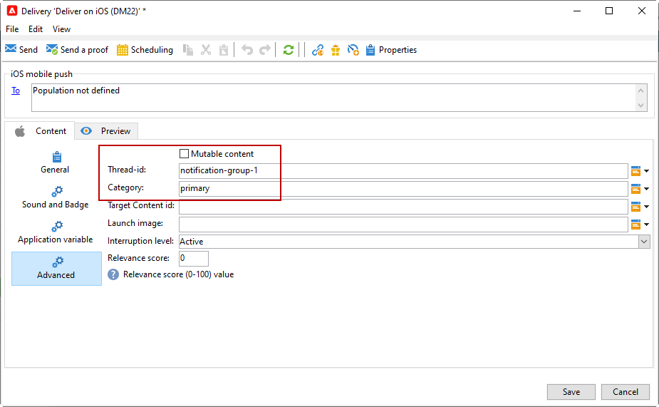

# Creare e inviare notifiche push{#push-notifications-create}

Le consegne tramite app mobile ti consentono di inviare notifiche ai dispositivi iOS e Android.

Prima di iniziare a inviare notifiche push con Adobe Campaign, è necessario assicurarsi che le configurazioni e le integrazioni siano attive nell’app mobile e per i tag in Adobe Experience Platform. [Ulteriori informazioni sulla configurazione push.](push-settings.md).

>[!CAUTION]
>
>Alcune modifiche importanti al servizio Android Firebase Cloud Messaging (FCM) verranno rilasciate nel 2024 e potrebbero influire sull’implementazione di Adobe Campaign. Per supportare questa modifica, potrebbe essere necessario aggiornare la configurazione dei servizi di abbonamento per i messaggi push Android. Puoi già verificare ed eseguire azioni. [Ulteriori informazioni](../../technotes/upgrades/push-technote.md).

## Creare la prima notifica push {#push-create}

Questa sezione descrive gli elementi specifici per la consegna delle notifiche di iOS e Android.

>[!IMPORTANT]
>
>Nel contesto di una distribuzione [Enterprise (FFDA)](../architecture/enterprise-deployment.md), la registrazione mobile è ora **asincrona**. [Ulteriori informazioni](../architecture/staging.md)

Per creare una nuova consegna, passare alla scheda **[!UICONTROL Campaigns]**, fare clic su **[!UICONTROL Deliveries]** e fare clic sul pulsante **[!UICONTROL Create]** sopra l&#39;elenco delle consegne esistenti.

Per impostazione predefinita, Adobe Campaign viene fornito con due modelli di consegna: uno per iOS e uno per Android. Puoi duplicarli per definire le tue impostazioni. Di seguito sono riportati i passaggi per configurare una consegna push in base a questi modelli.

>[!BEGINTABS]

>[!TAB iOS]

Per inviare notifiche sui dispositivi iOS, effettua le seguenti operazioni:

1. Selezionare il modello di consegna **[!UICONTROL Deliver on iOS]**.

   

1. Per definire la destinazione della notifica, fare clic sul collegamento **[!UICONTROL To]**, quindi su **[!UICONTROL Add]**.

   

1. Selezionare **[!UICONTROL Subscribers of an iOS mobile application (iPhone, iPad)]**, selezionare il servizio relativo all&#39;app mobile, quindi selezionare la versione iOS dell&#39;applicazione.

   

1. Scegli **[!UICONTROL Notification type]** tra **[!UICONTROL General notification (Alert, Sound, Badge)]** o **[!UICONTROL Silent notification]**.

   

   >[!NOTE]
   >
   >La modalità **Invio automatico** consente di inviare una notifica &quot;invisibile all&#39;utente&quot; a un&#39;app mobile. L’utente non viene informato dell’arrivo della notifica. Viene trasferita direttamente all’applicazione.

1. Nel campo **[!UICONTROL Title]**, immettere l&#39;etichetta del titolo che si desidera visualizzare nell&#39;elenco delle notifiche disponibili dal centro notifiche.

   Questo campo consente di definire il valore del parametro **title** del payload di notifica iOS.

1. Puoi aggiungere un valore **[!UICONTROL Subtitle]** del parametro **subtitle** del payload di notifica di iOS.

1. Immettere il contenuto del messaggio nella sezione **[!UICONTROL Message content]** della procedura guidata.

1. Dalla scheda **[!UICONTROL Sound and Badge]**, è possibile modificare le opzioni seguenti:

   * **[!UICONTROL Clean Badge]**: abilitare queste opzioni per aggiornare il valore del badge.

   * **[!UICONTROL Value]**: impostare un numero che verrà utilizzato per visualizzare direttamente sull&#39;icona dell&#39;applicazione il numero di nuove informazioni non lette.

   * **[!UICONTROL Critical alert mode]**: abilita questa opzione per aggiungere un suono alla notifica anche se il telefono dell&#39;utente è impostato sulla modalità di attivazione o se l&#39;iPhone è disattivato.

   * **[!UICONTROL Name]**: selezionare il suono che verrà riprodotto dal terminale mobile alla ricezione della notifica.

   * **[!UICONTROL Volume]**: volume dell&#39;audio da 0 a 100.

     >[!NOTE]
     > 
     >I suoni devono essere inclusi nell&#39;applicazione e definiti al momento della creazione del servizio.
     >

   

1. Dalla scheda **[!UICONTROL Application variables]**, **[!UICONTROL Application variables]** viene aggiunto automaticamente. Consentono di definire il comportamento di notifica; ad esempio, puoi configurare una schermata di un’applicazione specifica da visualizzare quando l’utente attiva la notifica.

1. Dalla scheda **[!UICONTROL Advanced]**, è possibile modificare le seguenti opzioni generali:

   * **[!UICONTROL Mutable content]**: abilitare questa opzione per consentire all&#39;app mobile di scaricare contenuti multimediali.

   * **[!UICONTROL Thread-id]**: identificatore utilizzato per raggruppare le notifiche correlate.

   * **[!UICONTROL Category]**: nome dell&#39;ID categoria che visualizzerà i pulsanti di azione. Queste notifiche forniscono all’utente un modo più rapido per eseguire diverse attività in risposta a una notifica senza aprire o esplorare l’applicazione.

   

1. Per le notifiche sensibili all’ora, puoi specificare le seguenti opzioni:

   * **[!UICONTROL Target content ID]**: identificatore utilizzato per individuare la finestra dell&#39;applicazione da portare avanti quando viene aperta la notifica.

   * **[!UICONTROL Launch image]**: nome del file dell&#39;immagine di avvio da visualizzare. Se l’utente sceglie di avviare l’applicazione, viene visualizzata l’immagine selezionata invece della schermata di avvio dell’applicazione.

   * **[!UICONTROL Interruption level]**:

      * **[!UICONTROL Active]**: per impostazione predefinita, il sistema visualizza immediatamente la notifica, illumina lo schermo e può riprodurre un suono. Le notifiche non interrompono le modalità Focus.

      * **[!UICONTROL Passive]**: il sistema aggiunge la notifica all&#39;elenco delle notifiche senza accendere lo schermo o riprodurre un suono. Le notifiche non interrompono le modalità Focus.

      * **[!UICONTROL Time sensitive]** Il sistema presenta immediatamente la notifica, accende lo schermo, può riprodurre un suono e interrompere le modalità di messa a fuoco. Questo livello non richiede un’autorizzazione speciale da Apple.

      * **[!UICONTROL Critical]** Il sistema visualizza immediatamente la notifica, illumina lo schermo e ignora le modalità di disattivazione audio o di attivazione. Tieni presente che questo livello richiede un’autorizzazione speciale da parte di Apple.

   * **[!UICONTROL Relevance score]**: impostare un punteggio di rilevanza da 0 a 100. Il sistema utilizza questa funzione per ordinare le notifiche nel riepilogo delle notifiche.

   

1. Una volta configurata la notifica, fare clic sulla scheda **[!UICONTROL Preview]** per visualizzare l&#39;anteprima della notifica.

   

>[!TAB Android]

Per inviare notifiche sui dispositivi Android, effettua le seguenti operazioni:

1. Selezionare il modello di consegna **[!UICONTROL Deliver on Android (android)]**.

   

   >[!NOTE]
   > 
   >Con le API FCM più recenti (HTTP v1), devi aggiornare i **modelli di consegna** per le notifiche push di Android per aumentare il numero di messaggi batch. A questo scopo, sfoglia le proprietà del modello di consegna Android e, nella scheda **Consegna**, imposta la [quantità batch messaggi](../../v8/send/configure-and-send.md#delivery-batch-quantity) su **256**. Applica questa modifica a tutti i modelli di consegna utilizzati per le consegne Android e a tutte le consegne Android esistenti.

1. Per definire la destinazione della notifica, fare clic sul collegamento **[!UICONTROL To]**, quindi su **[!UICONTROL Add]**.

   

1. Seleziona **[!UICONTROL Subscribers of an Android mobile application]**, scegli il servizio relativo alla tua app mobile (Neotrips, in questo caso), quindi seleziona la versione Android dell&#39;applicazione.

   

1. Quindi inserisci il contenuto per la notifica.

   

1. Fai clic sull&#39;icona **[!UICONTROL Insert emoticon]** per inserire gli emoticon nella notifica push.

1. Nel campo **[!UICONTROL Application variables]**, immettere il valore di ciascuna variabile. Ad esempio, puoi configurare una schermata dell’applicazione specifica da visualizzare quando l’utente attiva la notifica.

1. Una volta configurata la notifica, fare clic sulla scheda **[!UICONTROL Preview]** per visualizzare l&#39;anteprima della notifica.

   <!---->

>[!ENDTABS]

## Testare, inviare e monitorare le notifiche push {#push-test}

Per inviare una bozza e la consegna finale, utilizza lo stesso processo utilizzato per le altre consegne.

Scopri come convalidare una consegna in [questa pagina](preview-and-proof.md).

Scopri come confermare e inviare la consegna in [questa pagina](send.md)

Dopo aver inviato i messaggi, puoi monitorare e tenere traccia delle consegne. Ulteriori informazioni sui motivi degli errori di consegna delle notifiche push in [questa pagina](delivery-failures.md#push-error-types).

