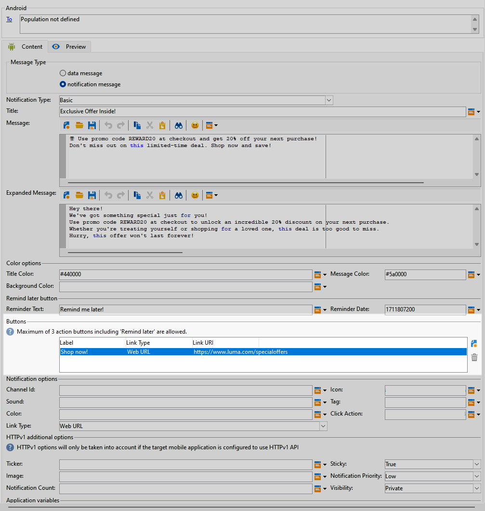
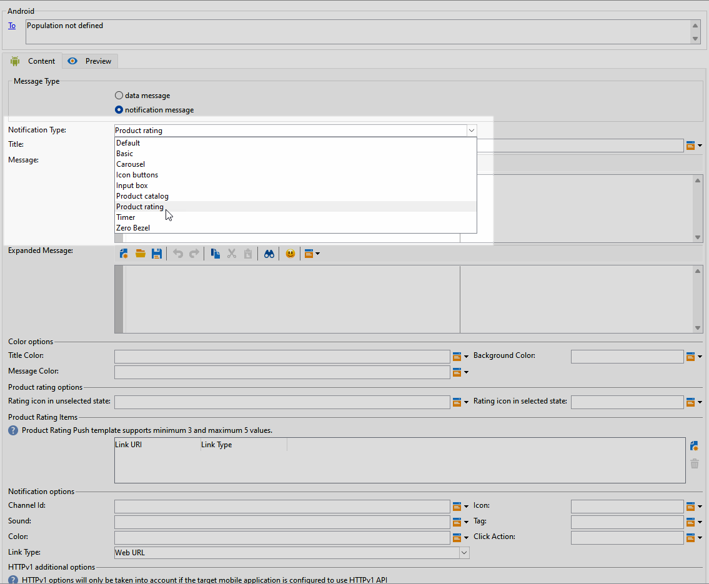
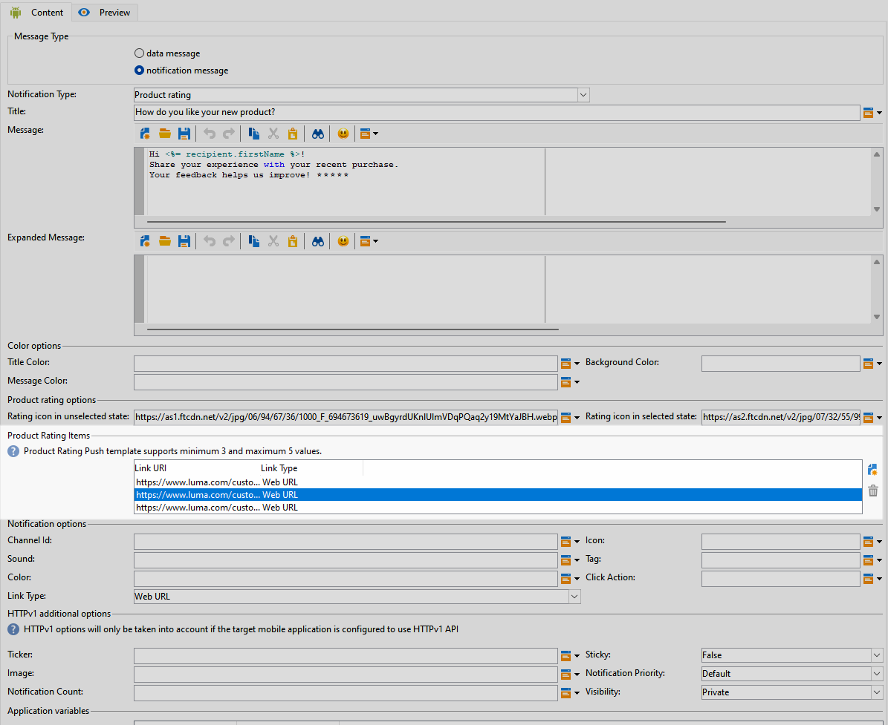

# Progettare una consegna push avanzata per Android {#rich-push}

>[!IMPORTANT]
>
>Prima di progettare una notifica push potenziata, è necessario configurare il connettore V2. Per la procedura dettagliata, consulta [questa pagina](https://experienceleague.adobe.com/en/docs/campaign-classic/using/sending-messages/sending-push-notifications/configure-the-mobile-app/configuring-the-mobile-application-android#configuring-external-account-android).

Con Firebase Cloud Messaging puoi scegliere tra due tipi di messaggi:

* **[!UICONTROL Data message]** è gestito dall&#39;app client. Questi messaggi vengono inviati direttamente all’app mobile, che genera e visualizza una notifica Android sul dispositivo. I messaggi di dati contengono solo variabili dell’applicazione personalizzate.

* **[!UICONTROL Notification message]**, gestito automaticamente da FCM SDK. FCM mostra automaticamente il messaggio sui dispositivi degli utenti per conto dell’app client. I messaggi di notifica contengono un set preimpostato di parametri e opzioni, ma possono ancora essere personalizzati con variabili personalizzate dell’applicazione.

Se la barra di scorrimento è disabilitata nell&#39;interfaccia, accedere a **[!UICONTROL Administration]** `>` **[!UICONTROL Platform]** `>` **[!UICONTROL Options]** e impostare l&#39;opzione **[!UICONTROL XtkUseScrollBar]** su 1.

## Definire il contenuto di una notifica Android {#push-message}

Una volta creata la consegna push, puoi definirne il contenuto utilizzando uno dei seguenti modelli:

* **Predefinito** consente di inviare notifiche con una semplice icona e un&#39;immagine associata.

* **Basic** può includere testo, immagini e pulsanti nelle notifiche.

* **Carosello** consente di inviare notifiche con testo e più immagini che gli utenti possono scorrere.

* **Pulsanti icona** consente di inviare notifiche con un&#39;icona e un&#39;immagine corrispondente.

* **La casella di input** raccoglie l&#39;input e il feedback dell&#39;utente direttamente tramite la notifica.

* **Nel catalogo prodotti** sono visualizzate diverse immagini dei prodotti.

* **Valutazione del prodotto** consente agli utenti di fornire feedback e valutare i prodotti.

* **Timer** include un timer di conto alla rovescia attivo nelle notifiche.

* **Frontale zero** utilizza l&#39;intera superficie di sfondo per un&#39;immagine, con testo sovrapposto senza problemi.

Per ulteriori informazioni su come personalizzare questi modelli, accedi alle schede seguenti.

>[!BEGINTABS]

>[!TAB Predefinito]

1. Dall&#39;elenco a discesa **[!UICONTROL Notification type]**, selezionare **[!UICONTROL Default]**.

   

1. Per comporre il messaggio, immettere il testo nei campi **[!UICONTROL Title]** e **[!UICONTROL Message]**.

   

1. Utilizza i campi di personalizzazione dinamica per definire il contenuto, personalizzare i dati e aggiungere contenuto dinamico. [Ulteriori informazioni](../send/personalize.md)

1. Per personalizzare ulteriormente la notifica push, configurare **[!UICONTROL Notification options]** e **[!UICONTROL HTTPv1 additional options]** della notifica push. [Ulteriori informazioni](#push-advanced)

   

Dopo aver definito il contenuto del messaggio, puoi utilizzare gli abbonati di prova per visualizzare in anteprima e verificare il messaggio.

>[!TAB Base]

1. Dall&#39;elenco a discesa **[!UICONTROL Notification Type]**, selezionare **[!UICONTROL Basic]**.

   

1. Per comporre il messaggio, immettere il testo nei campi **[!UICONTROL Title]**, **[!UICONTROL Message]** e **[!UICONTROL Expanded message]**.

   Il testo **[!UICONTROL Message]** viene visualizzato nella visualizzazione compressa mentre **[!UICONTROL Expanded message]** viene visualizzato quando la notifica viene espansa.

   

1. Utilizza i campi di personalizzazione dinamica per definire il contenuto, personalizzare i dati e aggiungere contenuto dinamico. [Ulteriori informazioni](../send/personalize.md)

1. Nel menu **[!UICONTROL Color options]** immettere i codici colore esadecimali per **[!UICONTROL Title]**, **[!UICONTROL Message]** e **[!UICONTROL Background]**.

1. Aggiungi **[!UICONTROL Remind later button]** se necessario. Immetti **[!UICONTROL Reminder Text]** e **Data** nei campi corrispondenti.

   Nel campo **[!UICONTROL Reminder Date]** è previsto un valore che rappresenta un&#39;epoca in secondi.

1. Fai clic su **[!UICONTROL Add button]** e compila i campi seguenti:

   * **[!UICONTROL Label]**: testo visualizzato sul pulsante.
   * **[!UICONTROL Link URI]**: specificare l&#39;URI da eseguire facendo clic sul pulsante.

   È possibile includere fino a tre pulsanti nella notifica push. Se si sceglie **[!UICONTROL Remind later button]**, è possibile includere solo un massimo di due pulsanti.

1. Seleziona **[!UICONTROL Link type]** dell&#39;URL collegato del pulsante:

   * **[!UICONTROL Web URL]**: gli URL Web indirizzano gli utenti al contenuto online. Facendo clic su, viene richiesto al browser Web predefinito del dispositivo di aprire e passare all&#39;URL designato.

   * **[!UICONTROL Deeplink]**: i collegamenti profondi sono URL che indirizzano gli utenti a sezioni specifiche all&#39;interno di un&#39;app, anche se l&#39;app è chiusa. Facendo clic su di esso, può essere visualizzata una finestra di dialogo che consente agli utenti di scegliere tra varie app in grado di gestire il collegamento.

   * **[!UICONTROL Open App]**: gli URL aperti dell&#39;app consentono di connettersi direttamente al contenuto di un&#39;applicazione. Consente all’applicazione di impostarsi come gestore predefinito per un tipo specifico di collegamento, ignorando la finestra di dialogo per la disambiguazione.

   Per ulteriori informazioni su come gestire i collegamenti alle app Android, consulta la [documentazione per sviluppatori di Android](https://developer.android.com/training/app-links).

   

1. Per personalizzare ulteriormente la notifica push, configurare **[!UICONTROL Notification options]** e **[!UICONTROL HTTPv1 additional options]** della notifica push. [Ulteriori informazioni](#push-advanced)

   

Dopo aver definito il contenuto del messaggio, puoi utilizzare gli abbonati di prova per visualizzare in anteprima e verificare il messaggio.

>[!TAB Carosello]

1. Dall&#39;elenco a discesa **[!UICONTROL Notification Type]**, selezionare **[!UICONTROL Carousel]**.

   

1. Per comporre il messaggio, immettere il testo nei campi **[!UICONTROL Title]**, **[!UICONTROL Message]** e **[!UICONTROL Expanded message]**.

   Il testo **[!UICONTROL Message]** viene visualizzato nella visualizzazione compressa mentre **[!UICONTROL Expanded message]** viene visualizzato quando la notifica viene espansa.

   

1. Utilizza l’editor espressioni per definire il contenuto, personalizzare i dati e aggiungere contenuto dinamico. [Ulteriori informazioni](../send/personalize.md)

1. Nel menu **[!UICONTROL Color options]** immettere i codici colore esadecimali per **[!UICONTROL Title]**, **[!UICONTROL Message]** e **[!UICONTROL Background]**.

1. Scegli come funziona **[!UICONTROL Carousel]**:

   * **[!UICONTROL Auto]**: passa automaticamente da un&#39;immagine all&#39;altra sotto forma di diapositive, passando a intervalli predefiniti.
   * **[!UICONTROL Manual]**: consente agli utenti di scorrere manualmente tra le diapositive per spostarsi tra le immagini.

1. Dall&#39;elenco a discesa **[!UICONTROL Layout]**, selezionare l&#39;opzione **[!UICONTROL Filmstrip]** per includere anteprime delle immagini precedenti e successive insieme alla diapositiva principale.

1. Fai clic su **[!UICONTROL Add image]** e immetti l&#39;URL dell&#39;immagine, il testo e l&#39;URL dell&#39;azione.

   Assicurati di includere un minimo di tre immagini e un massimo di cinque.

   

1. Per personalizzare ulteriormente la notifica push, configurare **[!UICONTROL Notification options]** e **[!UICONTROL HTTPv1 additional options]** della notifica push. [Ulteriori informazioni](#push-advanced)

   

Dopo aver definito il contenuto del messaggio, puoi utilizzare gli abbonati di prova per visualizzare in anteprima e verificare il messaggio.

>[!TAB Pulsanti icona]

1. Dall&#39;elenco a discesa **[!UICONTROL Notification Type]**, selezionare **[!UICONTROL Icon buttons]**.

   

1. Nel menu **[!UICONTROL Color options]** immettere i codici colore esadecimali per **[!UICONTROL Background]**.

   

1. Specificare l&#39;URL per **[!UICONTROL Cancel button image]**.

1. In **[!UICONTROL Icon image buttons]**, fare clic su **[!UICONTROL Add image]**. Immettere quindi l&#39;**URL immagine**, il **tipo collegamento** e l&#39;**URI collegamento**.

   Accertatevi di includere un minimo di tre immagini e un massimo di cinque pulsanti.

   

1. Per personalizzare ulteriormente la notifica push, configurare **[!UICONTROL Notification options]** e **[!UICONTROL HTTPv1 additional options]** della notifica push. [Ulteriori informazioni](#push-advanced)

   

Dopo aver definito il contenuto del messaggio, puoi utilizzare gli abbonati di prova per visualizzare in anteprima e verificare il messaggio.

>[!TAB Casella di input]

1. Dall&#39;elenco a discesa **[!UICONTROL Notification Type]**, selezionare **[!UICONTROL Input box]**.

   

1. Per comporre il messaggio, immettere il testo nei campi **[!UICONTROL Title]**, **[!UICONTROL Message]** e **[!UICONTROL Expanded message]**.

   Il testo **[!UICONTROL Message]** viene visualizzato nella visualizzazione compressa mentre **[!UICONTROL Expanded message]** viene visualizzato quando la notifica viene espansa.

   

1. Nel menu **[!UICONTROL Color options]** immettere i codici colore esadecimali per **[!UICONTROL Title]**, **[!UICONTROL Message]** e **[!UICONTROL Background]**.

1. Nel menu **[!UICONTROL Input box options]**, compila la seguente opzione:

   * **[!UICONTROL Input receiver name]**: immettere il nome o l&#39;identificatore del destinatario dell&#39;input.
   * **[!UICONTROL Input text]**: immettere il testo per la **casella di input**.
   * **[!UICONTROL Feedback text]**: immettere il testo da visualizzare dopo una risposta.
   * **[!UICONTROL Feedback image]**: aggiungi l&#39;URL per l&#39;immagine visualizzata dopo una risposta.

   

1. Per personalizzare ulteriormente la notifica push, configurare **[!UICONTROL Notification options]** e **[!UICONTROL HTTPv1 additional options]** della notifica push. [Ulteriori informazioni](#push-advanced)

   

Dopo aver definito il contenuto del messaggio, puoi utilizzare gli abbonati di prova per visualizzare in anteprima e verificare il messaggio.

>[!TAB Catalogo prodotti]

1. Dall&#39;elenco a discesa **[!UICONTROL Notification Type]**, selezionare **[!UICONTROL Product catalog]**.

   

1. Per comporre il messaggio, immettere il testo nei campi **[!UICONTROL Title]**, **[!UICONTROL Message]** e **[!UICONTROL Expanded message]**.

   Il testo **[!UICONTROL Message]** viene visualizzato nella visualizzazione compressa mentre **[!UICONTROL Expanded message]** viene visualizzato quando la notifica viene espansa.

   

1. Nel menu **[!UICONTROL Color options]** immettere i codici colore esadecimali per **[!UICONTROL Title]**, **[!UICONTROL Message]** e **[!UICONTROL Background]**.

1. Nel menu **[!UICONTROL Product catalog options]**, compila le seguenti opzioni:

   * **[!UICONTROL Action button text]**: testo visualizzato sul pulsante.
   * **[!UICONTROL Action button text color]**: colore del testo del pulsante Azione.
   * **[!UICONTROL Action button color]**: colore del pulsante Azione.
   * **[!UICONTROL Action button URI]**: specificare l&#39;URI da eseguire facendo clic sul pulsante.
   * **[!UICONTROL Display type]**: scegliere tra visualizzazione verticale o orizzontale.

   

1. Nel menu **[!UICONTROL Product catalog items]**, fare clic su **[!UICONTROL Add]** e immettere i dettagli seguenti per ogni elemento:

   * **[!UICONTROL Title]**
   * **[!UICONTROL Description]**
   * **[!UICONTROL Image URL]**
   * **[!UICONTROL Price]**
   * **[!UICONTROL URI]**

   Assicurati di includere un massimo di tre elementi.

   

1. Per personalizzare ulteriormente la notifica push, configurare **[!UICONTROL Notification options]** e **[!UICONTROL HTTPv1 additional options]** della notifica push. [Ulteriori informazioni](#push-advanced)

Dopo aver definito il contenuto del messaggio, puoi utilizzare gli abbonati di prova per visualizzare in anteprima e verificare il messaggio.

>[!TAB Valutazione del prodotto]

1. Dall&#39;elenco a discesa **[!UICONTROL Notification Type]**, selezionare **[!UICONTROL Product rating]**.

   

1. Per comporre il messaggio, immettere il testo nei campi **[!UICONTROL Title]**, **[!UICONTROL Message]** e **[!UICONTROL Expanded message]**.

   Il testo **[!UICONTROL Message]** viene visualizzato nella visualizzazione compressa mentre **[!UICONTROL Expanded message]** viene visualizzato quando la notifica viene espansa.

   

1. Nel menu **[!UICONTROL Color options]** immettere i codici colore esadecimali per **[!UICONTROL Title]**, **[!UICONTROL Message]** e **[!UICONTROL Background]**.

1. Nel menu **[!UICONTROL Product rating options]**, immettere gli URL per **[!UICONTROL Rating icon in unselected state]** e **[!UICONTROL Rating icon in selected state]**.

   

1. Nel menu **[!UICONTROL Product rating items]**, fare clic su **[!UICONTROL Add]**, immettere **[!UICONTROL Link URI]** e scegliere **[!UICONTROL Link type]**.

   * **[!UICONTROL Web URL]**: gli URL Web indirizzano gli utenti al contenuto online. Facendo clic su, viene richiesto al browser Web predefinito del dispositivo di aprire e passare all&#39;URL designato.

   * **[!UICONTROL Deeplink]**: i collegamenti profondi sono URL che indirizzano gli utenti a sezioni specifiche all&#39;interno di un&#39;app, anche se l&#39;app è chiusa. Facendo clic su di esso, può essere visualizzata una finestra di dialogo che consente agli utenti di scegliere tra varie app in grado di gestire il collegamento.

   * **[!UICONTROL Open App]**: gli URL aperti dell&#39;app consentono di connettersi direttamente al contenuto di un&#39;applicazione. Consente all’applicazione di impostarsi come gestore predefinito per un tipo specifico di collegamento, ignorando la finestra di dialogo per la disambiguazione.

   * **[!UICONTROL Dismiss]**: nessun URL associato al pulsante. Facendo clic su si chiude la finestra di dialogo o l&#39;interfaccia.

   Assicurati di includere un minimo di tre valori e un massimo di cinque valori.

   

1. Per personalizzare ulteriormente la notifica push, configurare **[!UICONTROL Notification options]** e **[!UICONTROL HTTPv1 additional options]** della notifica push. [Ulteriori informazioni](#push-advanced)

   

Dopo aver definito il contenuto del messaggio, puoi utilizzare gli abbonati di prova per visualizzare in anteprima e verificare il messaggio.

>[!TAB Timer]

1. Dall&#39;elenco a discesa **[!UICONTROL Notification Type]**, selezionare **[!UICONTROL Timer]**.

   

1. Per comporre il messaggio, immettere il testo nei campi **[!UICONTROL Title]**, **[!UICONTROL Message]** e **[!UICONTROL Expanded message]**.

   Il testo **[!UICONTROL Message]** viene visualizzato nella visualizzazione compressa mentre **[!UICONTROL Expanded message]** viene visualizzato quando la notifica viene espansa.

   

1. Immettere il testo che verrà visualizzato dopo la scadenza del timer nei campi **[!UICONTROL Alternate title]**, **[!UICONTROL Alternate message]** e **[!UICONTROL Alternate expanded message]**.

1. Nel menu **[!UICONTROL Color options]** immettere i codici colore esadecimali per **[!UICONTROL Title]**, **[!UICONTROL Message]**, **[!UICONTROL Background]** e **[!UICONTROL Timer]**.

   

1. Imposta **[!UICONTROL Timer duration]** in secondi o **[!UICONTROL Timer end timestamp]** su un timestamp epoca specifico e aggiungi l&#39;URL **[!UICONTROL Alternate image]** che verrà visualizzato dopo la scadenza del timer.

   

1. Per personalizzare ulteriormente la notifica push, configurare **[!UICONTROL Notification options]** e **[!UICONTROL HTTPv1 additional options]** della notifica push. [Ulteriori informazioni](#push-advanced)

Dopo aver definito il contenuto del messaggio, puoi utilizzare gli abbonati di prova per visualizzare in anteprima e verificare il messaggio.

>[!TAB Frontale zero]

1. Dall&#39;elenco a discesa **[!UICONTROL Notification Type]**, selezionare **[!UICONTROL Zero bezel]**.

   

1. Per comporre il messaggio, immettere il testo nei campi **[!UICONTROL Title]**, **[!UICONTROL Message]** e **[!UICONTROL Expanded message]**.

   Il testo **[!UICONTROL Message]** viene visualizzato nella visualizzazione compressa mentre **[!UICONTROL Expanded message]** viene visualizzato quando la notifica viene espansa.

   

1. Nel menu **[!UICONTROL Color options]** immettere i codici colore esadecimali per **[!UICONTROL Title]**, **[!UICONTROL Message]** e **[!UICONTROL Background]**.

1. Nel menu **[!UICONTROL Zero bezel options]**, aggiungi l&#39;URL immagine nel campo **[!UICONTROL Collapsed notification style]**.

   

1. Per personalizzare ulteriormente la notifica push, configurare **[!UICONTROL Notification options]** e **[!UICONTROL HTTPv1 additional options]** della notifica push. [Ulteriori informazioni](#push-advanced)

Dopo aver definito il contenuto del messaggio, puoi utilizzare gli abbonati di prova per visualizzare in anteprima e verificare il messaggio.

>[!ENDTABS]

## Impostazioni avanzate della notifica push {#push-advanced}

### Opzioni di notifica {#notification-options}

| Parametro | Descrizione |
|---------|---------|
| **[!UICONTROL Channel ID]** | Imposta l’ID canale della notifica. L’app deve creare un canale con questo ID canale prima di ricevere qualsiasi notifica con questo ID canale. |
| **[!UICONTROL Icon]** | Imposta l’icona della notifica da visualizzare sui dispositivi dei profili. |
| **[!UICONTROL Sound]** | Imposta l’audio da riprodurre quando il dispositivo riceve la notifica. |
| **[!UICONTROL Tag]** | Imposta un identificatore utilizzato per sostituire le notifiche esistenti nella barra delle notifiche. In questo modo si evita l’accumulo di notifiche multiple e si garantisce che venga visualizzata solo la notifica pertinente più recente. |
| **[!UICONTROL Color]** | Imposta il colore dell’icona della notifica con codice colore esadecimale. |
| **[!UICONTROL Click action]** | Imposta l’azione associata a un utente che fa clic sulla notifica. |
| **[!UICONTROL Notification background color]** | Imposta il colore dello sfondo della notifica con i codici di colore esadecimali. |
| **[!UICONTROL Link type]** | <ul><li>URL web: gli URL web indirizzano gli utenti al contenuto online. Facendo clic su, viene richiesto al browser Web predefinito del dispositivo di aprire e passare all&#39;URL designato.</li><li>Deeplink: i collegamenti profondi sono URL che guidano gli utenti verso sezioni specifiche all&#39;interno di un&#39;app, anche se l&#39;app è chiusa. Facendo clic su di esso, può essere visualizzata una finestra di dialogo che consente agli utenti di scegliere tra varie app in grado di gestire il collegamento.</li><li> App aperta: gli URL aperti dell’app ti consentono di connettersi direttamente al contenuto all’interno di un’applicazione. Consente all’applicazione di impostarsi come gestore predefinito per un tipo specifico di collegamento, ignorando la finestra di dialogo per la disambiguazione.</li></ul> |

### Opzioni aggiuntive HTTPv1 {#additional-options}

| Parametro | Descrizione |
|---------|---------|
| **[!UICONTROL Ticker]** | Imposta il testo del segno di spunta della notifica. Disponibile solo per i dispositivi impostati su Android 5.0 Lollipop. |
| **[!UICONTROL Sticky]** | Quando è attivata, la notifica rimane visibile anche dopo che l’utente fa clic su di essa.  Se è disattivata, la notifica viene automaticamente ignorata quando l’utente interagisce con essa. Il comportamento permanente consente alle notifiche importanti di rimanere sullo schermo per periodi più lunghi. |
| **[!UICONTROL Image]** | Imposta l&#39;URL dell&#39;immagine da visualizzare nella notifica. |
| **[!UICONTROL Notification Priority]** | Imposta il livello di priorità della notifica, che può essere predefinito, minimo, basso o alto. Il livello di priorità determina l’importanza e l’urgenza della notifica, influenzandone la modalità di visualizzazione e la possibilità di ignorare determinate impostazioni di sistema. Per ulteriori informazioni, consulta la [documentazione FCM ](https://firebase.google.com/docs/reference/fcm/rest/v1/projects.messages#notificationpriority). |
| **[!UICONTROL Notification Count]** | Imposta il numero di nuove informazioni non lette da visualizzare direttamente sull’icona dell’applicazione. Questo consente all’utente di visualizzare rapidamente il numero di notifiche in sospeso. |
| **[!UICONTROL Visibility]** | Imposta il livello di visibilità della notifica, che può essere pubblica, privata o segreta. Il livello di visibilità determina la quantità di contenuto della notifica viene visualizzata nella schermata di blocco e in altre aree sensibili. Per ulteriori informazioni, consulta la [documentazione FCM](https://firebase.google.com/docs/reference/fcm/rest/v1/projects.messages#visibility). |
| **[!UICONTROL Application variables]** | Consente di definire il comportamento di notifica. Queste variabili sono completamente personalizzabili e sono incluse nel payload del messaggio inviato al dispositivo mobile. |
