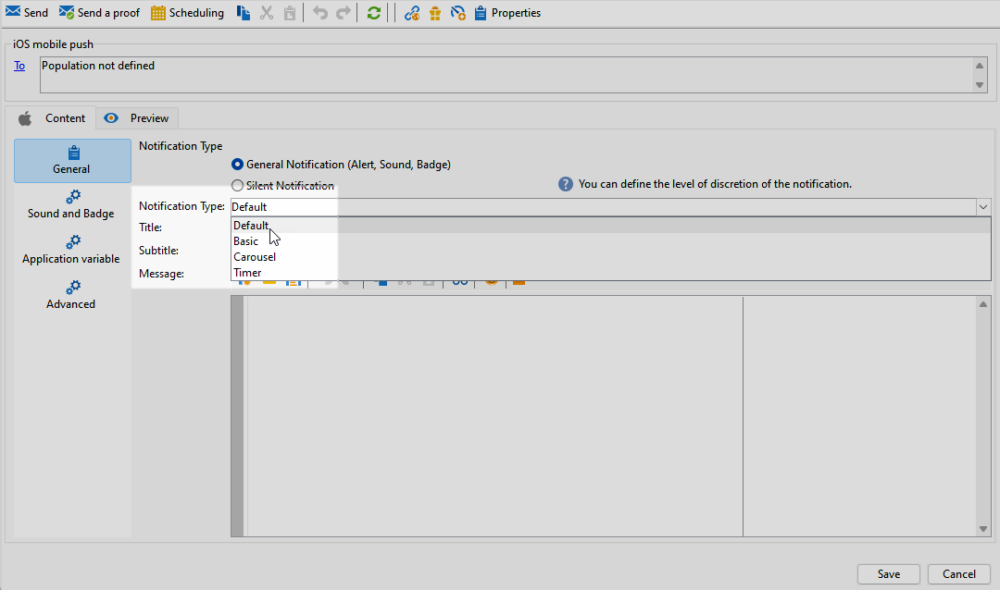
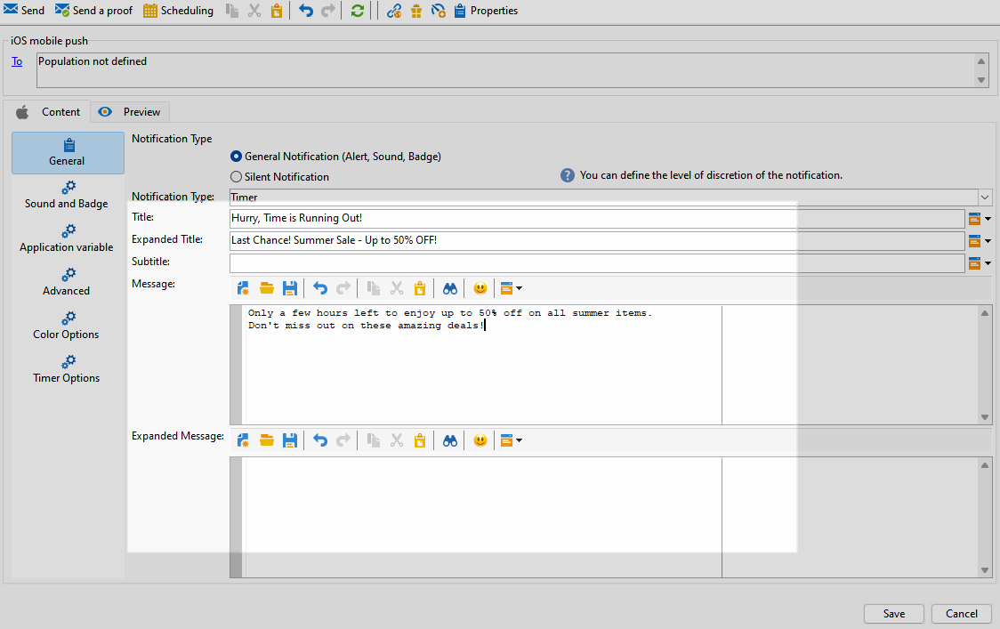
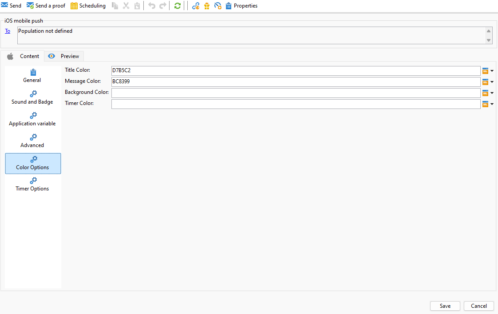

# Progettare una consegna push iOS avanzata {#rich-push}

>[!IMPORTANT]
>
>Prima di progettare una notifica push potenziata, è necessario configurare il connettore V2. Per la procedura dettagliata, consulta [questa pagina](https://experienceleague.adobe.com/en/docs/campaign-classic/using/sending-messages/sending-push-notifications/configure-the-mobile-app/configuring-the-mobile-application).

## Definire il contenuto di una notifica iOS {#push-message}

Una volta creata la consegna push, puoi definirne il contenuto utilizzando uno dei seguenti modelli:

* **Predefinito** consente di inviare notifiche con una semplice icona e un&#39;immagine associata.

* **Basic** può includere testo, immagini e pulsanti nelle notifiche.

* **Carosello** consente di inviare notifiche con testo e più immagini che gli utenti possono scorrere.

Per ulteriori informazioni su come personalizzare questi modelli, accedi alle schede seguenti.

>[!BEGINTABS]

>[!TAB Predefinito]

1. Scegli **[!UICONTROL General notification (Alert, Sound, Badge)]** come **[!UICONTROL Notification type]**.

1. Dall&#39;elenco a discesa **[!UICONTROL Notification Type]**, selezionare **[!UICONTROL Default]**.

   

1. Nel campo **[!UICONTROL Title]**, immettere l&#39;etichetta del titolo che si desidera visualizzare nell&#39;elenco delle notifiche disponibili dal centro notifiche.

   Questo campo consente di definire il valore del parametro **title** del payload di notifica iOS.

1. Facoltativamente, aggiungi **[!UICONTROL Subtitle]**, che corrisponde al parametro **subtitle** del payload di notifica di iOS.

1. Immettere il contenuto del messaggio nella sezione **[!UICONTROL Message content]** della procedura guidata.

   

1. Passare alla scheda **[!UICONTROL Sound and Badge]** per personalizzare ulteriori impostazioni, ad esempio le opzioni audio e di badge per le notifiche. [Ulteriori informazioni](#sound-badge)

   

1. Dalla scheda **[!UICONTROL Application variables]**, **[!UICONTROL Application variables]** viene aggiunto automaticamente. Consentono di definire il comportamento di notifica; ad esempio, puoi configurare una schermata di un’applicazione specifica da visualizzare quando l’utente attiva la notifica.

1. Per ulteriori personalizzazioni, esplora **[!UICONTROL Advanced options]** disponibile per le notifiche push. [Ulteriori informazioni](#push-advanced)

   

1. Una volta configurata la notifica, fare clic sulla scheda **[!UICONTROL Preview]** per visualizzare l&#39;anteprima della notifica.

>[!TAB Base]

1. Scegli **[!UICONTROL General notification (Alert, Sound, Badge)]** come **[!UICONTROL Notification type]**.

1. Dall&#39;elenco a discesa **[!UICONTROL Notification Type]**, selezionare **[!UICONTROL Basic]**.

   

1. Per comporre il messaggio, immettere il testo nei campi **[!UICONTROL Title]**,**[!UICONTROL Expanded message]**, **[!UICONTROL Message]** e **[!UICONTROL Expanded message]**.

   Il testo **[!UICONTROL Message]** viene visualizzato nella visualizzazione compressa mentre **[!UICONTROL Expanded message]** viene visualizzato quando la notifica viene espansa.

   

1. Facoltativamente, aggiungi **[!UICONTROL Subtitle]**, che corrisponde al parametro **subtitle** del payload di notifica di iOS.

1. Passare alla scheda **[!UICONTROL Sound and Badge]** per personalizzare ulteriori impostazioni, ad esempio le opzioni audio e di badge per le notifiche. [Ulteriori informazioni](#sound-badge)

1. Dalla scheda **[!UICONTROL Application variables]**, **[!UICONTROL Application variables]** viene aggiunto automaticamente. Consentono di definire il comportamento di notifica; ad esempio, puoi configurare una schermata di un’applicazione specifica da visualizzare quando l’utente attiva la notifica.

1. Per ulteriori personalizzazioni, esplora **[!UICONTROL Advanced options]** disponibile per le notifiche push. [Ulteriori informazioni](#push-advanced)

   

1. Nel menu **[!UICONTROL Color options]** immettere i codici colore esadecimali per **[!UICONTROL Title]**, **[!UICONTROL Message]** e **[!UICONTROL Background]**.

   

Dopo aver definito il contenuto del messaggio, puoi utilizzare gli abbonati di prova per visualizzare in anteprima e verificare il messaggio.

>[!TAB Carosello]

1. Scegli **[!UICONTROL General notification (Alert, Sound, Badge)]** come **[!UICONTROL Notification type]**.

1. Dall&#39;elenco a discesa **[!UICONTROL Notification Type]**, selezionare **[!UICONTROL Carousel]**.

   

1. Per comporre il messaggio, immettere il testo nei campi **[!UICONTROL Title]**, **[!UICONTROL Expanded Title]** e **[!UICONTROL Message]**.

   

1. Passare alla scheda **[!UICONTROL Sound and Badge]** per personalizzare ulteriori impostazioni, ad esempio le opzioni audio e di badge per le notifiche. [Ulteriori informazioni](#sound-badge)

1. Dalla scheda **[!UICONTROL Application variables]**, **[!UICONTROL Application variables]** viene aggiunto automaticamente. Consentono di definire il comportamento di notifica; ad esempio, puoi configurare una schermata di un’applicazione specifica da visualizzare quando l’utente attiva la notifica.

   

1. Per ulteriori personalizzazioni, esplora **[!UICONTROL Advanced options]** disponibile per le notifiche push. [Ulteriori informazioni](#push-advanced)

1. Nel menu **[!UICONTROL Color options]** immettere i codici colore esadecimali per **[!UICONTROL Title]**, **[!UICONTROL Message]** e **[!UICONTROL Background]**.

1. Scegliere il funzionamento di **[!UICONTROL Carousel]** nella scheda **[!UICONTROL Carousel options]**:

   * **[!UICONTROL Auto]**: passa automaticamente da un&#39;immagine all&#39;altra sotto forma di diapositive, passando a intervalli predefiniti.
   * **[!UICONTROL Manual]**: consente agli utenti di scorrere manualmente tra le diapositive per spostarsi tra le immagini.

1. Fai clic su **[!UICONTROL Add image]** e immetti **[!UICONTROL Image URL]**, **[!UICONTROL Text]** e **[!UICONTROL Action URL]**.

   Assicurati di includere un minimo di tre immagini e un massimo di cinque.

   

Dopo aver definito il contenuto del messaggio, puoi utilizzare gli abbonati di prova per visualizzare in anteprima e verificare il messaggio.

>[!TAB Timer]

1. Scegli **[!UICONTROL General notification (Alert, Sound, Badge)]** come **[!UICONTROL Notification type]**.

1. Dall&#39;elenco a discesa **[!UICONTROL Notification Type]**, selezionare **[!UICONTROL Timer]**.

   

1. Per comporre il messaggio, immettere il testo nei campi **[!UICONTROL Title]**,**[!UICONTROL Expanded title]**, **[!UICONTROL Message]** e **[!UICONTROL Expanded message]**.

   Il testo **[!UICONTROL Message]** viene visualizzato nella visualizzazione compressa mentre **[!UICONTROL Expanded message]** viene visualizzato quando la notifica viene espansa.

   

1. Facoltativamente, aggiungi **[!UICONTROL Subtitle]**, che corrisponde al parametro **subtitle** del payload di notifica di iOS.

1. Passare alla scheda **[!UICONTROL Sound and Badge]** per personalizzare ulteriori impostazioni, ad esempio le opzioni audio e di badge per le notifiche. [Ulteriori informazioni](#sound-badge)

1. Dalla scheda **[!UICONTROL Application variables]**, **[!UICONTROL Application variables]** viene aggiunto automaticamente. Consentono di definire il comportamento di notifica; ad esempio, puoi configurare una schermata di un’applicazione specifica da visualizzare quando l’utente attiva la notifica.

1. Per ulteriori personalizzazioni, esplora **[!UICONTROL Advanced options]** disponibile per le notifiche push. [Ulteriori informazioni](#push-advanced)

1. Nel menu **[!UICONTROL Color options]** immettere i codici colore esadecimali per **[!UICONTROL Title]**, **[!UICONTROL Message]** e **[!UICONTROL Background]**.

   

1. Dalla scheda **[!UICONTROL Timer]**, imposta **[!UICONTROL Timer duration]** in secondi o **[!UICONTROL Timer end timestamp]** su un timestamp epoca specifico.

1. Immettere il testo e l&#39;immagine che verranno visualizzati dopo la scadenza del timer nei campi **[!UICONTROL Alternate title]**, **[!UICONTROL Alternate message]** e **[!UICONTROL Alternate image]**.

   

Dopo aver definito il contenuto del messaggio, puoi utilizzare gli abbonati di prova per visualizzare in anteprima e verificare il messaggio.

>[!ENDTABS]

## Impostazioni avanzate della notifica push {#push-advanced}

### Opzioni audio e badge {#sound-badge}

| Parametro | Descrizione |
|---------|---------|
| **[!UICONTROL Clean Badge]** | Abilita queste opzioni per aggiornare il valore del badge. |
| **[!UICONTROL Value]** | Impostare un numero che verrà utilizzato per visualizzare direttamente sull&#39;icona dell&#39;applicazione il numero di nuove informazioni non lette. |
| **[!UICONTROL Critical alert mode]** | Abilita questa opzione per aggiungere un suono alla notifica anche se il telefono dell’utente è impostato sulla modalità di attivazione o se l’iPhone è disattivato. |
| **[!UICONTROL Name]** | Selezionare il suono che verrà riprodotto dal terminale mobile alla ricezione della notifica. |
| **[!UICONTROL Volume]** | Impostare il volume dell&#39;audio da 0 a 100. I suoni devono essere inclusi nell&#39;applicazione e definiti al momento della creazione del servizio. |

### Opzioni avanzate {#notification-options}

| Parametro | Descrizione |
|---------|---------|
| **[!UICONTROL Mutable content]** | Abilita questa opzione per consentire all’app mobile di scaricare contenuti multimediali. |
| **[!UICONTROL Thread-id]** | Imposta l’identificatore utilizzato per raggruppare le notifiche correlate. |
| **[!UICONTROL Category]** | Imposta il nome dell&#39;ID categoria che visualizzerà i pulsanti di azione. Queste notifiche forniscono all’utente un modo più rapido per eseguire diverse attività in risposta a una notifica senza aprire o esplorare l’applicazione. |
| **[!UICONTROL Target content ID]** | Impostare un identificatore utilizzato per impostare la finestra dell&#39;applicazione da portare avanti quando viene aperta la notifica. |
| **[!UICONTROL Launch image]** | Imposta il nome del file dell&#39;immagine di avvio da visualizzare. Se l’utente sceglie di avviare l’applicazione, viene visualizzata l’immagine selezionata invece della schermata di avvio dell’applicazione. |
| **[!UICONTROL Click action]** | Imposta l’azione associata a un utente che fa clic sulla notifica. |
| **[!UICONTROL Interruption level]** | <ul><li>Attivo: per impostazione predefinita, il sistema presenta immediatamente la notifica, illumina lo schermo e può riprodurre un suono. Le notifiche non interrompono le modalità di attivazione.</li><li>Passivo: il sistema aggiunge la notifica all’elenco delle notifiche senza accendere lo schermo o riprodurre un suono. Le notifiche non interrompono le modalità Focus.</li><li> Sensibile al tempo: il sistema presenta immediatamente la notifica, accende lo schermo, può riprodurre un suono e interrompere le modalità di messa a fuoco. Questo livello non richiede un’autorizzazione speciale da Apple.</li><li>Critico: il sistema presenta immediatamente la notifica, illumina lo schermo e ignora le modalità di disattivazione audio o di messa a fuoco. Tieni presente che questo livello richiede un’autorizzazione speciale da parte di Apple.</li></ul> |
| **[!UICONTROL Relevance score]** | Imposta un punteggio di rilevanza da 0 a 100. Il sistema utilizza questa funzione per ordinare le notifiche nel riepilogo delle notifiche. |
