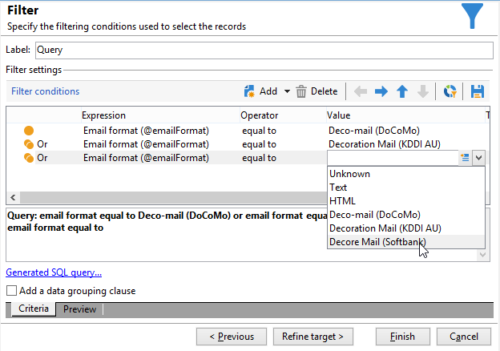

# Inviare e-mail su cellulari giapponesi {#sending-emails-on-japanese-mobiles}

## Formati e-mail per dispositivi mobili giapponesi {#email-formats-for-japanese-mobiles}

Adobe Campaign gestisce tre formati giapponesi specifici per le e-mail sui dispositivi mobili: **Deco-mail** (dispositivi mobili DoCoMo), **Decore Mail** (dispositivi mobili Softbank) e **Decoration Mail** (dispositivi mobili KDDI AU). Questi formati impongono particolari vincoli di codifica, struttura e dimensione. Ulteriori informazioni su limitazioni e raccomandazioni in [questa sezione](#limitations-and-recommendations).

Affinché il destinatario riceva correttamente i messaggi in uno di questi formati, è consigliabile selezionare **[!UICONTROL Deco-mail (DoCoMo)]**, **[!UICONTROL Decore Mail (Softbank)]** o **[!UICONTROL Decoration Mail (KDDI AU)]** nel profilo corrispondente:

Se tuttavia si lascia l&#39;opzione **[!UICONTROL Email format]** come **[!UICONTROL Unknown]**, **[!UICONTROL HTML]** o **[!UICONTROL Text]**, Adobe Campaign rileverà automaticamente (durante l&#39;invio dell&#39;e-mail) il formato giapponese da utilizzare per visualizzare correttamente il messaggio.

Questo sistema di rilevamento automatico si basa sull&#39;elenco di domini predefiniti definiti nel set di regole di posta **[!UICONTROL Management of Email Formats]**. Per ulteriori informazioni sulla gestione dei formati di posta elettronica, consulta la [documentazione di Campaign Classic](https://experienceleague.adobe.com/docs/campaign-classic/using/installing-campaign-classic/additional-configurations/email-deliverability.html?lang=it#managing-email-formats).

## Limitazioni e raccomandazioni {#limitations-and-recommendations}

Per l’invio di e-mail che verranno lette su un dispositivo mobile gestito da un provider giapponese (Softbank, DoCoMo, KDDI AU) si applicano alcuni vincoli.

Pertanto, devi:

* Usa solo immagini in formato JPEG o GIF
* Creare una consegna con sezioni di testo e HTML che siano strettamente inferiori a 10.000 byte (per KDDI AU e DoCoMo)
* Utilizza immagini con una dimensione totale (prima della codifica) inferiore a 100 KB
* Non utilizzare più di 20 immagini per messaggio
* Utilizza un formato HTML di dimensioni ridotte (per ogni operatore è disponibile un numero limitato di tag)

>[!NOTE]
>
>Le limitazioni specifiche di ciascun operatore devono essere tenute in considerazione durante la creazione del messaggio. Consulta la relativa documentazione del prodotto.

## Verificare il contenuto dell’e-mail {#testing-the-email-content}

### Anteprima del messaggio {#previewing-the-message}

Adobe Campaign consente di verificare che il formato del messaggio sia adattato per essere inviato a un cellulare giapponese.

Dopo aver definito il contenuto e inserito l’oggetto dell’e-mail, puoi controllare la visualizzazione e la formattazione al momento della creazione del messaggio.

Nella scheda **[!UICONTROL Preview]** della finestra di modifica del contenuto, facendo clic su **[!UICONTROL More... > Deco-mail diagnostic]** è possibile:

* Verifica che i tag di contenuto di HTML siano conformi alle restrizioni del formato giapponese
* Verifica che il numero di immagini nel messaggio non superi il limite imposto dal formato (20 immagini)
* Verifica la dimensione totale del messaggio (inferiore a 100 KB)

  

### Eseguire la regola di tipologia {#running-typology-rule}

Oltre alla diagnosi di anteprima, viene eseguito un secondo controllo durante l&#39;invio di una bozza o di una consegna: durante l&#39;analisi viene avviata una regola di tipologia specifica, **[!UICONTROL Deco-mail check]**.

>[!IMPORTANT]
>
>Questa regola di tipologia viene eseguita solo se almeno uno dei destinatari è configurato per ricevere e-mail in formato **[!UICONTROL Deco-mail (DoCoMo)]**, **[!UICONTROL Decore Mail (Softbank)]** o **[!UICONTROL Decoration Mail (KDDI AU)]**.

Questa regola di tipologia ti consente di verificare che la consegna rispetti i [vincoli di formato](#limitations-and-recommendations) definiti dagli operatori giapponesi, in particolare in relazione alle dimensioni totali dell&#39;e-mail, alle dimensioni delle sezioni HTML e text, al numero di immagini nei messaggi e ai tag nel contenuto di HTML.

### Inviare bozze {#sending-proofs}

Puoi inviare delle bozze per verificare la consegna. Quando invii la bozza, se utilizzi indirizzi di sostituzione, inserisci gli indirizzi che corrispondono al formato e-mail del profilo utilizzato.

Ad esempio, puoi sostituire l&#39;indirizzo di un profilo con test@softbank.ne.jp se il formato e-mail per questo profilo è stato definito in precedenza il **[!UICONTROL Decore Mail (Softbank)]**.

## Inviare messaggi {#sending-messages}

Per inviare un’e-mail a destinatari con formati e-mail giapponesi con Campaign, sono possibili due opzioni:

* Creare due consegne: una solo per i destinatari giapponesi e un&#39;altra per gli altri destinatari. Fare riferimento a [questa sezione](#designing-a-specific-delivery-for-japanese-formats).
* Creare una singola consegna e Adobe Campaign rileverà automaticamente il formato da utilizzare. Fare riferimento a [questa sezione](#designing-a-delivery-for-all-formats).

### Progettare una consegna specifica per i formati giapponesi {#designing-a-specific-delivery-for-japanese-formats}

Puoi creare un flusso di lavoro contenente due consegne: una da leggere su un dispositivo mobile giapponese e un’altra per i destinatari con un formato e-mail standard.

A questo scopo, utilizza l&#39;attività **[!UICONTROL Split]** nel flusso di lavoro e definisci i formati di posta elettronica giapponesi (Deco-mail, Decoration Mail e Decore Mail) come condizioni di filtro.

### Progettare una consegna per tutti i formati {#designing-a-delivery-for-all-formats}

Quando Adobe Campaign gestisce dinamicamente i formati in base al dominio (profili con formati e-mail definiti come **[!UICONTROL Unknown]**, **[!UICONTROL HTML]** o **[!UICONTROL Text]** ), puoi inviare la stessa consegna a tutti i destinatari.

Il contatto del messaggio verrà visualizzato correttamente per gli utenti sui cellulari giapponesi, come per i destinatari standard.

>[!IMPORTANT]
>
>Assicurati di rispettare le funzioni speciali associate a ciascun formato e-mail giapponese (Deco-mail, Decoration Mail e Decore Mail). Per ulteriori informazioni sulle limitazioni, consultare [questa sezione](#limitations-and-recommendations).
