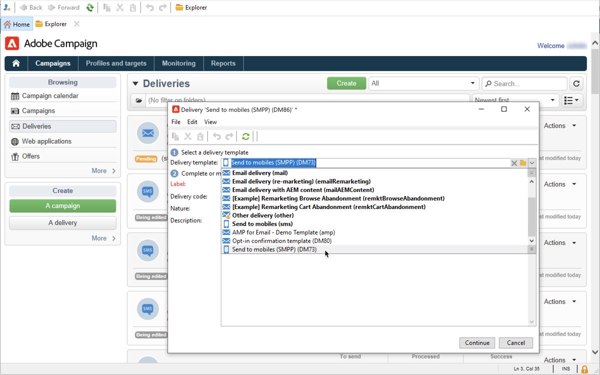

# Creare e inviare SMS

Utilizza Adobe Campaign per inviare messaggi SMS personalizzati.

Scopri come iniziare a utilizzare il canale SMS in [Documentazione di Campaign Classic v7](https://experienceleague.adobe.com/docs/campaign-classic/using/sending-messages/sending-messages-on-mobiles/sms-channel.html){target="_blank"}

>[!NOTE]
>
>Adobe Campaign consente inoltre di inviare notifiche push su dispositivi mobili tramite **Canale app mobile Adobe Campaign (NMAC)** opzione. Per ulteriori informazioni, consulta [questa sezione](push.md).

## Configurare il canale SMS

Per inviare a un telefono cellulare, è necessario:

* Un account esterno che specifica un connettore e un tipo di messaggio.

* Un modello di consegna in cui si fa riferimento a questo account esterno.

Scopri come configurare un canale SMS in [Documentazione di Campaign Classic v7](https://experienceleague.adobe.com/docs/campaign-classic/using/sending-messages/sending-messages-on-mobiles/sms-set-up.html#sending-messages){target="_blank"}

Prima di iniziare a inviare SMS:

* Assicurati che nel profilo dei destinatari sia presente almeno un telefono cellulare.
* Rivedi Adobe Campaign Classic [Best practice per la consegna](https://experienceleague.adobe.com/docs/campaign-classic/using/sending-messages/key-steps-when-creating-a-delivery/delivery-bestpractices/delivery-best-practices.html#sending-messages){target="_blank"} , applicabile anche a Campaign v8.

Inoltre, è necessario avere familiarità con il protocollo e le impostazioni SMS. Scopri la connessione impostata tra Adobe Campaign e un provider SMPP in [questo documento](https://experienceleague.adobe.com/docs/campaign-classic/using/sending-messages/sending-messages-on-mobiles/sms-protocol.html#sending-messages){target="_blank"}.

## Creare la prima consegna SMS

1. Per creare una nuova consegna, passa a **[!UICONTROL Campaigns]** , fare clic su **[!UICONTROL Deliveries]** e fai clic su **[!UICONTROL Create]** sopra l’elenco delle consegne esistenti.

   

   Per informazioni globali su come creare una consegna, consulta [Documentazione di Campaign Classic v7](https://experienceleague.adobe.com/docs/campaign-classic/using/sending-messages/key-steps-when-creating-a-delivery/steps-about-delivery-creation-steps.html#sending-messages){target="_blank"}.

1. Seleziona un modello di consegna che fa riferimento all’account esterno pertinente per inviare consegne SMS.

   

   Scopri come creare un account esterno SMPP in [Documentazione di Campaign Classic v7](https://experienceleague.adobe.com/docs/campaign-classic/using/sending-messages/sending-messages-on-mobiles/sms-set-up.html#creating-an-smpp-external-account){target="_blank"}

   Scopri come creare un modello di consegna da consegnare ai cellulari in [Documentazione di Campaign Classic v7](https://experienceleague.adobe.com/docs/campaign-classic/using/sending-messages/sending-messages-on-mobiles/sms-set-up.html#changing-the-delivery-template){target="_blank"}

1. Identifica la consegna con un’etichetta, un codice e una descrizione.

1. Clic **[!UICONTROL Continue]** per confermare e visualizzare la finestra configurazione messaggio.

1. Inserisci il contenuto del messaggio in **[!UICONTROL Text content]** della procedura guidata, inclusi i campi di personalizzazione in base alle esigenze.

   

1. Seleziona la popolazione target.

I passaggi chiave per la creazione e la progettazione di un SMS sono descritti in dettaglio nella documentazione di Campaign Classic v7:

* Creare un SMS

  [Scopri come creare una consegna SMS](https://experienceleague.adobe.com/docs/campaign-classic/using/sending-messages/sending-messages-on-mobiles/sms-create.html#sending-messages){target="_blank"}

* Progettare il contenuto degli SMS

  [Scopri come definire il contenuto degli SMS](https://experienceleague.adobe.com/docs/campaign-classic/using/sending-messages/sending-messages-on-mobiles/sms-create.html#defining-the-sms-content){target="_blank"}

* Selezionare il pubblico dell’e-mail

  [Scopri come definire la popolazione target](https://experienceleague.adobe.com/docs/campaign-classic/using/sending-messages/key-steps-when-creating-a-delivery/steps-defining-the-target-population.html){target="_blank"}

I passaggi per definire un pubblico sono descritti in dettaglio in [questa pagina](../start/audiences.md).

## Verifica l’SMS

Per visualizzare il rendering del messaggio con la relativa personalizzazione, fai clic su **[!UICONTROL Preview]** e seleziona un destinatario.

Per inviare una bozza, consulta le seguenti sezioni della documentazione di Campaign Classic v7:

* Convalidare una consegna e inviare le bozze
  [Scopri i passaggi chiave per convalidare una consegna](https://experienceleague.adobe.com/docs/campaign-classic/using/sending-messages/key-steps-when-creating-a-delivery/steps-validating-the-delivery.html?lang=it){target="_blank"}
* Aggiungere indirizzi seed
  [Scopri gli indirizzi di seed](https://experienceleague.adobe.com/docs/campaign-classic/using/sending-messages/using-seed-addresses/about-seed-addresses.html){target="_blank"}

## Inviare e monitorare le consegne SMS

I passaggi chiave per inviare e monitorare un SMS sono descritti in dettaglio nella documentazione di Campaign Classic v7:

* Inviare, monitorare e tenere traccia delle consegne SMS

  [Scopri gli strumenti per inviare, monitorare e tenere traccia degli SMS](https://experienceleague.adobe.com/docs/campaign-classic/using/sending-messages/sending-messages-on-mobiles/sms-send.html#sending-messages){target="_blank"}

* Risolvere i problemi relativi alle consegne SMS

  [Informazioni sulla risoluzione dei problemi relativi agli SMS](https://experienceleague.adobe.com/docs/campaign-classic/using/sending-messages/sending-messages-on-mobiles/troubleshooting-sms.html#sending-messages){target="_blank"}
