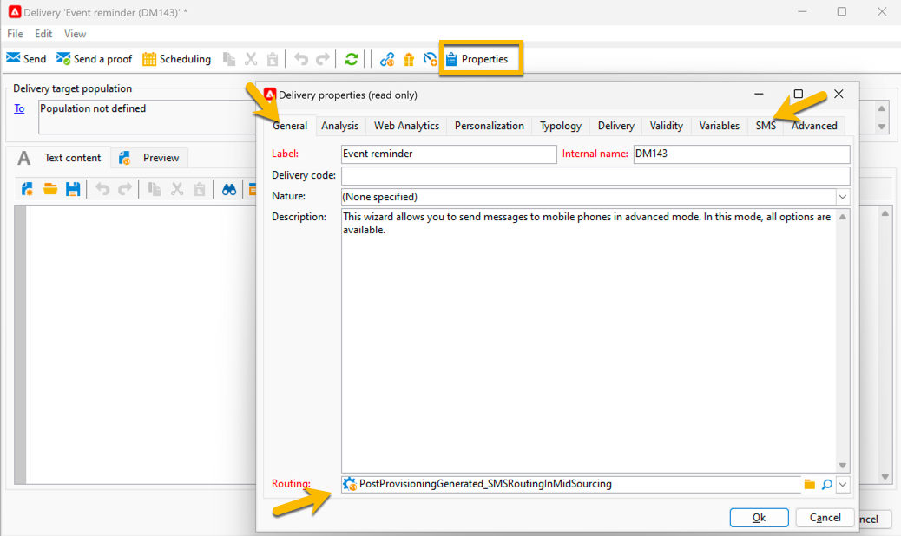

# Creare la prima consegna SMS {#sms-delivery}

Per creare una nuova consegna SMS, segui i passaggi seguenti:

1. Crea una nuova consegna e seleziona il modello di consegna SMS creato per gli invii SMS. [Ulteriori informazioni](sms-mid-sourcing.md#sms-delivery-template).

   {zoomable="yes"}

   Ulteriori informazioni sui passaggi di creazione della consegna in [questa pagina](../../start/create-message.md).

<!-- * For standalone instance,  [learn more here](sms-standalone-instance.md#sms-delivery-template).
* For mid-sourcing infrastructure, -->

1. Rinomina la consegna nel campo **[!UICONTROL Label]** e aggiungi le informazioni nel campo **[!UICONTROL Delivery code]** e nell&#39;elenco **[!UICONTROL Nature]**, se necessario, per il tracciamento. Puoi anche aggiungere **[!UICONTROL Description]** alla consegna.

1. Fare clic sul pulsante **[!UICONTROL Continue]**. Ora nella consegna sono presenti tutte le impostazioni del modello.

1. È possibile archiviare il pulsante **[!UICONTROL Properties]** in modo che tutto sia configurato in base alle esigenze. [Ulteriori informazioni sulla scheda SMS](sms-delivery-settings.md#sms-tab)

{zoomable="yes"}

1. [Definisci il contenuto](sms-content.md) della consegna.

1. [Selezionare il pubblico](sms-audience.md).

I passaggi per definire un pubblico sono descritti in dettaglio in [questa pagina](../../audiences/create-audiences.md).

## Convalidare e inviare SMS {#sms-validate}

Dopo la creazione della consegna, puoi:

1. [Invia bozze](sms-proofs.md) per convalidare il rendering e il contenuto,

1. Quindi [invia al pubblico finale](sms-send.md).

## Monitorare e tenere traccia degli SMS {#sms-monitor}

Dopo l&#39;invio, [scopri come monitorare e tenere traccia dell&#39;SMS](sms-monitor.md).

