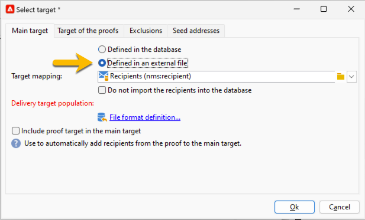

# Selezionare il pubblico della consegna SMS {#sms-audience}

Prima di selezionare il pubblico, [ulteriori informazioni sul pubblico](../../audiences/gs-audiences.md).

Nella maggior parte dei casi, il target principale di una consegna viene estratto dal database di Adobe Campaign (modalità predefinita). Tuttavia, il pubblico può anche essere archiviato in un file esterno. [Per ulteriori informazioni, consulta questa sezione](#external-audience).

## Pubblico in Adobe Campaign

Per selezionare il pubblico della consegna, segui i passaggi seguenti:

1. Nell&#39;editor di consegna, fare clic sul collegamento **[!UICONTROL To]**. Verrà aperta una finestra **[!UICONTROL Select target]**

1. Poiché il pubblico è archiviato nel database di Adobe Campaign, nella scheda **[!UICONTROL Main target]** scegliere l&#39;opzione **[!UICONTROL Defined in the database]**.

   {zoomable="yes"}

1. Selezionare **[!UICONTROL Target mapping]** nell&#39;elenco a discesa. La mappatura di destinazione predefinita di Adobe Campaign è Destinatari, basata sullo schema **[!UICONTROL nms:recipient]**.

   Sono disponibili altre mappature di destinazione, alcune delle quali possono essere correlate alla configurazione specifica. Per ulteriori informazioni sui mapping di destinazione, fare riferimento a [Operazioni con i mapping di destinazione](../../audiences/target-mappings.md).

1. Fare clic sul pulsante **[!UICONTROL Add]** per definire i filtri di restrizione.

   Puoi quindi selezionare il tipo di filtro da applicare:

   {zoomable="yes"}

   Per utilizzare un tipo di destinazione, selezionarlo e fare clic sul pulsante **[!UICONTROL Next]**.

   Di seguito sono elencati i tipi di target offerti per impostazione predefinita:

   * **[!UICONTROL Filtering conditions]**: consente di definire una query e di visualizzare il risultato.
   * **[!UICONTROL A list of recipients]**: consente di selezionare un elenco preparato contenente il pubblico
   * **[!UICONTROL A recipient]**: consente di selezionare direttamente un destinatario nella tabella.
   * **[!UICONTROL Recipients included in a folder]**: consente di selezionare una cartella nella struttura di navigazione di Esplora risorse
   * **[!UICONTROL Recipients of a delivery]**: consente di selezionare il pubblico di una consegna precedente
   * **[!UICONTROL Recipients of deliveries belonging to a folder]**: consente di selezionare il pubblico di tutte le consegne in una determinata cartella
   * **[!UICONTROL Subscribers of an information service]**: questa opzione consente di selezionare una newsletter a cui i destinatari devono iscriversi per essere destinatari della consegna creata.
   * **[!UICONTROL User filters]**: consente di utilizzare i filtri predefiniti.

   L&#39;opzione **[!UICONTROL Exclude recipients from this segment]** consente di eseguire il targeting di destinatari che non soddisfano i criteri di destinazione definiti. Per utilizzare questa opzione, seleziona la casella appropriata e quindi applica il targeting, come definito in precedenza, per escludere i profili risultanti.

1. Immetti il nome del pubblico nel campo etichetta e fai clic sul pulsante **[!UICONTROL Finish]** per convalidare il pubblico.

   {zoomable="yes"}

   È possibile aggiungere tutti i gruppi desiderati facendo nuovamente clic sul pulsante **[!UICONTROL Add]**. Puoi anche eliminarne alcuni facendo clic sulla croce che si trova dopo l’etichetta.

## Pubblico in un file esterno {#external-audience}

Puoi utilizzare Adobe Campaign per inviare una consegna a un pubblico che non si trova nel database, ma in un file esterno.

Di seguito sono riportati i passaggi da seguire:

1. Nell&#39;editor di consegna, fare clic sul collegamento **[!UICONTROL To]**. Verrà aperta una finestra **[!UICONTROL Select target]**

1. Scegli l’opzione **[!UICONTROL Defined in an external file]**.

   {zoomable="yes"}

1. Per impostazione predefinita, i destinatari vengono importati nel database. Selezionare **[!UICONTROL Target mapping]** in questo caso. Per ulteriori informazioni sui mapping di destinazione, fare riferimento a [Operazioni con i mapping di destinazione](../../audiences/target-mappings.md).

   In caso contrario, è possibile scegliere anche **[!UICONTROL Do not import the recipients into the database]**.

1. Durante l&#39;importazione del file, fare clic sul collegamento **[!UICONTROL File format definition…]** per selezionare e configurare il file esterno.

1. Fai clic sul pulsante **[!UICONTROL Finish]** per convalidare il pubblico.
