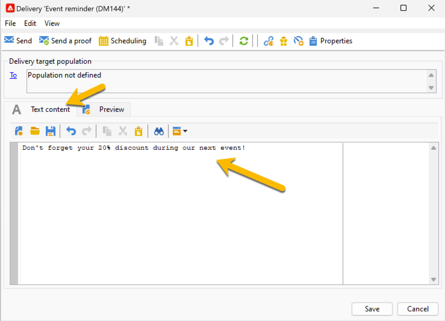
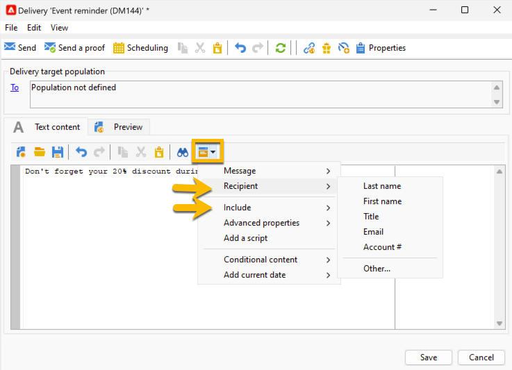
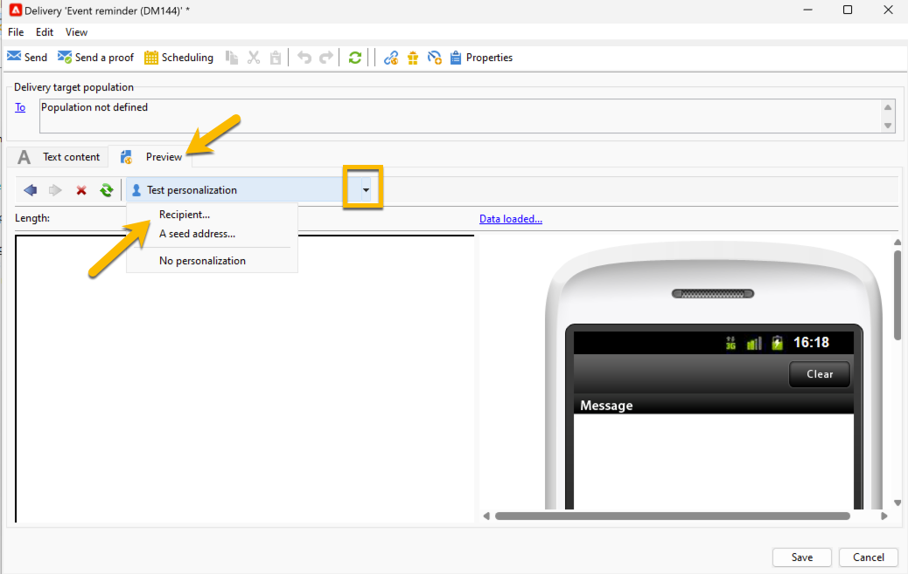

# Contenuto SMS {#sms-content}

Per configurare il contenuto della consegna SMS:

1. Immettere il contenuto del messaggio nella procedura guidata **[!UICONTROL Text content]**

   {zoomable="yes"}

1. Puoi personalizzare il messaggio inserendo campi di personalizzazione (ad esempio, aggiungendo il nome) o blocchi di personalizzazione predefiniti (ad esempio, aggiungendo i saluti). Puoi fare clic sul pulsante di personalizzazione per aggiungere questi:

   {zoomable="yes"}

   Dopo aver fatto clic su **[!UICONTROL Recipient]** > **[!UICONTROL First name]**, la personalizzazione sarà simile alla seguente:

   {zoomable="yes"}

1. Per visualizzare l&#39;anteprima della consegna, andare nella scheda **[!UICONTROL Preview]**, fare clic sull&#39;elenco a discesa **[!UICONTROL Test personalization]** e scegliere un destinatario nella tabella **[!UICONTROL Recipient]**.

   {zoomable="yes"}

   Avrai l’anteprima del tuo SMS con la personalizzazione:

   {zoomable="yes"}

>[!NOTE]
>
>* I messaggi SMS sono limitati a una lunghezza di 160 caratteri se viene utilizzata la tabella codici Latin-1 (ISO-8859-1). Se il messaggio è scritto in Unicode, non deve superare i 70 caratteri. Alcuni caratteri speciali possono influenzare la lunghezza del messaggio. Per ulteriori informazioni sulla lunghezza del messaggio, consulta la sezione [Traslitterazione caratteri SMS](smpp-external-account.md#smpp-channel-settings).
>
>* Quando sono presenti campi di personalizzazione o campi di contenuto condizionale, la dimensione del messaggio varia da un destinatario all’altro. La lunghezza del messaggio deve essere valutata una volta eseguita la personalizzazione.
>
>*Quando si avvia l&#39;analisi, viene controllata la lunghezza dei messaggi e viene visualizzato un avviso in caso di overflow.

Dopo aver creato il contenuto della consegna, puoi [selezionare il pubblico](sms-audience.md).
