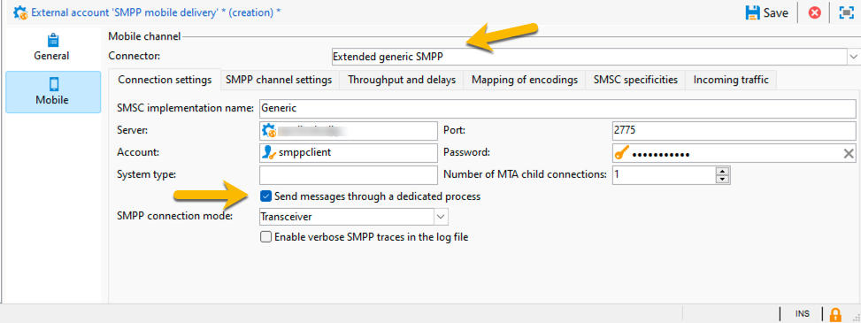

# SMS in un’infrastruttura mid-sourcing {#sms-mid}

>[!IMPORTANT]
>
>Questa documentazione è per Adobe Campaign v8.7.2 e versioni successive.
>
>Per le versioni precedenti, leggere la [documentazione di Campaign Classic v7](https://experienceleague.adobe.com/en/docs/campaign-classic/using/sending-messages/sending-messages-on-mobiles/sms-set-up/sms-set-up).

L’invio di consegne SMS con un’infrastruttura mid-sourcing richiede:

1. Un operatore SMS sul mid-server. [Scopri come crearlo qui](#sms-operator-mid)
1. Un account esterno SMS sul server Marketing che utilizzerà l’operatore creato in precedenza. [Scopri come crearlo qui](#sms-external-account)
1. Un account esterno SMPP sul server Mid, che specifica la modalità di consegna Canale e Mid-sourcing. [Scopri come crearlo qui](#smpp-external-account-mid)
1. Un modello di consegna che fa riferimento all’account esterno per semplificare il processo di invio. [Scopri come crearlo qui](#sms-delivery-template)

## Creare l’operatore SMS sul server mid {#sms-operator-mid}

Innanzitutto, devi creare un operatore SMS sul Mid-server, che verrà utilizzato dall’account esterno SMS sul server di marketing.

Per creare l’operatore SMS, effettua le seguenti operazioni:

1. In **[!UICONTROL Administration]** > **[!UICONTROL Access management]** > **[!UICONTROL Operators]**, fai clic su **[!UICONTROL New]** e compila il modulo nella nuova finestra aperta.

   * **[!UICONTROL Name (login)]** e **[!UICONTROL Label]** sono obbligatori.
   * La password non è obbligatoria, ma consigliata per la sicurezza.

   In seguito verrà utilizzato il nome (accesso) per denominare l’account esterno SMPP nel mid-server.

   {zoomable="yes"}

1. Nella parte **[!UICONTROL Groups and named rights]**, fare clic sul pulsante **[!UICONTROL Add]**.
Nella nuova finestra aperta, scegliere **[!UICONTROL Named rights]** nell&#39;elenco **[!UICONTROL Folder]** e selezionare **[!UICONTROL ADMINISTRATION]** nell&#39;elenco a destra.

1. Fare clic sul pulsante **[!UICONTROL Ok]**.

   {zoomable="yes"}

1. Fai clic sul pulsante **[!UICONTROL Save]** per finalizzare la creazione dell&#39;operatore SMS.

   {zoomable="yes"}

Ora è possibile visualizzarlo nell&#39;elenco degli operatori.

{zoomable="yes"}

## Creare un account esterno SMS sul server di marketing {#sms-external-account}

In un’infrastruttura mid, devi creare un account SMS esterno sul server Marketing come indicato di seguito

>[!IMPORTANT]
>
>L’utilizzo dello stesso account e della stessa password per più account SMS esterni può causare conflitti e sovrapposizioni tra gli account. Ulteriori informazioni sulla [pagina per la risoluzione dei problemi SMS](smpp-connection.md#sms-troubleshooting).

1. In **[!UICONTROL Administration]** > **[!UICONTROL Platform]** > **[!UICONTROL External Accounts]**, fare clic sull&#39;icona **[!UICONTROL New]**

   {zoomable="yes"}

1. Configura **[!UICONTROL Label]** e **[!UICONTROL Internal name]** dell&#39;account esterno. Definisci il tipo di account come **[!UICONTROL Routing]**, seleziona la casella **[!UICONTROL Enabled]**, seleziona **[!UICONTROL Mobile (SMS)]** per il canale e **[!UICONTROL Mid-sourcing]** per la modalità di consegna.

   {zoomable="yes"}

1. Nella scheda **[!UICONTROL Mid-sourcing]**, compila il modulo con l’URL del server di mid-sourcing e l’operatore SMS creato in precedenza sul server mid.

   Confermare la connessione facendo clic sul pulsante **[!UICONTROL Test the connection]**.

   {zoomable="yes"}

1. Fai clic su **[!UICONTROL Save]**.

## Creare un account esterno SMPP sul mid-server {#smpp-external-account-mid}

>[!IMPORTANT]
>
>L’utilizzo dello stesso account e della stessa password per più account SMS esterni può causare conflitti e sovrapposizioni tra gli account. Consulta la [pagina per la risoluzione dei problemi SMS](smpp-connection.md#sms-troubleshooting).

L’obiettivo ora è stabilire l’account esterno SMPP sul mid-server.

A questo scopo, segui la procedura indicata di seguito:

1. In **[!UICONTROL Administration]** > **[!UICONTROL Platform]** > **[!UICONTROL External Accounts]** del Mid-server, fai clic sull&#39;icona **[!UICONTROL New]**

1. Configura **[!UICONTROL Label]** e **[!UICONTROL Internal name]** dell&#39;account esterno.

   >[!WARNING]
   >
   >Quando si assegna un nome interno, assicurarsi di seguire la convenzione di denominazione specificata: `SMS Operator Name_Internal Name of the Marketing SMS external account`.
   >

   Definisci il tipo di account come **[!UICONTROL Routing]**, seleziona la casella **[!UICONTROL Enabled]**, seleziona **[!UICONTROL Mobile (SMS)]** per il canale e **[!UICONTROL Bulk delivery]** per la modalità di consegna.
   {zoomable="yes"}

1. Nella scheda **[!UICONTROL Mobile]**, mantenere **[!UICONTROL Extended generic SMPP]** nell&#39;elenco a discesa **[!UICONTROL Connector]**.

   La casella **[!UICONTROL Send messages through a dedicated process]** è selezionata per impostazione predefinita.

   {zoomable="yes"}

   Per impostare la connessione, è necessario compilare le schede di questo modulo. Per ulteriori informazioni sull&#39;account esterno SMPP[&#128279;](smpp-external-account.md#smpp-connection-settings), vedere .

## Configurare il modello di consegna {#sms-delivery-template}

Per facilitare la creazione della consegna SMS, crea un modello di consegna SMS in cui si fa riferimento a tutte le impostazioni.

In **[!UICONTROL Resources]** > **[!UICONTROL Templates]** > **[!UICONTROL Delivery templates]** sul server Marketing, fare clic con il pulsante destro del mouse sul modello di consegna Mobile esistente e scegliere **[!UICONTROL Duplicate]**.

{zoomable="yes"}

Modifica **[!UICONTROL Label]** e **[!UICONTROL Internal name]** del modello per riconoscerlo facilmente e fai clic sul pulsante **[!UICONTROL Properties]**.

{zoomable="yes"}

Nella scheda **[!UICONTROL General]**, in **[!UICONTROL Routing]**, seleziona l’account esterno SMPP.

{zoomable="yes"}

Nella scheda **[!UICONTROL SMS]** è possibile aggiungere parametri facoltativi al modello.

{zoomable="yes"}

[Ulteriori informazioni sulla configurazione della scheda SMS](sms-delivery-settings.md).
