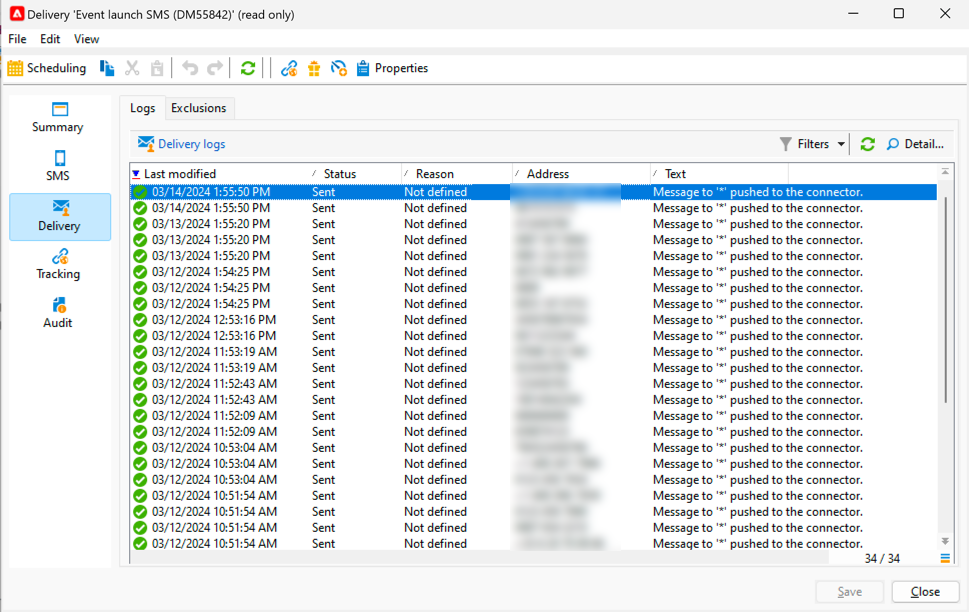

# Monitorare e tenere traccia di un SMS

È importante monitorare la consegna di SMS per essere sicuri che le campagne di marketing siano efficienti.

Qui le possibilità che devi sapere cosa succede dopo l’invio della consegna

## Comprendere il dashboard di consegna SMS

Il dashboard di consegna ti fornisce molte informazioni sul tuo SMS.

Per accedere alla dashboard, fai doppio clic sulla consegna nell’elenco di consegna.

Nella scheda **[!UICONTROL Summary]** sono presenti dati principali quali il numero di messaggi elaborati e il numero di operazioni riuscite.

{zoomable="yes"}

Dopo l&#39;invio dell&#39;SMS, la scheda **[!UICONTROL SMS]**, relativa al contenuto della consegna, non è più accessibile per una modifica.

Nella scheda **[!UICONTROL Delivery]** sono disponibili le informazioni sui registri di consegna. Per ogni indirizzo contattato, puoi vedere se l’SMS è stato inviato o meno

{zoomable="yes"}

Nella scheda **[!UICONTROL Exclusions]** sono disponibili i dettagli sul motivo per cui alcuni indirizzi sono esclusi dalla destinazione.

{zoomable="yes"}

La scheda **[!UICONTROL Tracking]** riguarda il tracciamento. Di seguito è riportato l’esempio di un URL tracciato nel contenuto dell’SMS.

{zoomable="yes"}

Infine, la scheda **[!UICONTROL Audit]** con tutti i dettagli durante l’avvio della consegna:

{zoomable="yes"}

## Comprendere gli errori SMS

I tipi di errore e i motivi dell’errore per gli SMS sono gli stessi delle e-mail.

Ulteriori informazioni su [errori di consegna](../delivery-failures.md) e in particolare sulle [quarantene SMS](../delivery-failures.md#sms-quarantines).

