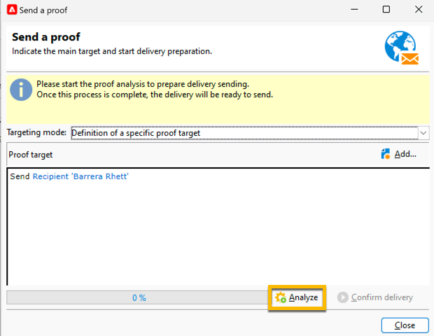
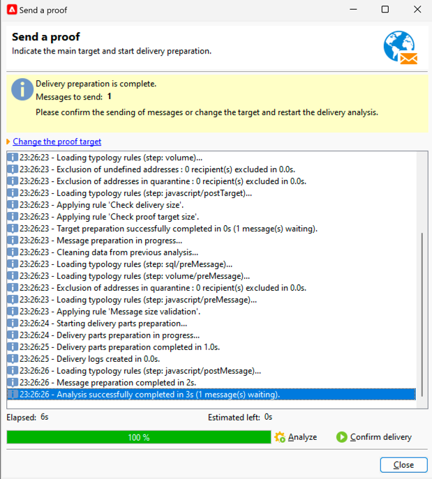

# Inviare una prova di una consegna SMS {#sms-proof}

Adobe consiglia vivamente di impostare un ciclo di convalida della consegna. Assicurati che il contenuto sia approvato prima di inviarlo al pubblico.

Puoi inviare una bozza per la consegna SMS per convalidarla:

1. Fare clic sul pulsante **[!UICONTROL Send a proof]**. Verrà aperta una finestra

   {zoomable="yes"}

   Sono disponibili più modalità per inviare una bozza:

   * **[!UICONTROL Definition of a specific proof target]**: consente di eseguire query con filtri sugli indirizzi nel database come destinazione della bozza
   * **[!UICONTROL Substitution of the address]**: consente di immettere gli indirizzi di test e utilizzare i dati dei destinatari di destinazione per convalidare il contenuto. Gli indirizzi di sostituzione possono essere immessi manualmente o selezionati dall&#39;elenco a discesa. L&#39;[enumerazione](../../config/enumerations.md) associata è **[!UICONTROL Substitution address (rcpAddress)]**.
Per impostazione predefinita, la sostituzione viene eseguita in modo casuale, ma è possibile selezionare un destinatario specifico dal target principale tramite l&#39;icona **[!UICONTROL Detail]**.
   * **[!UICONTROL Seed addresses]**: consente di accedere agli indirizzi di seed come destinazione della bozza. Questi indirizzi possono essere importati da un file o immessi manualmente.
   * **[!UICONTROL Specific target and Seed addresses]**: consente di combinare gli indirizzi di seed e gli indirizzi del destinatario.

1. Dopo aver scelto il tuo **[!UICONTROL Targeting mode]**, aggiungi gli indirizzi della bozza in base a esso

   Nell&#39;esempio seguente, scegliamo **[!UICONTROL Definition of a specific proof target]** e aggiungiamo un destinatario:

   {zoomable="yes"}

1. Fai clic sul pulsante **[!UICONTROL Analyze]**.
Adobe Campaign eseguirà tutti i controlli prima di convalidare l’invio della bozza. Al termine dell&#39;analisi, sarà possibile fare clic sul pulsante **[!UICONTROL Confirm delivery]**.

   {zoomable="yes"}

1. Per inviare la prova della consegna SMS, fai clic sul pulsante **[!UICONTROL Confirm delivery]**.

Se tutto è a posto in questa fase, puoi andare avanti e [inviare la tua consegna SMS al pubblico](sms-audience.md).
