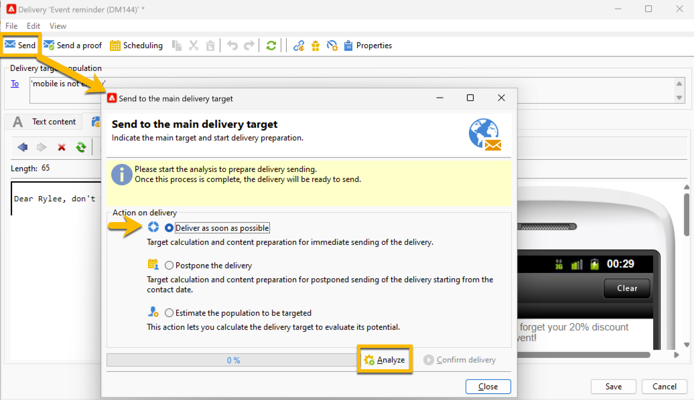

# Inviare la consegna SMS al pubblico {#sms-send-audience}

Quando l’SMS viene convalidato, ora puoi inviarlo al relativo pubblico.

1. Fai clic sul pulsante **[!UICONTROL Send]**.
Nella finestra aperta, scegli l’azione adatta a te.

   Nell&#39;esempio seguente, si sceglie di **[!UICONTROL Deliver it as soon as possible]**, verrà visualizzato il pulsante **[!UICONTROL Analyze]**. Fare clic sul pulsante **[!UICONTROL Analyze]**.

   {zoomable="yes"}

   Adobe Campaign eseguirà tutti i controlli prima di convalidare l’invio della bozza. Qui puoi vedere il volume reale del pubblico. Al termine dell&#39;analisi, sarà possibile fare clic sul pulsante **[!UICONTROL Confirm delivery]**.

   {zoomable="yes"}

1. Per inviare la consegna SMS al pubblico, fare clic sul pulsante **[!UICONTROL Confirm delivery]**.
