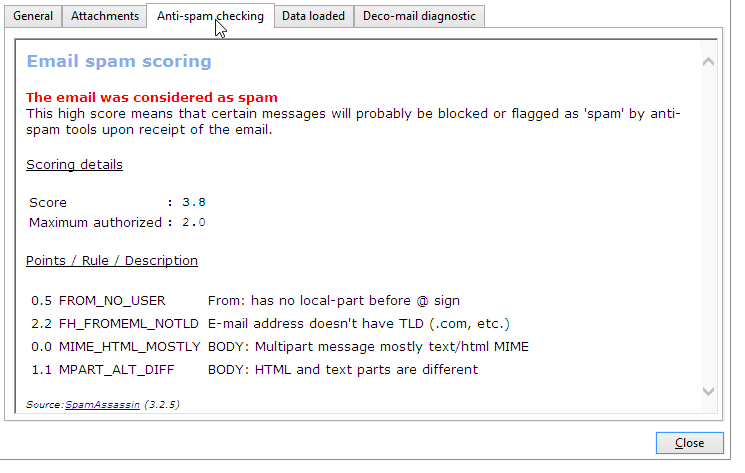

# SpamAssassin{#spamassassin}

Adobe Campaign può essere configurato per funzionare con [SpamAssassin](https://spamassassin.apache.org){target="_blank"}, un servizio di terze parti utilizzato per il filtro della posta indesiderata. Ciò ti consente di valutare le e-mail per determinare se un messaggio corre il rischio di essere considerato come spam dagli strumenti anti-spam utilizzati al momento della ricezione.

SpamAssassin sfrutta una varietà di tecniche di rilevamento spam, tra cui:

* Rilevamento di spam basato su DNS e su checksum fuzzy
* Filtro bayesiano
* Programmi esterni
* Inserisce nell&#39;elenco Bloccati
* Database online

>[!NOTE]
>
>SpamAssassin deve essere installato e configurato nel server applicazioni Adobe Campaign. Per ulteriori informazioni, contatta il tuo rappresentante Adobe.
>
>Le regole che determinano se un elemento è spam o meno vengono gestite tramite SpamAssassin e possono essere modificate da un amministratore con privilegi.

## Utilizzare SpamAssassin in Campaign {#using-spamassassin}

Dopo aver creato la consegna e-mail e averne definito il contenuto, segui i passaggi indicati di seguito per valutare i rischi.

Per ulteriori informazioni sulla creazione e la progettazione di una consegna, consulta questa [pagina](defining-the-email-content.md).

1. Vai alla scheda **[!UICONTROL Preview]**.
1. Seleziona un destinatario per visualizzare l’anteprima della consegna.

   

   >[!NOTE]
   >
   >Se non selezioni un destinatario, non è possibile eseguire il controllo anti-spam.

1. Un messaggio di avvertenza fornisce il risultato del test. Se viene rilevato un livello di rischio elevato, viene visualizzato il seguente messaggio di avvertenza:

   

1. Fare clic sul collegamento **[!UICONTROL More...]** accanto all&#39;avviso.
1. Seleziona la scheda **[!UICONTROL Anti-spam checking]**.
1. Andare alla sezione **[!UICONTROL Points / Rule / Description]** per visualizzare i motivi di questo rischio.

   

>[!NOTE]
>
>Ogni volta che si fa clic su **[!UICONTROL Anti-spam checking]**, viene chiamato il servizio SpamAssassin e il messaggio viene nuovamente analizzato per rilevare la posta indesiderata. Assicurati di aver modificato il contenuto prima di eseguire di nuovo l’analisi anti-spam.
