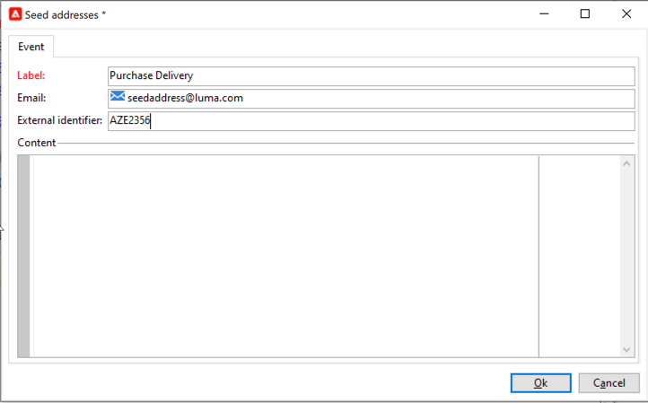

# Creare e pubblicare il modello per la messaggistica transazionale{#template-transactional-messages}

Ogni evento può attivare un messaggio personalizzato. Affinché questo accada, devi creare un modello di messaggio corrispondente a ciascun tipo di evento. I modelli contengono le informazioni necessarie per personalizzare il messaggio transazionale. Puoi inoltre utilizzare i modelli per verificare l’anteprima dei messaggi e inviare bozze utilizzando indirizzi di seed prima della consegna al target finale.

## Creare il modello{#create-message-template}

Per creare un modello di messaggio, effettua le seguenti operazioni:

1. Vai a **[!UICONTROL Message Center >Transactional message templates]** nella struttura Adobe Campaign.
1. Nell’elenco dei modelli di messaggi transazionali, fai clic con il pulsante destro del mouse e seleziona **[!UICONTROL New]** nel menu a discesa o fai clic sul pulsante **[!UICONTROL New]** sopra l’elenco dei modelli di messaggi transazionali.

   

1. Nella finestra di dialogo di consegna, seleziona il modello di consegna adatto al canale che desideri utilizzare.

   

1. Se necessario, modificane l’etichetta.
1. Seleziona il tipo di evento che corrisponde al messaggio da inviare. I tipi di evento destinati all’elaborazione da parte di Adobe Campaign devono essere creati in precedenza. [Ulteriori informazioni](#create-event-types)

   

   >[!CAUTION]
   >
   >Un tipo di evento non deve mai essere collegato a più di un modello.

1. Inserisci una natura e una descrizione, quindi fai clic su **[!UICONTROL Continue]** per creare il corpo del messaggio.

## Creare il contenuto{#create-message-content}

La definizione del contenuto dei messaggi transazionali è la stessa di tutte le consegne in Adobe Campaign. Ad esempio, per una consegna e-mail, puoi creare contenuto in formato HTML o testo, aggiungere allegati o personalizzare l’oggetto di consegna. [Ulteriori informazioni](../start/create-message.md).

>[!CAUTION]
>
>Le immagini incluse nel messaggio devono essere accessibili al pubblico. Adobe Campaign non fornisce alcun meccanismo di caricamento di immagini per i messaggi transazionali.\
>A differenza di JSSP o webApp, `<%=` non ha alcun escape predefinito.
>
>Devi eseguire correttamente l’escape di ogni dato proveniente dall’evento. L’escape dipende da come viene utilizzato questo campo. Ad esempio, all’interno di un URL, utilizza encodeURIComponent. Per essere visualizzato in HTML, è possibile utilizzare escapeXMLString.

Dopo aver definito il contenuto del messaggio, puoi integrare le informazioni sull’evento nel corpo del messaggio e personalizzarlo. Le informazioni sull’evento vengono inserite nel corpo del testo grazie ai tag di personalizzazione.

* Tutti i campi di personalizzazione provengono dal payload.
* È possibile fare riferimento a uno o più blocchi di personalizzazione in un messaggio transazionale. <!--The block content will be added to the delivery content during the publication to the execution instance.-->

Per inserire i tag di personalizzazione nel corpo di un messaggio e-mail, effettua le seguenti operazioni:

1. Nel modello del messaggio, fai clic sulla scheda corrispondente al formato e-mail (HTML o testo).
1. Inserisci il corpo del messaggio.
1. Nel corpo del testo, inserisci il tag utilizzando **[!UICONTROL Real time events>Event XML]** menu.

   

1. Compila il tag utilizzando la sintassi seguente: **nome elemento**.@**nome attributo** come mostrato di seguito.

   

## Testare il modello di messaggio transazionale {#test-message-template}

### Aggiungere indirizzi seed{#add-seeds}

Un indirizzo di seed consente di visualizzare un’anteprima del messaggio, inviarne una bozza e testare la personalizzazione del messaggio prima di inviarlo. Gli indirizzi di seed sono collegati alla consegna e non possono essere utilizzati per altre consegne.

1. Nel modello per messaggi transazionali, fai clic su **[!UICONTROL Seed addresses]** , quindi fare clic sulla scheda **[!UICONTROL Add]** pulsante.

   

1. Assegna un’etichetta a esso per una facile selezione in un secondo momento, quindi inserisci l’indirizzo seed (e-mail o telefono cellulare a seconda del canale di comunicazione).

1. Immetti l’identificatore esterno: questo campo opzionale ti consente di immettere una chiave aziendale (ID univoco, nome + e-mail, ecc.) comune a tutte le applicazioni sul sito web, utilizzato per identificare i profili. Se questo campo è presente anche nel database di marketing di Adobe Campaign, puoi riconciliare un evento con un profilo nel database.

   

1. Inserire i dati di prova. Fai riferimento a [questa sezione](#personalization-data).

   

1. Clic **[!UICONTROL Ok]** per confermare la creazione dell’indirizzo seed.

1. Ripeti il processo per creare tutti gli indirizzi necessari.

   

Una volta creati gli indirizzi, puoi accedervi all’anteprima e alla personalizzazione.

<!--

### Add personalization data{#personalization-data}

You can add data in the message template to test transactional message personalization. This will allow you to generate a preview or send a proof. If you install the **Deliverability** module, this data allows you to display a rendering of the messages for various desktop, web or mobile clients.

The purpose of this data is to test your messages before their final delivery. These messages do not coincide with actual data to be processed by Message Center.

However, the XML structure must be identical to that of the event stored in the execution instance, as shown below. 

This information enables you to personalize message content using personalization tags.

1. In the message template, click the **[!UICONTROL Seed addresses]** tab.
1. In the event content, enter the test information in XML format.

   
-->

### Anteprima del messaggio sulle transazioni{#transactional-message-preview}

Dopo aver creato uno o più indirizzi di seed e il corpo del messaggio, puoi visualizzare l’anteprima del messaggio e controllarne la personalizzazione.

1. Nel modello di messaggio, fai clic su **[!UICONTROL Preview]** , quindi seleziona **[!UICONTROL A seed address]** nell’elenco a discesa.

   

1. Seleziona l’indirizzo seed creato in precedenza per visualizzare il messaggio personalizzato.

   

### Inviare una bozza {#send-proof}

Puoi verificare la consegna dei messaggi inviando una bozza a un indirizzo seed creato in precedenza.

L’invio di una bozza comporta la stessa procedura applicata per qualsiasi consegna.

Ulteriori informazioni sulle bozze in [questa sezione](../send/preview-and-proof.md#proofs-send).

Tuttavia, per inviare la bozza di un messaggio sulle transazioni, è necessario effettuare le operazioni seguenti:

* Crea uno o più [indirizzi seed](#add-seeds) con dati di test di personalizzazione
* Creare il contenuto del messaggio

Per inviare la bozza:

1. Fai clic su **[!UICONTROL Send a proof]** nella finestra di consegna.
1. Analizza la consegna.
1. Correggi eventuali errori e conferma la consegna.

   

1. Verifica che il messaggio sia stato recapitato all’indirizzo di seed e che il suo contenuto sia conforme alla configurazione.

   

Le bozze sono accessibili in ogni modello tramite **[!UICONTROL Audit]** scheda.

#### Transizione da [!DNL Campaign Classic] v7 {#transition-from-v7}

Se sei [transizione da Campaign Classic v7](../start/v7-to-v8.md), tutte le consegne passano attraverso il server di mid-sourcing.

Tuttavia, quando si crea un modello di messaggio transazionale, il routing necessario per il corretto utilizzo del modello è **consegna e-mail interna**. Questo ciclo impedisce l’invio di bozze.

Di conseguenza, per inviare una bozza per il modello di messaggio transazionale, devi modificare il percorso dalla consegna e-mail interna a **account di indirizzamento mid-sourcing**.

Una volta inviate le bozze, devi ripristinare il routing alla consegna e-mail interna prima di pubblicare il modello di messaggio transazionale.

## Pubblicare il modello {#publish-message-template}

Quando è stato creato il modello di messaggio<!-- on the control instance--> è stato completato, puoi pubblicarlo, così potrai inviare messaggi collegati a eventi batch e in tempo reale.

<!--This process will also publish it on all execution instances.

NOTE: When publishing transactional message templates, typology rules are also automatically published on the execution instances.

Publication lets you automatically create two message templates on the execution instances, which will allow you to send messages linked to real-time and batch events.-->

>[!CAUTION]
>
>Ogni volta che apporti modifiche a un modello, assicurati di pubblicarle nuovamente affinché risultino efficaci durante la consegna dei messaggi transazionali.

1. Vai a **[!UICONTROL Message Center > Transactional message templates]** cartella della struttura.
1. Seleziona il modello da pubblicare<!--on your execution instances-->.
1. Fai clic su **[!UICONTROL Publish]**.

   

Una volta completata la pubblicazione, in vengono creati sia i modelli di messaggio da applicare a eventi di tipo batch che quelli di tipo in tempo reale **[!UICONTROL Administration > Production > Message Center Execution> Default > Transactional message templates]** cartella.

Dopo la pubblicazione di un modello, se viene attivato l’evento corrispondente, Adobe Campaign<!--execution instance--> riceverà l’evento, lo collegherà al modello transazionale e invierà il messaggio transazionale corrispondente a ciascun destinatario.

<!--
>[!NOTE]
>
>If you replace an existing field of the transactional message template, such as the sender address, with an empty value, the corresponding field on the execution instance(s) will not be updated once the transactional message is published again. It will still contain the previous value.
>
>However, if you add a non-empty value, the corresponding field will be updated as usual after the next publication.
-->

## Annullare la pubblicazione di un modello

Dopo la pubblicazione di un modello di messaggio <!--on the execution instances-->, può essere annullata.

* In effetti, un modello pubblicato può ancora essere chiamato se viene attivato l’evento corrispondente: se non utilizzi più un modello di messaggio, si consiglia di annullarne la pubblicazione. In questo modo si evita di inviare per errore un messaggio transazionale indesiderato.

  Ad esempio, hai pubblicato un modello di messaggio da utilizzare solo per le campagne natalizie. Puoi annullarne la pubblicazione al termine del periodo natalizio e pubblicarla nuovamente l’anno prossimo.

* Inoltre, non puoi eliminare un modello di messaggio transazionale con **[!UICONTROL Published]** stato. Devi prima annullare la pubblicazione.

Per annullare la pubblicazione di un modello di messaggio sulle transazioni, effettua le seguenti operazioni.

1. Accedi a **[!UICONTROL Message Center > Transactional message templates]** cartella.
1. Seleziona il modello da annullare la pubblicazione.
1. Fai clic su **[!UICONTROL Unpublish]**.
1. Fai clic su **[!UICONTROL Start]**.

Lo stato del modello di messaggio transazionale torna da **[!UICONTROL Published]** a **[!UICONTROL Being edited]**.

Una volta completata la pubblicazione:

* Entrambi i modelli di messaggio (applicati a eventi batch e di tipo in tempo reale) vengono eliminati<!-- from each execution instance-->.

  Non vengono più visualizzati nel **[!UICONTROL Administration > Production > Message Center Execution > Default > Transactional message templates]** cartella.

* Dopo aver annullato la pubblicazione di un modello, è possibile eliminarlo<!-- from the control instance-->.

  A tale scopo, selezionalo dall’elenco e fai clic sul pulsante **[!UICONTROL Delete]** in alto a destra.
