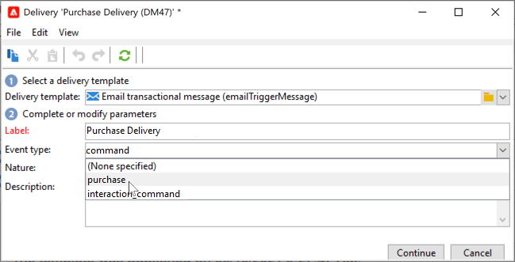
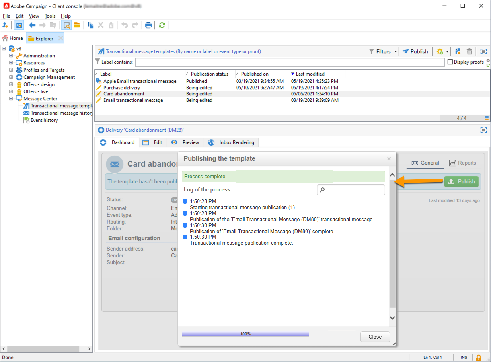

# Guida introduttiva ai messaggi transazionali{#send-transactional-messages}

La messaggistica transazionale (Message Center, Centro messaggi) è un modulo Campaign progettato per la gestione dei messaggi di attivazione. Queste notifiche sono generate da eventi attivati dai sistemi di informazione e possono essere: fattura, conferma dell&#39;ordine, conferma della spedizione, modifica della password, notifica di indisponibilità del prodotto, dichiarazione dell&#39;account, creazione dell&#39;account del sito web, ecc.

  Come utente di Cloud Services gestiti, [Adobe di contatto](../start/campaign-faq.md#support){target=&quot;_blank&quot;} per configurare i messaggi transazionali di Campaign nel tuo ambiente.

I messaggi transazionali vengono utilizzati per inviare:

* notifiche, ad esempio conferme d&#39;ordine o reimpostazioni di password
* una risposta in tempo reale individuale a un&#39;azione del cliente
* contenuto non promozionale

 Le impostazioni di messaggistica transazionale sono descritte in [questa sezione](../config/transactional-msg-settings.md).

 Comprendere l’architettura dei messaggi transazionali su [questa pagina](../architecture/architecture.md#transac-msg-archi).

## Principio operativo della messaggistica transazionale {#transactional-messaging-operating-principle}

Il modulo di messaggistica transazionale di Adobe Campaign si integra in un sistema di informazioni che restituisce gli eventi da modificare in messaggi transazionali personalizzati. Questi messaggi possono essere inviati singolarmente o in batch tramite e-mail, SMS o notifiche push.

Ad esempio, immagina di essere un’azienda con un sito web in cui i clienti possono acquistare prodotti.

Adobe Campaign ti consente di inviare un’e-mail di notifica ai clienti che hanno aggiunto prodotti al carrello. Quando uno di loro lascia il sito web senza procedere con i propri acquisti (evento esterno che attiva un evento Campaign), viene inviata automaticamente loro un’e-mail di abbandono del carrello (consegna dei messaggi transazionali).

I passaggi principali per l&#39;attuazione di questo progetto sono descritti di seguito:

1. [Creare un tipo di evento](#create-event-types).
1. [Creare e progettare il modello di messaggio](#create-message-template). Devi collegare un evento al messaggio durante questo passaggio.
1. [Verifica del messaggio](#test-message-template).
1. [Pubblica il modello di messaggio](#publish-message-template).

Una volta progettato e pubblicato il modello di messaggio transazionale, se viene attivato un evento corrispondente, i dati pertinenti vengono inviati a Campaign tramite i parametri PushEvent e PushEvents [Metodi SOAP](https://experienceleague.adobe.com/docs/campaign-classic/using/transactional-messaging/processing/event-description.html){target=&quot;_blank&quot;} e la consegna viene inviata ai destinatari di destinazione.

## Creare tipi di evento {#create-event-types}

Per fare in modo che ogni evento possa essere modificato in un messaggio personalizzato, devi innanzitutto creare **tipi di evento**.

Quando [creazione di un modello di messaggio](#create-message-template), selezioni il tipo di evento che corrisponde al messaggio che desideri inviare.

>[!CAUTION]
>
>È necessario creare tipi di evento prima di poterli utilizzare nei modelli di messaggio.

Per creare tipi di evento che verranno elaborati da Adobe Campaign, segui i passaggi seguenti:

1. Vai a **[!UICONTROL Administration > Platform > Enumerations]** cartella dell&#39;albero.

1. Seleziona **[!UICONTROL Event type]** dall&#39;elenco.

1. Fai clic su **[!UICONTROL Add]** per creare un valore di enumerazione. Può trattarsi di una conferma dell’ordine, una modifica della password, una modifica della consegna dell’ordine, ecc.

   

   >[!CAUTION]
   >
   >Ogni tipo di evento deve corrispondere a un valore nel **[!UICONTROL Event type]** enumerazione.

1. Una volta creati i valori elenco dettagliati, disconnettiti e torna all’istanza per rendere effettiva la creazione.

>[!NOTE]
>
>Ulteriori informazioni sugli elenchi dettagliati in [Documentazione di Campaign Classic v7](https://experienceleague.adobe.com/docs/campaign-classic/using/getting-started/administration-basics/managing-enumerations.html){target=&quot;_blank&quot;}.

## Definire un modello di messaggio sulle transazioni {#create-message-template}

Ogni evento può attivare un messaggio personalizzato. Affinché ciò accada, devi creare un modello di messaggio per far corrispondere ogni tipo di evento. I modelli contengono le informazioni necessarie per personalizzare il messaggio sulle transazioni. Puoi inoltre utilizzare i modelli per testare l’anteprima del messaggio e inviare bozze utilizzando gli indirizzi di seed prima di consegnarle al target finale.

### Creare il modello

Per creare un modello di messaggio, segui i passaggi seguenti:

1. Vai a **[!UICONTROL Message Center >Transactional message templates]** nella struttura Adobe Campaign.
1. Nell’elenco dei modelli di messaggi transazionali, fai clic con il pulsante destro del mouse e seleziona **[!UICONTROL New]** nel menu a discesa o fai clic su **[!UICONTROL New]** , sopra l’elenco dei modelli di messaggi transazionali.

   

1. Nella finestra di consegna, seleziona il modello di consegna adatto al canale che desideri utilizzare.

   

1. Se necessario, modificarne l’etichetta.
1. Seleziona il tipo di evento che corrisponde al messaggio che desideri inviare. I tipi di evento destinati all’elaborazione da parte di Adobe Campaign devono essere creati in precedenza. [Ulteriori informazioni](#create-event-types)

   

   >[!CAUTION]
   >
   >Un tipo di evento non deve mai essere collegato a più di un modello.

1. Immetti una natura e una descrizione, quindi fai clic su **[!UICONTROL Continue]** per creare il corpo del messaggio.

### Creare il contenuto{#create-message-content}

La definizione del contenuto dei messaggi transazionali è la stessa di tutte le consegne in Adobe Campaign. Ad esempio, per una consegna e-mail, puoi creare contenuto in HTML o in formato testo, aggiungere allegati o personalizzare l’oggetto di consegna. [Ulteriori informazioni](../start/create-message.md).

>[!CAUTION]
>
>Le immagini incluse nel messaggio devono essere accessibili al pubblico. Adobe Campaign non fornisce alcun meccanismo di caricamento delle immagini per i messaggi transazionali.\
>A differenza di JSSP o webApp, `<%=` non dispone di escape predefinito.
>
>Devi eseguire correttamente l’escape di ogni dato proveniente dall’evento. Questo escape dipende da come viene utilizzato questo campo. Ad esempio, all’interno di un URL, utilizza encodeURIComponent. Per essere visualizzato in HTML, è possibile utilizzare escapeXMLString.

Una volta definito il contenuto del messaggio, puoi integrare le informazioni sull’evento nel corpo del messaggio e personalizzarlo. Le informazioni sull’evento vengono inserite nel corpo del testo grazie ai tag di personalizzazione.

* Tutti i campi di personalizzazione provengono dal payload.
* È possibile fare riferimento a uno o più blocchi di personalizzazione in un messaggio transazionale. <!--The block content will be added to the delivery content during the publication to the execution instance.-->

Per inserire tag di personalizzazione nel corpo di un messaggio e-mail, effettua le seguenti operazioni:

1. Nel modello di messaggio, fai clic sulla scheda che corrisponde al formato dell’e-mail (HTML o testo).
1. Inserisci il corpo del messaggio.
1. Nel corpo del testo, inserisci il tag utilizzando **[!UICONTROL Real time events>Event XML]** menu.

   

1. Compila il tag utilizzando la seguente sintassi: **nome elemento**.@**nome attributo** come mostrato di seguito.

   

## Test del modello di messaggio transazionale {#test-message-template}

### Aggiungere indirizzi seed{#add-seeds}

Un indirizzo di seed ti consente di visualizzare un’anteprima del messaggio, inviare una bozza e testare la personalizzazione dei messaggi prima di inviare il messaggio. Gli indirizzi di seed sono collegati alla consegna e non possono essere utilizzati per altre consegne.

1. Nel modello di messaggio transazionale, fai clic sul pulsante **[!UICONTROL Seed addresses]** , quindi fai clic sul pulsante **[!UICONTROL Add]** pulsante .

   

1. Assegna un’etichetta per una selezione semplice in un secondo momento, quindi inserisci l’indirizzo di seed (e-mail o telefono cellulare a seconda del canale di comunicazione).

1. Immetti l’identificatore esterno: questo campo facoltativo consente di inserire una chiave business (ID univoco, nome + e-mail, ecc.) comune a tutte le applicazioni del sito web, utilizzato per identificare i profili. Se questo campo è presente anche nel database di marketing di Adobe Campaign, puoi quindi riconciliare un evento con un profilo nel database.

   

1. Inserire i dati di prova. Fai riferimento a [questa sezione](#personalization-data).

   

1. Fai clic su **[!UICONTROL Ok]** per confermare la creazione dell’indirizzo di seed.

1. Ripeti il processo per creare tutti gli indirizzi necessari.

   

Una volta creati gli indirizzi, puoi accedere alla loro anteprima e personalizzazione.

<!--

### Add personalization data{#personalization-data}

You can add data in the message template to test transactional message personalization. This will allow you to generate a preview or send a proof. If you install the **Deliverability** module, this data allows you to display a rendering of the messages for various desktop, web or mobile clients.

The purpose of this data is to test your messages before their final delivery. These messages do not coincide with actual data to be processed by Message Center.

However, the XML structure must be identical to that of the event stored in the execution instance, as shown below. 

This information enables you to personalize message content using personalization tags.

1. In the message template, click the **[!UICONTROL Seed addresses]** tab.
1. In the event content, enter the test information in XML format.

   
-->

### Anteprima del messaggio sulle transazioni{#transactional-message-preview}

Dopo aver creato uno o più indirizzi di seed e il corpo del messaggio, puoi visualizzare in anteprima il messaggio e controllarne la personalizzazione.

1. Nel modello di messaggio, fai clic sul pulsante **[!UICONTROL Preview]** , quindi seleziona **[!UICONTROL A seed address]** nell’elenco a discesa.

   

1. Seleziona l’indirizzo di seed creato in precedenza per visualizzare il messaggio personalizzato.

   

### Inviare una bozza

Puoi verificare la consegna dei messaggi inviando una bozza a un indirizzo di seed creato in precedenza.

L’invio di una bozza comporta la stessa procedura utilizzata per qualsiasi consegna.

 Ulteriori informazioni sulle bozze in [Documentazione di Campaign Classic v7](https://experienceleague.adobe.com/docs/campaign-classic/using/sending-messages/key-steps-when-creating-a-delivery/steps-validating-the-delivery.html#sending-a-proof){target=&quot;_blank&quot;}

Tuttavia, per inviare una prova di un messaggio sulle transazioni, devi eseguire le seguenti operazioni:

* Crea uno o più [indirizzi di seed](#add-seeds) con dati di test di personalizzazione
* Creare il contenuto del messaggio

Per inviare la bozza:

1. Fai clic sul pulsante **[!UICONTROL Send a proof]** nella finestra di consegna.
1. Analizza la consegna.
1. Correggi eventuali errori e conferma la consegna.

   

1. Verifica che il messaggio sia stato recapitato all’indirizzo di seed e che il suo contenuto sia conforme alla tua configurazione.

   

È possibile accedere alle bozze in ogni modello tramite il **[!UICONTROL Audit]** scheda .

## Pubblicare il modello {#publish-message-template}

Quando è stato creato il modello di messaggio<!-- on the control instance--> completato, puoi pubblicarlo, che ti consentirà di inviare messaggi collegati a eventi in tempo reale e batch.

<!--This process will also publish it on all execution instances.

NOTE: When publishing transactional message templates, typology rules are also automatically published on the execution instances.

Publication lets you automatically create two message templates on the execution instances, which will allow you to send messages linked to real-time and batch events.-->

>[!CAUTION]
>
>Ogni volta che apporti modifiche a un modello, accertati di pubblicarlo nuovamente affinché queste modifiche siano effettive durante la consegna dei messaggi transazionali.

1. Vai a **[!UICONTROL Message Center > Transactional message templates]** cartella dell&#39;albero.
1. Seleziona il modello da pubblicare<!--on your execution instances-->.
1. Fai clic su **[!UICONTROL Publish]**.

   

Una volta completata la pubblicazione, vengono creati sia i modelli di messaggio da applicare agli eventi di tipo batch che quelli di tipo in tempo reale nel **[!UICONTROL Administration > Production > Message Center Execution> Default > Transactional message templates]** cartella.

Una volta pubblicato un modello, se viene attivato l’evento corrispondente, Adobe Campaign<!--execution instance--> riceverà l’evento, lo collegherà al modello transazionale e invierà il messaggio transazionale corrispondente a ciascun destinatario.

<!--
>[!NOTE]
>
>If you replace an existing field of the transactional message template, such as the sender address, with an empty value, the corresponding field on the execution instance(s) will not be updated once the transactional message is published again. It will still contain the previous value.
>
>However, if you add a non-empty value, the corresponding field will be updated as usual after the next publication.
-->

## Annullare la pubblicazione di un modello

Una volta pubblicato il modello di messaggio <!--on the execution instances-->, può essere annullata la pubblicazione.

* In effetti, un modello pubblicato può ancora essere chiamato se viene attivato l’evento corrispondente: se non utilizzi più un modello di messaggio, è consigliabile annullarne la pubblicazione. In questo modo si evita di inviare per errore un messaggio sulle transazioni indesiderato.

   Ad esempio, hai pubblicato un modello di messaggio da utilizzare solo per le campagne di Natale. Puoi annullare la pubblicazione dopo la fine del periodo natalizio e pubblicarlo nuovamente l’anno prossimo.

* Inoltre, non puoi eliminare un modello di messaggio transazionale con il **[!UICONTROL Published]** stato. Per prima cosa devi annullarla pubblicazione.

Per annullare la pubblicazione di un modello di messaggio sulle transazioni, segui i passaggi riportati di seguito.

1. Sfoglia il **[!UICONTROL Message Center > Transactional message templates]** cartella.
1. Seleziona il modello da annullare la pubblicazione.
1. Fai clic su **[!UICONTROL Unpublish]**.
1. Fai clic su **[!UICONTROL Start]**.

Lo stato del modello di messaggio sulle transazioni cambia da **[!UICONTROL Published]** a **[!UICONTROL Being edited]**.

Al termine dell’annullamento della pubblicazione:

* Entrambi i modelli di messaggio (applicati a eventi di tipo batch e in tempo reale) vengono eliminati<!-- from each execution instance-->.

   Non vengono più visualizzati nella **[!UICONTROL Administration > Production > Message Center Execution > Default > Transactional message templates]** cartella.

* Una volta annullato la pubblicazione di un modello, puoi eliminarlo<!-- from the control instance-->.

   A tale scopo, selezionala dall’elenco e fai clic sul pulsante **[!UICONTROL Delete]** in alto a destra dello schermo.
