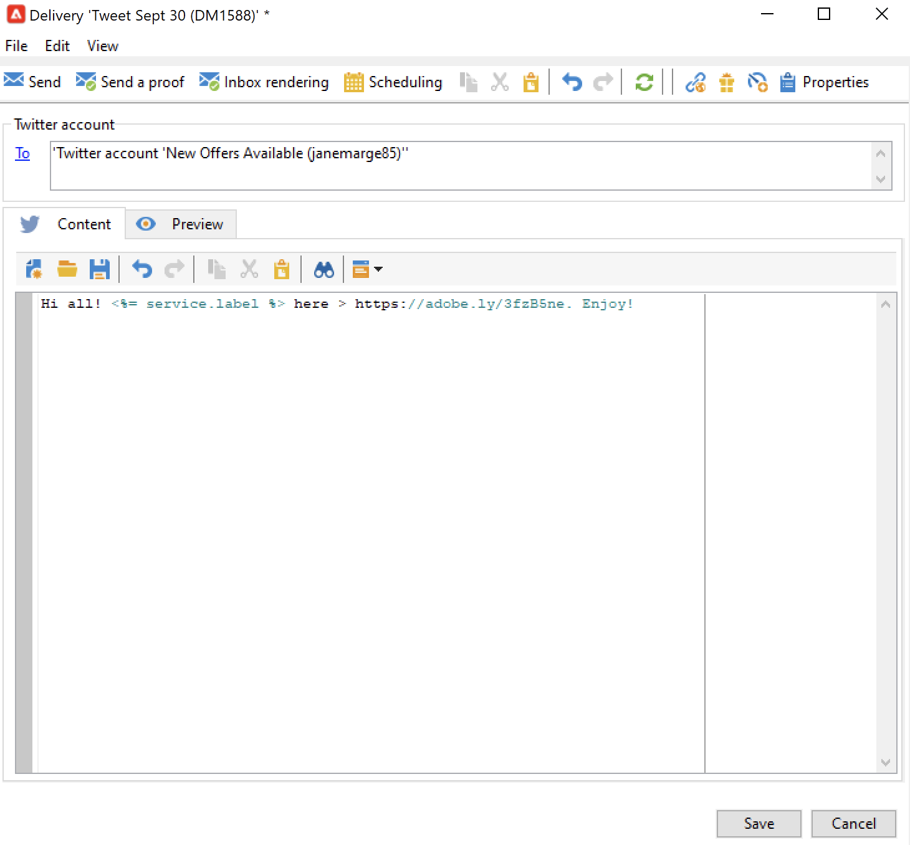

# Pubblicare messaggi sul Twitter con Adobe Campaign {#post-tw-messages}

Adobe Campaign viene fornito con **Social marketing** che consente di interagire con i clienti attuali e potenziali tramite Twitter.

Una volta configurata l’integrazione, puoi:

* Inviare messaggi diretti ai propri follower
* Pubblica tweet sul tuo account di Twitter
* Raccogliere nuovi contatti recuperando i dati del profilo, che consente di eseguire campagne di targeting e, quando possibile, di implementare strategie cross-channel. Questa azione richiede il consenso dell’utente.

I passaggi di configurazione per integrare l’account di Twitter con Adobe Campaign sono descritti in [questa pagina](../connect/ac-tw.md).

## Creazione e pubblicazione di un post di Twitter {#publish-on-tw}

Per pubblicare un messaggio sul tuo account di Twitter, segui la procedura riportata di seguito:

1. Creare una consegna di Twitter

   Crea una nuova consegna basata su **[!UICONTROL Tweet (twitter)]** modello di consegna.

   

1. Seleziona la destinazione principale

   Seleziona gli account a cui inviare i tweet.

   

   1. Fai clic sul collegamento **[!UICONTROL To]**.
   1. Fai clic sul pulsante **[!UICONTROL Add]**.
   1. Seleziona **[!UICONTROL A Twitter account]**.
   1. In **[!UICONTROL Folder]** , selezionare la cartella del servizio contenente l&#39;account di Twitter. Quindi seleziona l’account di Twitter a cui inviare il tweet.

1. Seleziona la destinazione della bozza

   Il **[!UICONTROL Target of the proofs]** Questa scheda ti consente di definire l’account di Twitter da utilizzare per le consegne di test prima della consegna finale.

   Come descritto nella sezione [passaggi di configurazione](../connect/ac-tw.md#tw-test-account), è necessario creare un account del Twitter di test privato dedicato all’invio delle bozze.

   >[!NOTE]
   >
   >Se utilizzi lo stesso account di test del Twitter per tutte le consegne, puoi salvare il target della bozza in **[!UICONTROL Tweet]** modello di consegna, accessibile tramite **[!UICONTROL Resources > Templates > Delivery templates]** nodo. La destinazione della bozza verrà quindi inserita per impostazione predefinita per ogni nuova consegna.

1. Definire il contenuto del post

   Inserisci il contenuto del post in **[!UICONTROL Content]** scheda.

   

   >[!CAUTION]
   >
   >Quando si effettua la registrazione in Twitter, si applicano le seguenti limitazioni:
   >
   >* Il messaggio non può superare i 140 caratteri.
   >* Formato HTML non supportato.
   >

1. Anteprima del post

   Sfoglia **[!UICONTROL Preview]** per controllare il rendering del post.

   

   1. Fai clic su **[!UICONTROL Preview]** scheda.
   1. Fai clic su **[!UICONTROL Test personalization]** menu a discesa e selezionare **[!UICONTROL Service]**.
   1. In **[!UICONTROL Folder]** , selezionare la cartella del servizio che contiene l&#39;account di Twitter.

1. Inviare una bozza

   Prima di pubblicare il tweet, assicurati di convalidarlo inviando una prova della pubblicazione: potrai quindi ottenere un rendering esatto della pubblicazione su una pagina di test di Twitter privata.

1. Pubblica il messaggio

   1. Una volta approvato il contenuto, fai clic su **[!UICONTROL Send]** pulsante.
   1. Seleziona **[!UICONTROL Deliver as soon as possible]** e fai clic su **[!UICONTROL Analyze]** pulsante.
   1. Al termine dell’analisi, verifica il risultato.
   1. Clic **[!UICONTROL Confirm delivery]**, quindi fai clic su **[!UICONTROL Yes]**.

## Inviare messaggi diretti ai follower {#direct-tw-messages}

Il **[!UICONTROL Synchronize Twitter accounts]** il flusso di lavoro tecnico recupera l’elenco dei follower del Twitter in modo da poter inviare loro messaggi diretti. [Ulteriori informazioni](../connect/ac-tw.md#synchro-tw-accounts)

Per inviare messaggi diretti ai tuoi follower, segui i passaggi seguenti:

1. Creare una consegna di Twitter in base al **[!UICONTROL Tweet (Direct Message)]** modello di consegna incorporato.

1. Seleziona la destinazione principale

   

   1. Seleziona la **[!UICONTROL To]** e il **[!UICONTROL Add]** pulsante.

   1. Scegli un tipo di targeting

      * Seleziona **[!UICONTROL Twitter subscribers]** per inviare un messaggio diretto a tutti i tuoi follower.

      * Seleziona **[!UICONTROL Filter conditions]** per definire una query e visualizzarne il risultato. Scopri come creare un filtro in [questa sezione](../audiences/create-filters.md#advanced-filters).

1. Seleziona la destinazione della bozza da **[!UICONTROL Target of the proofs]** scheda: questo account riceverà la prova del tuo messaggio diretto.

   Come descritto nella sezione [passaggi di configurazione](../connect/ac-tw.md#tw-test-account), è necessario creare un account del Twitter di test privato dedicato all’invio delle bozze.

   >[!NOTE]
   >
   >Se desideri inviare tutte le bozze dei messaggi diretti allo stesso account di Twitter, puoi salvare il target della bozza in **[!UICONTROL Tweet (Direct Message)]** modello di consegna, accessibile tramite **[!UICONTROL Resources > Templates > Delivery templates]** nodo.

1. Inserisci il contenuto del messaggio in **[!UICONTROL Content]** scheda.

   

   I campi di personalizzazione possono essere utilizzati come per le consegne e-mail, ad esempio per aggiungere il nome del follower nel corpo del messaggio. Per ulteriori informazioni, consulta [questa sezione](../send/personalize.md).

1. Anteprima del messaggio

   Sfoglia **[!UICONTROL Preview]** per controllare il rendering del post.

   

   1. Fai clic su **[!UICONTROL Preview]** scheda.
   1. Fai clic su **[!UICONTROL Test personalization]** menu a discesa e selezionare **[!UICONTROL Visitor Subscription]**.
   1. Scegli un account di Twitter con cui desideri verificare l’anteprima.

1. Inviare una bozza

   Prima di inviare il messaggio, assicurati di convalidarlo tramite [invio di una bozza a un account di test](../send/preview-and-proof.md): puoi quindi ottenere un rendering esatto del messaggio su un account di Twitter privato e controllare il contenuto e la personalizzazione.

1. Inviare il messaggio diretto

   1. Una volta approvato il contenuto, fai clic su **[!UICONTROL Send]** pulsante.
   1. Seleziona **[!UICONTROL Deliver as soon as possible]** e fai clic su **[!UICONTROL Analyze]** pulsante.
   1. Al termine dell’analisi, verifica il risultato.
   1. Clic **[!UICONTROL Confirm delivery]**, quindi fai clic su **[!UICONTROL Yes]**.

>[!CAUTION]
>
>Non puoi inviare più di 250 messaggi diretti al giorno. Per evitare di superare questa soglia, è possibile effettuare la consegna in ondate. Per ulteriori informazioni, consulta la [documentazione di Campaign Classic v7](https://experienceleague.adobe.com/docs/campaign-classic/using/sending-messages/key-steps-when-creating-a-delivery/steps-sending-the-delivery.html#sending-using-multiple-waves){target="_blank"}.

## Accedere ai dati di tracciamento {#tw-tracking}

Nella scheda **[!UICONTROL Tweet]** modello di consegna, il tracciamento è abilitato per impostazione predefinita.

I dati di tracciamento possono essere visualizzati nei rapporti di consegna e nella **[!UICONTROL Edit > Tracking]** della consegna e del servizio.

La configurazione di tracciamento è la stessa di una consegna e-mail. Ulteriori informazioni sono disponibili nella [documentazione di Campaign Classic v7](https://experienceleague.adobe.com/docs/campaign-classic/using/sending-messages/monitoring-deliveries/about-delivery-monitoring.html?lang=it){target="_blank"}.

