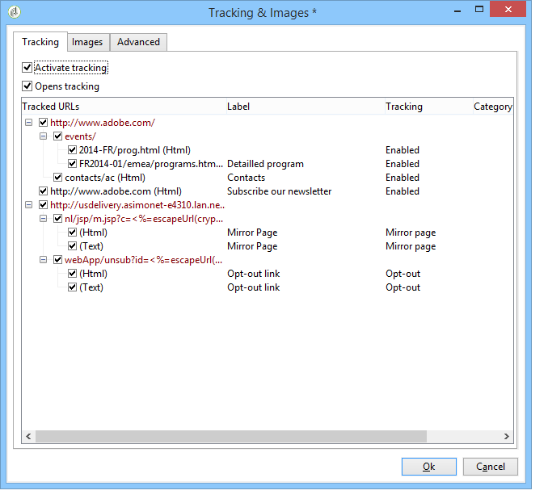

# Configurare le opzioni di tracciamento URL {#personalizing-url-tracking}

Le impostazioni avanzate di verifica dei messaggi sono accessibili tramite l&#39;icona **[!UICONTROL Tracking & Images]** nella barra degli strumenti dell&#39;assistente alla consegna.

>[!NOTE]
>
>In questa finestra è configurata anche la gestione delle immagini nelle e-mail. Vedi [Aggiungi immagini](defining-the-email-content.md#adding-images).

Puoi configurare le opzioni di tracciamento:

* Attiva/disattiva il tracciamento URL per tutti i messaggi.

  >[!CAUTION]
  >
  >Quando il tracciamento non è attivato su una consegna (ad esempio, opzione **[!UICONTROL Activate tracking]** non selezionata), i rapporti e i dati relativi al tracciamento non sono disponibili: i rapporti Aperture, Hot click e URL tracciati non mostreranno alcun dato e **[!UICONTROL Tracking logs]** schede non verranno visualizzate per questa consegna.

* Attiva/disattiva il tracciamento per le aperture dei messaggi.

Gli URL tracciati sono elencati nella finestra centrale sotto forma di struttura ad albero.

Puoi attivare o disattivare il tracciamento singolarmente per ogni URL del messaggio. Per ulteriori informazioni al riguardo, consulta [questa sezione](tracked-links.md).

La scheda **[!UICONTROL Advanced]** ti consente di personalizzare le formule di calcolo degli URL tracciati e dell&#39;URL di apertura.

>[!CAUTION]
>
>Le impostazioni in questa scheda possono essere modificate solo da utenti esperti.

