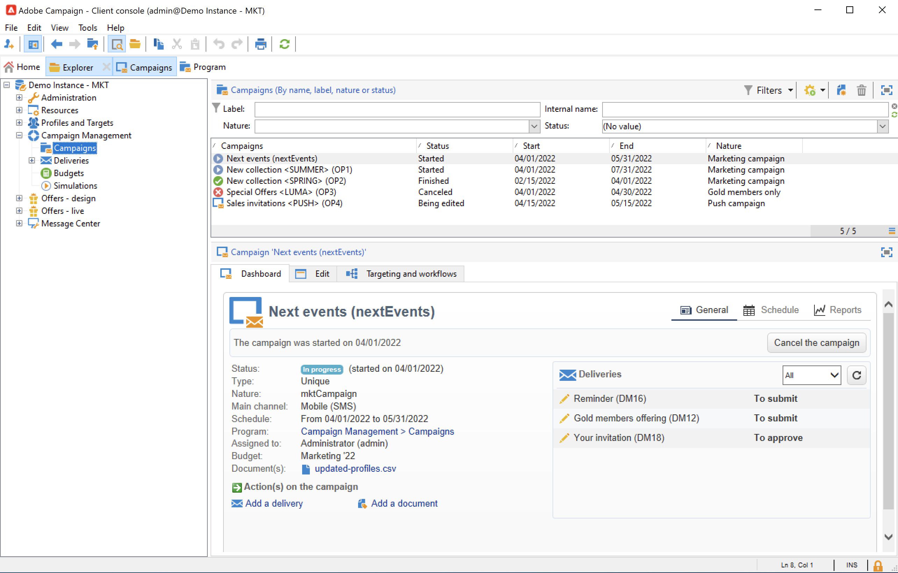

# Scoprire l’interfaccia utente {#ui-client-console}

Puoi accedere ad Adobe Campaign tramite la sua console client o la sua interfaccia utente web. Puoi anche utilizzare le API per gestire i dati ed eseguire attività nella piattaforma Campaign.

>[!CAUTION]
>
>Questa documentazione si concentra sull’utilizzo della console client di Campaign. Se utilizzi l&#39;interfaccia utente di Campaign Web, consulta [questa documentazione](https://experienceleague.adobe.com/docs/campaign-web/v8/campaign-web-home.html?lang=it){target="_blank"}.

* **Console client** - La console client di Campaign è un&#39;applicazione nativa che comunica con il server applicazioni Adobe Campaign tramite protocolli Internet standard, quali SOAP e HTTP. La console client di Campaign centralizza tutte le funzionalità e le impostazioni e richiede una larghezza di banda minima in quanto si basa su una cache locale. Progettata per una facile distribuzione, la console client di Campaign può essere distribuita da un browser Internet, aggiornata automaticamente e non richiede alcuna configurazione di rete specifica in quanto genera solo traffico HTTP(S). [Ulteriori informazioni](#ui-access)

  Scopri come installare e configurare la console client di Campaign in [questa sezione](../start/connect.md).

* **Interfaccia utente Web** - In qualità di utente di Campaign v8, a partire dalla versione v8.6.1, ora puoi accedere a un ambiente web, disponibile tramite l&#39;interfaccia utente centrale di Adobe Experience Cloud. Puoi quindi connetterti ad Adobe Campaign da un browser web. Questa nuova interfaccia consente di creare, gestire ed eseguire azioni di marketing chiave. Tuttavia, non tutte le funzionalità di Campaign sono disponibili. [Ulteriori informazioni](#ac-web-ui).

* **Accesso web** - Le funzionalità di accesso web di Adobe Campaign ti consentono di accedere a un sottoinsieme di funzionalità di Campaign con un browser web, utilizzando un&#39;interfaccia utente di HTML. Utilizza questa interfaccia web per accedere ai rapporti, controllare e convalidare i messaggi, accedere alle dashboard di monitoraggio e altro ancora.  Ulteriori informazioni su Campaign Web Access [sono disponibili in questa sezione](../start/connect.md#web-access).

* **API** - Per risolvere altri casi d&#39;uso, è possibile chiamare il sistema da applicazioni esterne utilizzando le API dei servizi Web esposte tramite il protocollo SOAP. Ulteriori informazioni sulle API di Campaign [in questa pagina](../dev/api.md).

## Utilizzare la console client {#ui-access}

La console client di Campaign è un’applicazione nativa che comunica con il server applicazioni di Adobe Campaign tramite protocolli Internet standard, come SOAP e HTTP. La console client di Campaign centralizza tutte le funzionalità e le impostazioni e richiede una larghezza di banda minima in quanto si basa su una cache locale. Progettata per una facile distribuzione, la console client di Campaign può essere distribuita da un browser Internet, aggiornata automaticamente e non richiede alcuna configurazione di rete specifica in quanto genera solo traffico HTTP(S).  [Ulteriori informazioni sulla console client di Campaign](../start/connect.md). Puoi passare all’interfaccia utente di Campaign Web dalla scheda dedicata nella pagina Home della console client.

>[!NOTE]
>
>Se la nuova scheda di accesso non viene visualizzata, verificare che i campi seguenti non siano lasciati vuoti all&#39;interno dell&#39;account esterno di Adobe Experience Cloud: **Server**, **Tenant**, **Server di richiamata** e **Association mark**.

Puoi anche utilizzare un browser web per accedere a Campaign. In questo contesto, è disponibile solo un sottoinsieme delle funzionalità di Campaign. [Ulteriori informazioni](#web-browser)

### Sfogliare l’interfaccia {#ui-browse}

Una volta connesso alla console client di Campaign, accedi alla home page. Sfoglia i collegamenti per accedere alle funzionalità di. L’insieme di funzionalità disponibili nell’interfaccia dipende dalle opzioni e dalle autorizzazioni.

Dalla sezione centrale della home page, utilizza i collegamenti per accedere al materiale di supporto di Campaign, alla community e al sito web di supporto. Utilizza le schede centrali per sfogliare la nuova interfaccia utente di Campaign Web e il pannello di controllo Campaign.

Sfoglia le schede nella sezione superiore per accedere alle funzionalità chiave di Campaign:

>[!NOTE]
>
>L’elenco delle funzionalità di base a cui puoi accedere dipende dalle autorizzazioni e dall’implementazione.

Per ogni funzionalità, è possibile accedere al set di funzionalità chiave nella sezione **[!UICONTROL Browsing]**. Il collegamento **[!UICONTROL More]** consente di accedere a tutti gli altri componenti.

Ad esempio, quando si passa alla scheda **[!UICONTROL Profiles and targets]**, è possibile accedere agli elenchi dei destinatari, ai servizi di abbonamento, ai flussi di lavoro di targeting esistenti e alle scelte rapide per la creazione di tutti questi componenti.

Quando selezioni un elemento nella schermata, questo viene caricato in una nuova scheda in modo da poter sfogliare facilmente il contenuto.

### Creare un elemento {#create-an-element}

Utilizzare i tasti di scelta rapida nella sezione **[!UICONTROL Create]** a sinistra dello schermo per aggiungere nuovi elementi. È inoltre possibile utilizzare il pulsante **[!UICONTROL Create]** sopra l&#39;elenco per aggiungere nuovi elementi all&#39;elenco corrente.

Ad esempio, nella pagina di consegna, utilizza il pulsante **[!UICONTROL Create]** per creare una nuova consegna.

<!--
## Use a web browser {#web-browser}

You can also access a subset of Campaign capabilities through the a web browser.

The web access interface is similar to the console interface. From a browser, you can use the same navigation and display features as in the console, but you can perform only a reduced set of actions on campaigns. For example, you can view and cancel campaigns, but you cannot modify campaigns. 

[Learn more about Campaign web access](../start/connect.md#web-access).-->

### Accedere a Campaign Explorer {#ac-explorer-ui}

Sfoglia Campaign Explorer per accedere a tutte le funzionalità e le impostazioni di Adobe Campaign.

Questa area di lavoro consente di accedere alla struttura di Explorer per sfogliare tutte le funzionalità e le opzioni.

* La sezione a sinistra mostra la struttura di Esplora campagne e consente di sfogliare tutti i componenti e le impostazioni dell’istanza in base alle autorizzazioni di cui disponi. Puoi aggiungere e personalizzare le cartelle come descritto in [questa pagina](../audiences/folders-and-views.md).

* Nella sezione superiore viene visualizzato l&#39;elenco dei record della cartella corrente. Questi elenchi sono completamente personalizzabili. [Ulteriori informazioni](../config/ui-settings.md)

* Nella sezione inferiore vengono visualizzati i dettagli del record selezionato.

## Interfaccia utente di Campaign Web {#ac-web-ui}

In qualità di utente della console client di Campaign v8, a partire dalla versione v8.6.1, ora puoi accedere a un ambiente web, disponibile tramite l’interfaccia utente centrale di Adobe Experience Cloud. Experience Cloud è un insieme integrato di applicazioni, prodotti e servizi per il marketing digitale di Adobe. Grazie alla sua interfaccia intuitiva, puoi accedere rapidamente alle applicazioni cloud, alle funzionalità dei prodotti e ai servizi.

>[!AVAILABILITY]
>L’interfaccia utente di Campaign Web è disponibile solo per gli utenti che si connettono a Adobe Campaign con il proprio Adobe ID. Ulteriori informazioni su [Adobe Identity Management System (IMS)](https://helpx.adobe.com/it/enterprise/using/users.html){target="_blank"}.
>

Ulteriori informazioni sulla nuova interfaccia utente di Campaign Web sono disponibili in [questa documentazione](https://experienceleague.adobe.com/docs/campaign-web/v8/campaign-web-home.html?lang=it){target="_blank"}.

Funzionalità, configurazione e impostazioni aggiuntive e avanzate sono disponibili solo nella console client. Ulteriori informazioni sulle funzionalità disponibili in entrambe le interfacce utente [nella documentazione dell&#39;interfaccia utente di Campaign Web](https://experienceleague.adobe.com/docs/campaign-web/v8/start/capability-matrix.html?lang=it){target="_blank"}.

## Lingue supportate {#languages}

Le lingue supportate dipendono dall’interfaccia utente.

* Per l’interfaccia della console client di Campaign v8, le lingue supportate sono:

   * Inglese (Regno Unito)
   * Inglese (Stati Uniti)
   * Francese
   * Tedesco
   * Giapponese

  >[!CAUTION]
  >
  >La lingua viene selezionata durante il processo di installazione e non può essere modificata in seguito.

* Per le lingue supportate dall&#39;interfaccia utente di Campaign Web, [fai riferimento a questa pagina](https://experienceleague.adobe.com/docs/campaign-web/v8/start/connect-to-campaign.html#language-pref){target="_blank"}.

La lingua influisce sui formati di data e ora.

Le principali differenze tra l&#39;inglese americano e l&#39;inglese britannico sono:

<table> 
 <thead> 
  <tr> 
   <th> Formati  </th> 
   <th> Inglese (Stati Uniti)  </th> 
   <th> Inglese (EN)  </th> 
  </tr> 
 </thead> 
 <tbody> 
  <tr> 
   <td> Data  </td> 
   <td> La settimana inizia di domenica  </td> 
   <td> La settimana inizia il lunedì  </td> 
  </tr> 
  <tr> 
   <td> Data breve  </td> 
   <td> 
%2M/%2D/%4Y

<strong>es: 09/25/2018</strong>
 </td> 
   <td> 
%2D/%2M/%4Y

<strong>es: 25/09/2018</strong>
 </td> 
  </tr> 
  <tr> 
   <td> Data breve con ora  </td> 
   <td> 
%2M/%2D/%4Y %I:%2N:%2S %P

<strong>es: 09/25/2018 10:47:25 PM</strong>
 </td> 
   <td> 
%2D/%2M/%4Y %2H:%2N:%2S

<strong>es: 25/09/2018 22:47:25</strong>
 </td> 
  </tr> 
 </tbody> 
</table>
