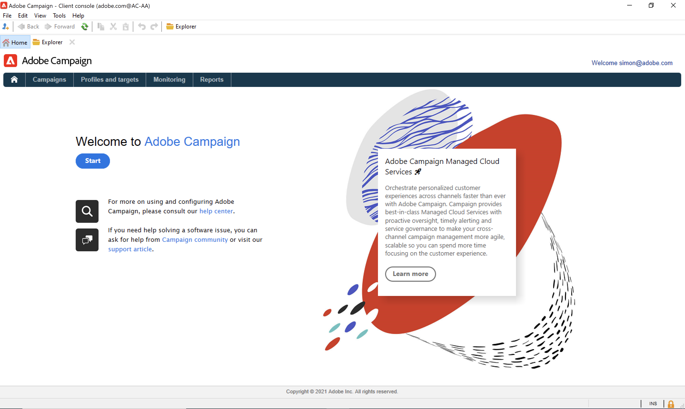

# Scopri l’interfaccia utente di Campaign

## Accedere all’interfaccia utente di Campaign{#ui-access}

L’area di lavoro di Campaign è disponibile tramite [Client Console](../architecture/general-architecture.md).

Scopri come installare e configurare Campaign Client Console in [questa sezione](../start/connect.md).

Puoi anche utilizzare un browser web per accedere a Campaign. In questo contesto, è disponibile solo un sottoinsieme delle funzionalità di Campaign. [Ulteriori informazioni](#web-browser)

## Sfoglia l’interfaccia utente{#ui-browse}

Una volta connesso a Campaign, accedi alla home page. Sfoglia i collegamenti per accedere alle funzionalità di. L’insieme di funzionalità disponibili nell’interfaccia utente dipende dalle opzioni e dalle autorizzazioni.

Dalla sezione centrale della home page, utilizza i collegamenti per accedere al materiale di supporto di Campaign, alla community e al sito web di supporto.

Utilizza le schede nella sezione superiore per sfogliare le funzionalità chiave di Campaign:

>[!NOTE]
>
>L’elenco delle funzionalità di base a cui puoi accedere dipende dalle autorizzazioni e dall’implementazione.

Per ogni funzionalità, puoi accedere al set di funzioni chiave nella **[!UICONTROL Browsing]** sezione. Il **[!UICONTROL More]** consente di accedere a tutti gli altri componenti.

Ad esempio, quando navighi su **[!UICONTROL Profiles and targets]** , puoi accedere agli elenchi dei destinatari, ai servizi di abbonamento, ai flussi di lavoro di targeting esistenti e alle scelte rapide per la creazione di tutti questi componenti.

Quando selezioni un elemento nella schermata, questo viene caricato in una nuova scheda in modo da poter sfogliare facilmente il contenuto.

## Creare un elemento {#create-an-element}

Utilizzare le scelte rapide in **[!UICONTROL Create]** a sinistra dello schermo per aggiungere nuovi elementi. È inoltre possibile utilizzare **[!UICONTROL Create]** sopra l&#39;elenco per aggiungere nuovi elementi all&#39;elenco corrente.

Ad esempio, nella pagina di consegna, utilizza **[!UICONTROL Create]** per creare una nuova consegna.

## Utilizzare un browser web {#web-browser}

Puoi anche accedere a un sottoinsieme di funzionalità di Campaign tramite un browser web.

L’interfaccia di accesso web è simile all’interfaccia della console. Da un browser, puoi utilizzare le stesse funzioni di navigazione e visualizzazione della console, ma puoi eseguire solo un set ridotto di azioni sulle campagne. Ad esempio, puoi visualizzare e annullare le campagne, ma non puoi modificarle.

 [Ulteriori informazioni sull’accesso web a Campaign](../start/connect.md#web-access).

## Accedere a Campaign Explorer {#ac-explorer-ui}

Sfoglia Campaign Explorer per accedere a tutte le funzionalità e le impostazioni di Adobe Campaign.

Questa area di lavoro consente di accedere alla struttura di Explorer per sfogliare tutte le funzionalità e le opzioni.

* La sezione a sinistra mostra la struttura di Esplora campagne e consente di sfogliare tutti i componenti e le impostazioni dell’istanza in base alle autorizzazioni di cui disponi. Puoi aggiungere e personalizzare le cartelle come descritto in [questa pagina](../audiences/folders-and-views.md).

* Nella sezione superiore viene visualizzato l&#39;elenco dei record della cartella corrente. Questi elenchi sono completamente personalizzabili. [Ulteriori informazioni](../config/ui-settings.md)

* Nella sezione inferiore vengono visualizzati i dettagli del record selezionato.

## Lingue{#languages}

L’interfaccia utente di Campaign v8 è disponibile nelle seguenti lingue:

* Inglese (Regno Unito)
* Inglese (Stati Uniti)
* Francese
* Tedesco
* Giapponese

La lingua viene selezionata durante il processo di installazione.

>[!CAUTION]
>
>Una volta creata l’istanza, non è possibile cambiare la lingua.

La lingua influisce sui formati di data e ora.

Le principali differenze tra l&#39;inglese americano e l&#39;inglese britannico sono:

<table> 
 <thead> 
  <tr> 
   <th> Formati  </th> 
   <th> Inglese (Stati Uniti)  </th> 
   <th> Inglese (EN)  </th> 
  </tr> 
 </thead> 
 <tbody> 
  <tr> 
   <td> Data  </td> 
   <td> La settimana inizia di domenica  </td> 
   <td> Inizio settimana lunedì  </td> 
  </tr> 
  <tr> 
   <td> Data breve  </td> 
   <td> 
%2M/%2D/%4Y

<strong>es: 09/25/2018</strong>
 </td> 
   <td> 
%2D/%2M/%4Y

<strong>es: 25/09/2018</strong>
 </td> 
  </tr> 
  <tr> 
   <td> Data e ora brevi  </td> 
   <td> 
%2M/%2D/%4Y %I:%2N:%2S %P

<strong>ex: 09/25/2018 10:47:25 PM</strong>
 </td> 
   <td> 
%2D/%2M/%4Y %2H:%2N:%2S

<strong>ex: 25/09/2018 22:47:25</strong>
 </td> 
  </tr> 
 </tbody> 
</table>
