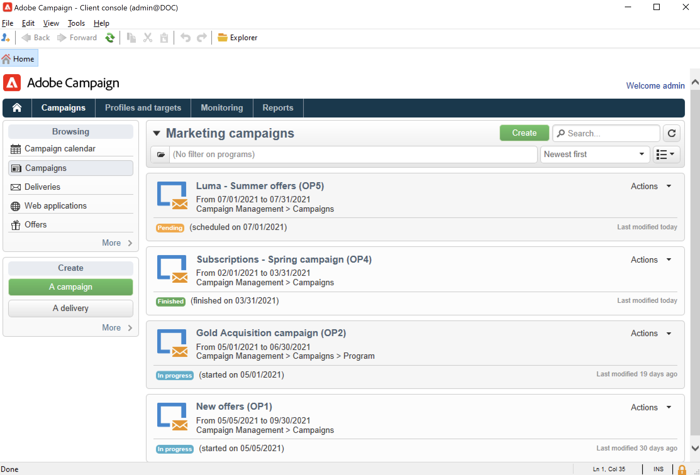

# Introduzione alle campagne di marketing{#gs-ac-campaigns}

Adobe Campaign offre un serie di soluzioni che consentono di personalizzare e distribuire campagne su tutti i canali online e offline. Puoi creare, configurare, eseguire e analizzare campagne di marketing. Tutte le campagne di marketing possono essere gestite da un centro di controllo unificato. Scopri come sfogliare e creare campagne di marketing in questa sezione.

Le campagne includono azioni (consegne), processi (importazione o estrazione file) e risorse (documenti di marketing, descrizioni della consegna). Vengono utilizzati nelle campagne di marketing. Le campagne fanno parte di un programma e i programmi sono inclusi in un piano di campagna.

## Orchestrazione di campagne cross-channel{#cross-channel-orchestration}

 Adobe Campaign ti consente di progettare e orchestrare campagne mirate e personalizzate su più canali: e-mail, direct mail, SMS, notifica push. Un’unica interfaccia ti offre tutte le funzioni necessarie per pianificare, orchestrare, configurare, personalizzare, automatizzare, eseguire e misurare tutte le tue campagne e comunicazioni.

### Concetti principali{#ac-core-concepts}

Prima di iniziare a implementare le campagne di marketing, devi acquisire familiarità con i concetti seguenti:

* **Campagna di marketing**: una campagna centralizza tutti gli elementi relativi a una campagna di marketing: consegne, regole di targeting, costi, file di esportazione, documenti correlati, eccetera. Ogni campagna è associata a un programma.

* **Programma**: un programma consente di definire azioni di marketing per un periodo di calendario: lancio, sondaggi, fidelizzazione, eccetera. Ogni programma contiene campagne collegate a un calendario, che fornisce una visualizzazione complessiva.

* **Piano**: il piano marketing può contenere più programmi. È collegato a un periodo di calendario, ha un bilancio assegnato e può anche essere collegato a documenti e obiettivi.

* **Flusso di lavoro per campagne**: un flusso di lavoro per campagne contiene attività per definire la logica della campagna. Utilizza i flussi di lavoro per campagne per definire i tipi di pubblico e creare consegne per tutti i canali disponibili.

* **Campagne ricorrenti**: le campagne ricorrenti vengono create da un modello specifico che definisce il modello di flusso di lavoro da eseguire e la pianificazione di esecuzione.

* **Campagne periodiche**: una campagna periodica è una campagna creata automaticamente in base alla pianificazione di esecuzione del relativo modello.

## Area di lavoro di una campagna di marketing{#ac-workspace}

Adobe Campaign consente di creare, configurare, eseguire e analizzare tutte le campagne di marketing da un centro di controllo unificato.

 Per scoprire come accedere e implementare campagne di marketing, consulta [questa sezione](https://experienceleague.adobe.com/docs/campaign/automation/campaign-orchestration/set-up-campaigns.html?lang=it).

## Passaggi principali per iniziare{#gs-ac-start}

I passaggi principali per creare una campagna di marketing cross-channel sono i seguenti:

1. **Pianificare e progettare programmi e campagne di marketing**

   Definire la gerarchia e la pianificazione, stabilire il budget, aggiungere risorse e selezionare gli operatori.

    Per scoprire come creare un piano di marketing e configurare le campagne, consulta [questa pagina](https://experienceleague.adobe.com/docs/campaign/automation/campaign-orchestration/marketing-campaign-create.html?lang=it).

   Tutte le campagne di marketing si basano su un modello, che memorizza le impostazioni e le funzionalità principali. Viene fornito un modello integrato al fine di creare una campagna per la quale non è stata definita alcuna configurazione specifica. Puoi creare e configurare i modelli della campagna e quindi creare campagne a partire da questi modelli.

   Per scoprire come utilizzare i modelli di campagna, consulta [questa pagina](https://experienceleague.adobe.com/docs/campaign/automation/campaign-orchestration/marketing-campaign-templates.html?lang=it).

   Per scoprire cosa sono le campagne ricorrenti e come configurarle, consulta [questa pagina](https://experienceleague.adobe.com/docs/campaign/automation/campaign-orchestration/recurring-periodic-campaigns.html?lang=it).

1. **Definire i tipi di pubblico**

   Puoi creare i tipi di pubblico in un flusso di lavoro o selezionare un gruppo esistente, ad esempio un elenco di destinatari, gli abbonati a una newsletter o i destinatari di una consegna precedente, oppure puoi selezionare qualsiasi condizione di filtro.

   

   Per scoprire come definire il pubblico dei messaggi, consulta [questa pagina](https://experienceleague.adobe.com/docs/campaign/automation/campaign-orchestration/marketing-campaign-target.html?lang=it).

1. **Creare consegne**

   Seleziona uno o più canali, definisci il contenuto del messaggio e avvia le consegne.

   

    Per scoprire come creare e avviare le consegne delle campagne di marketing, consulta [questa pagina](https://experienceleague.adobe.com/docs/campaign/automation/campaign-orchestration/marketing-campaign-deliveries.html?lang=it).

   È possibile associare vari documenti a una campagna: rapporti, foto, pagine web, diagrammi, ecc.

    Per ulteriori informazioni sui documenti associati, consulta [questa pagina](https://experienceleague.adobe.com/docs/campaign/automation/campaign-orchestration/marketing-campaign-assets.html?lang=it).

1. **Impostare il processo di approvazione**

   Adobe Campaign consente di impostare processi di approvazione collaborativa per le fasi principali della campagna di marketing. Per ogni campagna puoi approvare il target di consegna, i contenuti e i costi. Gli operatori di Adobe Campaign incaricati dell’approvazione possono ricevere una notifica tramite e-mail e accettare o rifiutare l’approvazione dalla console o tramite una connessione web.

   Per scoprire come impostare e gestire le approvazioni, consulta [questa pagina](https://experienceleague.adobe.com/docs/campaign/automation/campaign-orchestration/marketing-campaign-approval.html?lang=it#campaign-orchestration).

## Componente aggiuntivo Marketing distribuito{#distributed-marketing-add-on}

Adobe Campaign offre il componente aggiuntivo **Marketing distribuito** per l’implementazione di campagne di cooperazione tra enti centrali (sedi centrali, dipartimenti di marketing, ecc.) ed enti locali (negozi, agenzie regionali, ecc.). Questa cooperazione si basa su un’area di lavoro condivisa nota come **[!UICONTROL List of campaign packages]**, in cui i modelli di campagna progettati da entità centrali vengono offerti agli enti locali.

>[!NOTE]
>
>Questa funzionalità è disponibile a partire da Campaign v8.3. Per verificare la versione, consulta [questa sezione](compatibility-matrix.md#how-to-check-your-campaign-version-and-buildversion)

Per scoprire come configurare e utilizzare le funzionalità di marketing distribuito di Campaign, consulta [questa pagina](https://experienceleague.adobe.com/docs/campaign/automation/distributed-marketing/about-distributed-marketing.html?lang=it).

## Componente aggiuntivo Gestione risposta{#response-manager-add-on}

Adobe Campaign offre il componente aggiuntivo **Gestione della risposta** che consente di misurare il successo e la redditività delle campagne di marketing o delle proposte di offerte tra canali di comunicazione: e-mail, dispositivi mobili, direct mailing, ecc.

>[!NOTE]
>
>Questa funzionalità è disponibile a partire da Campaign v8.3. Per verificare la versione, consulta [questa sezione](compatibility-matrix.md#how-to-check-your-campaign-version-and-buildversion)

 Scopri come configurare e utilizzare Campaign Response Manager nella [documentazione di Campaign Classic v7](https://experienceleague.adobe.com/docs/campaign-classic/using/response-manager/about-response-manager.html?lang=it){target=&quot;_blank&quot;}

