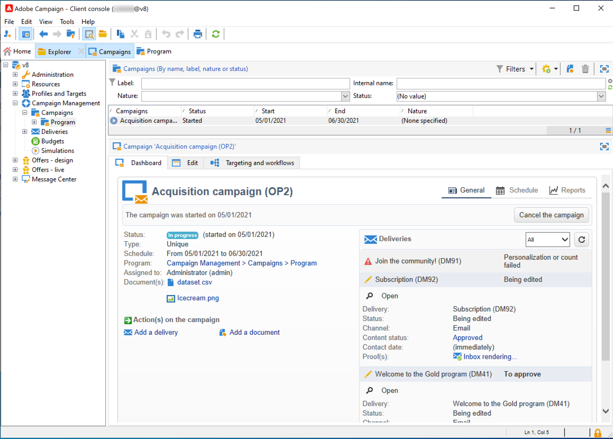

# Connessione ad Adobe Campaign v8{#gs-ac-connect}

Per iniziare a lavorare con Campaign, devi installare e configurare la console client.

Client Console è un’applicazione nativa che comunica con l’application server di Adobe Campaign tramite protocolli Internet standard, come SOAP e HTTP. La console del client di Campaign centralizza tutte le funzionalità e le impostazioni e richiede una larghezza di banda minima in quanto si basa su una cache locale. Progettata per una facile implementazione, la console del client Campaign può essere distribuita da un browser Internet, aggiornata automaticamente e non richiede alcuna configurazione di rete specifica in quanto genera solo traffico HTTP(S).

Prima di iniziare, è necessario:

* Verifica la compatibilità di sistema e strumenti con Adobe Campaign nella [Matrice di compatibilità](compatibility-matrix.md)
* Ottieni l’URL del server Campaign
* Crea il tuo Adobe ID o ottieni le tue credenziali utente dalla tua azienda
* Installa il runtime WebView2 di Microsoft Edge sul sistema. [Ulteriori informazioni](#webview)

## Installare la console client{#download-ac-console}

### runtime Microsoft Edge Webview2 {#webview}

Dalla versione di build di Campaign Classic 8.4, è necessaria l’installazione del runtime Microsoft Edge Webview 2 per qualsiasi installazione della console client.

Web View è installato per impostazione predefinita come parte del sistema operativo Windows 11. Se non è già presente nel sistema, il programma di installazione della console client di Campaign ti chiederà di scaricarla da [Sito web per sviluppatori di Microsoft](http://www.adobe.com/go/acc-ms-webview2-runtime-download_it){target="_blank"}. Il collegamento per il download non funziona nel browser Internet Explorer 11 in quanto Microsoft ne ha dichiarato obsoleto il supporto. Assicurati di utilizzare un browser diverso per accedere al collegamento.

### Scarica la console{#install-ac-console}

Quando utilizzi Campaign per la prima volta, devi scaricare e installare la console client.

Per scaricare la console client sono disponibili due opzioni:

1. In qualità di amministratore di Campaign, collegati ad Adobe [Distribuzione di software](https://experience.adobe.com/#/downloads/content/software-distribution/it/campaign.html){target="_blank"}.

1. In qualità di utente finale, l’amministratore di Campaign implementa la console client per conto tuo e la rende disponibile tramite un URL dedicato.

Una volta scaricato il programma di installazione della console client, installalo sul computer locale.

Non è possibile modificare la lingua della console client dopo l’installazione.

## Creare la connessione{#create-your-connection}

Una volta installata la Console client, segui i passaggi descritti di seguito per creare la connessione al server applicazioni:

1. Avvia la console e sfoglia il collegamento nell’angolo a destra per accedere alla schermata di configurazione della connessione.

1. Fai clic su **[!UICONTROL Add > Connection]** e immetti l’etichetta e l’URL dell’application server di Adobe Campaign.

1. Specifica una connessione al server dell’applicazione Adobe Campaign tramite un URL. Utilizzare un DNS o un alias del computer o l&#39;indirizzo IP.

   Ad esempio, puoi utilizzare il [`https://<machine>.<domain>.com`](https://myserver.adobe.com) digitare URL.

1. Controlla l’opzione **[!UICONTROL Connect with an Adobe ID]**.

1. Fai clic su **[!UICONTROL Ok]** per salvare le impostazioni.

Puoi aggiungere tutte le connessioni necessarie per connettersi, ad esempio, agli ambienti di test, stage e produzione.

>[!NOTE]
>
>La **[!UICONTROL Add]** pulsante consente di creare **[!UICONTROL folders]** per organizzare tutte le connessioni. Trascina e rilascia ciascuna connessione in una cartella.

## Accedere ad Adobe Campaign {#logon-to-ac}

Gli utenti di Campaign si collegano alla console Adobe Campaign utilizzando il proprio Adobe ID, tramite Adobe Identity Management System (IMS). Possono utilizzare lo stesso ID per tutte le soluzioni Adobe. La connessione viene salvata quando si utilizza Adobe Campaign con altre soluzioni. Ulteriori informazioni su Adobe IMS in [questa pagina](https://helpx.adobe.com/enterprise/using/identity.html){target="_blank"}.

Per accedere a un’istanza, segui i passaggi seguenti:

1. Avvia la console e sfoglia il collegamento nell’angolo a destra per accedere alla schermata di configurazione della connessione.

   

1. Seleziona l’istanza Campaign a cui devi accedere.

1. Fai clic su **[!UICONTROL Ok]**.

Puoi quindi accedere a Campaign con il tuo Adobe ID.

>[!NOTE]
>
>Poiché Microsoft Edge Webview2 non salva le credenziali proxy, la console potrebbe richiedere l’autenticazione due volte alla prima connessione.

## Aggiornare la console client{#upgrade-ac-console}

Quando il sistema viene aggiornato a una versione più recente, è necessario aggiornare la console client alla stessa versione. Questa è una best practice e per alcune versioni questo aggiornamento è obbligatorio. In tal caso, è menzionato nella [Note sulla versione](release-notes.md).

In qualità di utente di Cloud Services gestiti, Adobe implementa la console client per tuo conto. Quando ti connetti all’ambiente aggiornato, viene richiesto di scaricare la versione più recente della console client in una finestra a comparsa. È necessario accettare questo aggiornamento e aggiornare la console client come richiesto.

>[!CAUTION]
>
>L’Adobe consiglia di lasciare l’opzione **[!UICONTROL No longer ask this question]** deselezionata per essere certi di essere avvisati quando è disponibile una nuova versione della console. Se questa opzione è selezionata, l’utente non viene informato che è necessario un aggiornamento della console.

## Concedere l’accesso agli utenti{#grant-access}

Adobe Campaign ti consente di definire e gestire i diritti assegnati ai vari operatori.

In qualità di amministratore di Campaign, sei responsabile della creazione degli operatori e della condivisione delle loro credenziali con gli utenti.

Ulteriori informazioni sugli utenti e su come definirne le autorizzazioni in [questa sezione](gs-permissions.md).

## Accesso web{#web-access}

È possibile accedere ad alcune parti dell’applicazione tramite un browser web utilizzando un’interfaccia utente di HTML: reporting, approvazione della consegna, monitoraggio delle istanze e altro ancora.

L’accesso Web fornisce un’interfaccia simile alla console ma con un set ridotto di funzionalità.

Ad esempio, per un determinato operatore, nella console verrà visualizzata una campagna con le seguenti opzioni:

Mentre con l&#39;accesso Web, le opzioni consentono principalmente la visualizzazione:

Nel processo di convalida viene utilizzato anche l’accesso Web: gli operatori possono fare clic sull’e-mail di richiesta di approvazione e connettersi a Campaign tramite il proprio browser web per convalidare o rifiutare un contenuto o un budget di consegna.

Per accedere all’istanza Campaign dal web, l’URL è:  `https://<your adobe campaign server>:<port number>/view/home`.
