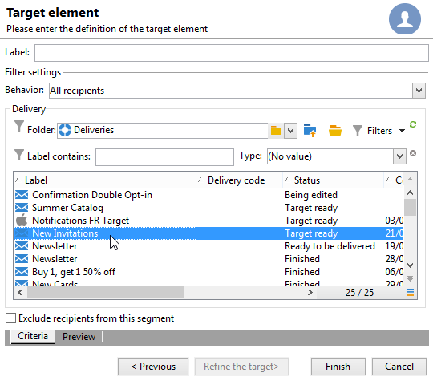
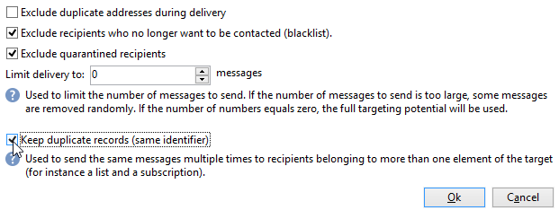

# Creare la prima consegna {#create-a-msg}

In questa pagina scoprirai come creare una consegna singola. Puoi creare altri tipi di consegne per generare i tuoi casi d’uso. Ulteriori informazioni sui diversi tipi di consegne e su come crearle sono disponibili in [questa pagina](gs-message.md).

I passaggi chiave per la creazione di una consegna singola sono i seguenti:

1. **Crea una nuova consegna**. [Ulteriori informazioni](#create-the-delivery)

1. **Definisci il contenuto della consegna**. [Ulteriori informazioni](#content-of-the-delivery)

1. **Seleziona la popolazione target** [Ulteriori informazioni](#target-population)

Puoi quindi preparare, testare, inviare e monitorare i messaggi con Adobe Campaign.

>[!NOTE]
>
>I passaggi descritti in questa sezione presuppongono che tutti i destinatari target e i relativi profili siano memorizzati nel database, ad eccezione del caso di consegna esterna. Consulta [Selezione di destinatari esterni](#selecting-external-recipients).

## Creare la consegna {#create-the-delivery}

Per creare una consegna, segui questi passaggi:

1. Accedi all’elenco delle consegne e fai clic su **[!UICONTROL Create]**.
1. Seleziona il canale di consegna. Per farlo, scegli il modello di consegna appropriato dall’elenco a discesa.

   

   Per ogni canale installato viene fornito un modello incorporato: e-mail, telefono, canali mobili (push/SMS), direct mail, X (Twitter), ecc. I canali disponibili nell’elenco dipendono dal contratto di licenza.

   Puoi creare nuovi modelli di consegna per preconfigurare parametri specifici in base alle esigenze.  [Ulteriori informazioni](../send/create-templates.md).

1. Immetti un nome per la consegna nel campo **[!UICONTROL Label]**.

   Alla consegna può essere assegnato anche un codice di consegna (facoltativo). Il nome della consegna e il relativo codice sono visibili nell’elenco delle consegne ma non esposti ai destinatari.

1. Aggiungi una descrizione nel campo **[!UICONTROL Description]** (facoltativo).
1. Seleziona la natura della consegna nel campo pertinente (facoltativo). Queste informazioni sono utili per il tracciamento della consegna: puoi filtrare in base a questo criterio nell’elenco di consegna o creare query utilizzando questo criterio di selezione.
1. Fai clic su **[!UICONTROL Continue]** per visualizzare la finestra del contenuto del messaggio.

## Definire il contenuto della consegna {#content-of-the-delivery}

Il contenuto della consegna è pronto per essere configurato. La definizione del contenuto della consegna è specifica per ciascun canale. Per ulteriori informazioni, consulta la sezione dedicata:

* [Definire il contenuto dell’e-mail](../send/email.md)
* [Definire il contenuto dell’SMS](../send/sms/sms-content.md)
* [Definire il contenuto delle direct mail](../send/direct-mail.md)
* [Definire il contenuto delle notifiche push](../send/push.md)

## Definire il pubblico di destinazione {#target-population}

Per ogni consegna, puoi definire diversi tipi di pubblico di destinazione:

* **Pubblico principale**: profili che ricevono messaggi. [Ulteriori informazioni](#select-the-main-target)
* **Target di bozza**: profili che ricevono messaggi di bozza. Una bozza è un messaggio specifico che ti consente di testare un messaggio prima di inviarlo al target principale. [Ulteriori informazioni](#select-the-proof-target)

Inoltre, nel contesto di una campagna di marketing, puoi aggiungere:

* **Indirizzi seed**: destinatari che non rientrano nel target di consegna ma che ricevono la consegna. [Ulteriori informazioni](../audiences/test-profiles.md)
* **Gruppi di controllo**: popolazione che non riceve la consegna, utilizzata per tenere traccia del comportamento e dell’impatto della campagna. [Ulteriori informazioni](../../automation/campaigns/marketing-campaign-target.md#add-a-control-group).

### Selezionare i destinatari principali della consegna {#select-the-main-target}

Nella maggior parte dei casi, il target principale viene estratto dal database di Adobe Campaign (modalità predefinita). Tuttavia, i destinatari possono anche essere archiviati in un [file esterno](#selecting-external-recipients).

Per selezionare i destinatari di una consegna, segui i passaggi indicati di seguito:

1. Nell’editor di consegna, seleziona **[!UICONTROL To]**.
1. Se i destinatari sono memorizzati nel database, scegli la prima opzione.

   {zoomable="yes"}

1. Seleziona la [mappatura target](../audiences/target-mappings.md) nell’elenco a discesa **[!UICONTROL Target mapping]**.
1. Fai clic sul pulsante **[!UICONTROL Add]** per definire i filtri di restrizione.

   {width="60%" align="left" zoomable="yes"}

   Seleziona un tipo di filtro e fai clic su **[!UICONTROL Next]** per definire le condizioni. È possibile visualizzare i destinatari filtrati dalla scheda **[!UICONTROL Preview]**. A seconda del tipo di target, il pulsante **[!UICONTROL Refine target]** consente di combinare diversi criteri di targeting.

   Sono disponibili i seguenti tipi di target:

   * **[!UICONTROL Filtering conditions]**: utilizzare questa opzione per definire una query personalizzata per il recupero dei destinatari. Per informazioni su come progettare una query, consulta [questa sezione](../start/query-editor.md).
   * **[!UICONTROL A list of recipients]**: utilizza questa opzione per impostare come target un elenco di profili. Per ulteriori informazioni sugli elenchi, consulta [questa sezione](../audiences/create-audiences.md).
   * **[!UICONTROL A recipient]**: utilizza questa opzione per selezionare un profilo specifico nel database.
   * **[!UICONTROL Recipients included in a folder]**: utilizza questa opzione per eseguire il targeting di tutti i profili contenuti in una cartella specifica.
   * **[!UICONTROL Recipients of a delivery]**: utilizza questa opzione per generare il target dai destinatari di una consegna. Quindi, seleziona la consegna nell’elenco:

     

   * **[!UICONTROL Delivery recipients belonging to a folder]**: utilizza questa opzione per generare il target dalle consegne dei destinatari incluse in una cartella specifica.

     

     È possibile filtrare il comportamento dei destinatari selezionandolo dall’elenco a discesa:

     

     >[!NOTE]
     >
     >L’opzione **[!UICONTROL Include sub-folders]** consente inoltre di eseguire il targeting delle consegne contenute nelle cartelle presenti nella struttura ad albero sotto il nodo selezionato.

   * **[!UICONTROL Subscribers of an information service]**: questa opzione consente di selezionare una newsletter a cui i destinatari devono essere iscritti per rientrare nel target della consegna creata.

     

   * **[!UICONTROL User filters]**: questa opzione consente di accedere ai filtri preconfigurati per utilizzarli come criteri di filtro per i profili del database. I filtri preconfigurati sono presentati in [questa sezione](../audiences/create-filters.md#default-filters).
   * L’opzione **[!UICONTROL Exclude recipients from this segment]** consente di eseguire il targeting dei destinatari che non soddisfano i criteri di destinazione definiti. Per utilizzare questa opzione, seleziona la casella appropriata, quindi applica il targeting, come definito in precedenza, per escludere i profili risultanti.

1. Immetti un nome per questo targeting nel campo **[!UICONTROL Label]**. Per impostazione predefinita, l’etichetta è quella del primo criterio di targeting. Quando vengono combinati più criteri di filtro, è consigliato utilizzare un nome esplicito.
1. Fai clic su **[!UICONTROL Finish]** per convalidare le opzioni di targeting.

   I criteri di targeting definiti sono riepilogati nella sezione centrale della scheda di configurazione principale del target. Fai clic su un criterio per visualizzarne il contenuto (configurazione e anteprima). Per eliminare un criterio, fai clic sulla crocetta che segue la sua etichetta.

   

### Selezionare destinatari esterni {#selecting-external-recipients}

È possibile inviare messaggi ai profili che non sono memorizzati nel database, ma in un file esterno. Ad esempio, per inviare una consegna a destinatari importati da un file di testo:

1. Fai clic sul collegamento **[!UICONTROL To]** per selezionare i destinatari della consegna.
1. Seleziona l’opzione **[!UICONTROL Defined in an external file]**.
1. Seleziona il file contenente i destinatari.
1. Durante l’importazione dei destinatari, fai clic sul collegamento **[!UICONTROL File format definition...]** per selezionare e configurare il file esterno.

   Per ulteriori informazioni sull’importazione di dati, consulta la [documentazione di Campaign Classic v7](https://experienceleague.adobe.com/it/docs/campaign-classic/using/getting-started/importing-and-exporting-data/generic-imports-exports/executing-import-jobs#step-2---source-file-selection){target="_blank"}.

1. Fai clic su **[!UICONTROL Finish]** e configura la consegna come consegna standard.

>[!CAUTION]
>
>Quando definisci il contenuto del messaggio per la consegna e-mail a destinatari esterni, non includere il collegamento alla pagina mirror, in quanto non può essere generato in questa modalità di consegna.

### Impostazioni di esclusione {#define-exclusion-settings}

Quando viene definito il [pubblico di una consegna](#target-population), viene utilizzata la scheda **[!UICONTROL Exclusions]** per limitare il numero di messaggi. I parametri predefiniti sono consigliati, ma puoi adattare le impostazioni in base alle esigenze. Tuttavia, queste opzioni devono essere modificate solo da un utente esperto, in modo da evitare uso improprio ed errori.

>[!CAUTION]
>
>In qualità di utente esperto, per casi d’uso specifici puoi modificare queste impostazioni, ma Adobe consiglia di mantenere la configurazione predefinita.

Puoi escludere gli indirizzi che hanno raggiunto un certo numero di errori consecutivi o la cui valutazione della qualità è inferiore a una soglia specificata in questa finestra. Puoi anche scegliere se autorizzare o meno gli indirizzi non qualificati per i quali non sono stati restituiti dati.

Per modificare la configurazione predefinita, fai clic sul collegamento **[!UICONTROL Edit...]**.

+++ Opzioni disponibili:

* **[!UICONTROL Exclude duplicate addresses during delivery]**: questa opzione è attiva per impostazione predefinita e rimuove gli indirizzi e-mail duplicati durante la consegna. La strategia applicata può variare a seconda del modo in cui Adobe Campaign viene utilizzato e del tipo di dati nel database. Il valore dell’opzione può essere configurato per ogni modello di consegna.
* **[!UICONTROL Exclude recipients who no longer want to be contacted]**, ad esempio i destinatari i cui indirizzi e-mail fanno parte dell’elenco Bloccati (“rinuncia”). Questa opzione deve rimanere selezionata per rispettare l’etica professionale dell’e-marketing.
* **[!UICONTROL Exclude quarantined recipients]**: questa opzione consente di escludere dal target i profili con un indirizzo messo in quarantena. Si consiglia vivamente di mantenere selezionata questa opzione. Ulteriori informazioni sulla gestione della quarantena sono disponibili in [questa sezione](../send/quarantines.md).
* **[!UICONTROL Limit delivery]** a un determinato numero di messaggi. Questa opzione consente di immettere il numero massimo di messaggi da inviare. Se il pubblico target supera il numero di messaggi indicato, al target viene applicata una selezione casuale. Per inviare tutti i messaggi, mantieni questo valore su “0”.
* **[!UICONTROL Keep duplicate records (same identifier)]**: questa opzione consente di inviare più consegne a destinatari che soddisfano diversi criteri di targeting.
+++

### Selezionare i destinatari dei messaggi di bozza {#select-the-proof-target}

Per le consegne e-mail, puoi inviare bozze per convalidare il contenuto del messaggio. L’invio di bozze consente di controllare il collegamento di rinuncia, la mirror page e tutti gli altri collegamenti, convalidare il messaggio, verificare che siano visualizzate le immagini, rilevare eventuali errori, ecc. È possibile anche controllare la progettazione e il rendering su dispositivi diversi.

Una bozza è un messaggio specifico che consente di testare un messaggio prima che venga inviato al pubblico principale. I destinatari della bozza hanno il compito di approvare il messaggio: rendering, contenuto, impostazioni di personalizzazione, configurazione.

Per ulteriori informazioni sui destinatari e l’invio della bozza, consulta [questa sezione](../send/preview-and-proof.md#send-proofs).

#### Video tutorial {#seeds-and-proofs-video}

In questo video scoprirai come aggiungere seed e bozze a un’e-mail esistente e come inviarla.

>[!VIDEO](https://video.tv.adobe.com/v/3447007?quality=12&captions=ita)

Ulteriori video dimostrativi di Campaign Classic sono disponibili [qui](https://experienceleague.adobe.com/docs/campaign-classic-learn/tutorials/overview.html?lang=it).

## Preparare e convalidare la consegna {#validate-the-delivery}

Quando una consegna è stata creata e configurata, devi convalidarla prima di inviarla al target principale.

Per eseguire questa operazione:

1. **Analizza la consegna**: questo passaggio consente di preparare i messaggi da consegnare. [Ulteriori informazioni](../send/delivery-analysis.md).

1. **Invia bozze**: questo passaggio consente di verificare i contenuti, l’URL, la personalizzazione ecc. [Ulteriori informazioni](../send/preview-and-proof.md).

>[!IMPORTANT]
>
>I due passaggi qui sopra **devono essere** eseguiti dopo ogni modifica apportata al contenuto del messaggio.

## Configurare e inviare la consegna {#configuring-and-sending-the-delivery}

Accedi ai parametri di consegna per configurare altre impostazioni e definire la modalità di invio dei messaggi. Puoi definire la priorità di consegna, impostare l’invio in scaglioni, configurare le impostazioni per i nuovi tentativi e verificare l’invio della consegna. Al termine della configurazione, puoi confermare l’invio. I messaggi vengono quindi inviati immediatamente o in base alla pianificazione della consegna.

Per informazioni su come configurare le impostazioni di consegna, consulta [questa pagina](../send/configure-and-send.md).
