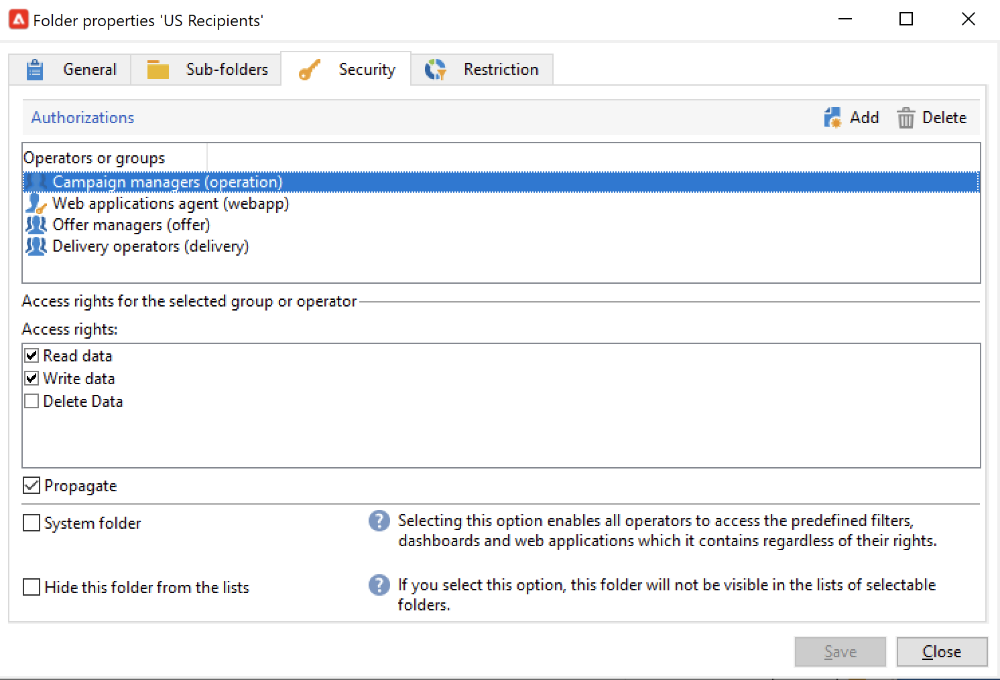

# Gestire le autorizzazioni cartella{#manage-folder-permissions}

## Limitare l’accesso a una cartella{#restrict-access-to-a-folder}

Utilizza le autorizzazioni sulle cartelle per organizzare e controllare l’accesso ai dati di Campaign.

La gestione delle cartelle è descritta in [questa pagina](../audiences/folders-and-views.md).

Per modificare le autorizzazioni per una cartella Campaign specifica, effettua le seguenti operazioni:

1. Fai clic con il pulsante destro del mouse sulla cartella e seleziona **[!UICONTROL Properties...]**.
1. Accedi a **[!UICONTROL Security]** per visualizzare le autorizzazioni per questa cartella.

   

* A **autorizzare un gruppo o un operatore**, fare clic su **[!UICONTROL Add]** e selezionare il gruppo o l&#39;operatore per assegnare le autorizzazioni per questa cartella.
* A **proibisci gruppo o operatore**, fai clic su **[!UICONTROL Delete]** e selezionare il gruppo o l&#39;operatore per rimuovere l&#39;autorizzazione per questa cartella.
* A **selezionare i diritti assegnati a un gruppo o a un operatore**, selezionare il gruppo o l&#39;operatore, selezionare i diritti di accesso che si desidera concedere e deselezionare gli altri.

## Propagare le autorizzazioni {#propagate-permissions}

Per propagare autorizzazioni e diritti di accesso, seleziona la **[!UICONTROL Propagate]** nelle proprietà della cartella.

Le autorizzazioni definite in questa finestra verranno quindi applicate a tutte le sottocartelle del nodo corrente. Puoi sempre sovraccaricare queste autorizzazioni per ciascuna sottocartella.

>[!NOTE]
>
>Deselezionare **[!UICONTROL Propagate]** opzione per una cartella non la cancella per le sottocartelle: devi cancellarla esplicitamente per ciascuna sottocartella.

## Concedi l’accesso a tutti gli operatori {#grant-access-to-all-operators}

In **[!UICONTROL Security]** , seleziona la scheda **[!UICONTROL System folder]** per consentire l’accesso a tutti gli operatori, indipendentemente dalle loro autorizzazioni.

Se questa opzione è deselezionata, è necessario aggiungere esplicitamente l’operatore (o il relativo gruppo) all’elenco di autorizzazioni affinché possano accedervi.
