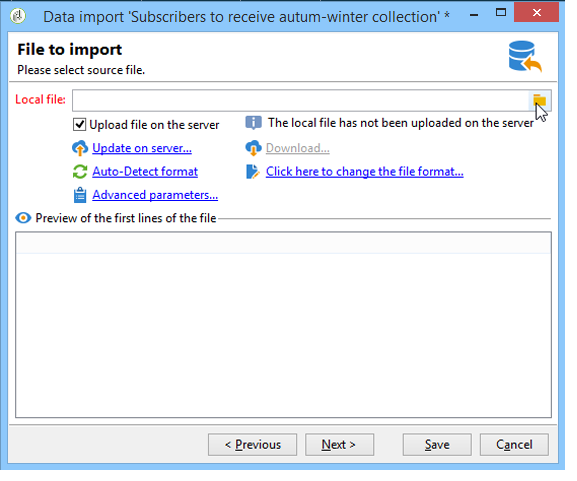

# Importare dati in Campaign {#ootb-profiles}

Campaign ti consente di aggiungere contatti al database. Puoi caricare un file, pianificare e automatizzare più aggiornamenti dei contatti alla volta, raccogliere dati sul web o inserire informazioni di profilo direttamente nella tabella dei destinatari.

Le importazioni di profili sono configurate in modelli dedicati eseguiti tramite flussi di lavoro attraverso l’attività **Importazione**. Possono essere ripetuti automaticamente in base a una pianificazione, ad esempio per automatizzare lo scambio di dati tra diversi sistemi di informazione. Per ulteriori informazioni, consulta [questa sezione](../../automation/workflow/recurring-import-workflow.md).

## Eseguire un’importazione

Adobe Campaign consente di importare nel database dati da uno o più file in formato testo, CSV, TAB o XML. Questi file sono associati a una tabella (principale o collegata) e ogni campo dei file di origine è associato a un campo del database.

>[!NOTE]
>
>È possibile importare dati senza eseguirne il mapping con i dati del database utilizzando la funzione **[!UICONTROL Import a list]**. I dati possono quindi essere utilizzati esclusivamente nei flussi di lavoro tramite l&#39;oggetto **[!UICONTROL Read list]**. Per ulteriori informazioni, consulta [questa pagina](../../automation/workflow/read-list.md).

## Utilizza l’assistente all’importazione

L’assistente all’importazione ti consente di configurare un’importazione, definirne le opzioni (ad esempio, la trasformazione dei dati) e avviarne l’esecuzione. Si tratta di una serie di schermate il cui contenuto dipende dal tipo di importazione (semplice o multipla) e dai diritti dell’operatore.

L’assistente all’importazione viene visualizzato dopo la creazione di un nuovo processo di importazione.

Nel file di origine, ogni riga coincide con un record. I dati nei record sono separati da delimitatori (spazio, tabulazione, carattere, ecc.). Ciò significa che i dati vengono recuperati sotto forma di colonne e che ogni colonna è associata a un campo del database.

### Passaggio 1: scegliere il modello di importazione {#step-1---choosing-the-import-template}

Quando avvii l’assistente all’importazione, devi innanzitutto selezionare un modello. Ad esempio, per configurare l’importazione dei destinatari che hanno ricevuto una newsletter, effettua le seguenti operazioni:

1. Selezionare la cartella **[!UICONTROL Profiles and Targets > Job > Generic imports and exports]**.
1. Fai clic su **Nuovo**, quindi su **Importa** per creare il modello di importazione.

   

1. Fare clic sulla freccia a destra del campo **[!UICONTROL Import template]** per selezionare il modello oppure fare clic su **[!UICONTROL Select link]** per sfogliare la struttura.

   Il modello nativo è **[!UICONTROL New text import]**. Questo modello non deve essere modificato, ma puoi duplicarlo per configurarne uno nuovo a seconda delle tue esigenze. Per impostazione predefinita, i modelli di importazione vengono salvati nel nodo **[!UICONTROL Profiles and targets > Templates > Job templates]**.

1. Immettere un nome per l&#39;importazione nel campo **[!UICONTROL Label]**. Puoi aggiungere una descrizione.
1. Seleziona il tipo di importazione nel campo appropriato. Esistono due tipi di importazione possibili: **[!UICONTROL Simple import]** per importare un solo file e **[!UICONTROL Multiple import]** per importare più file in una singola esecuzione.

   Per un&#39;importazione multipla, selezionare **[!UICONTROL Multiple import]** dall&#39;elenco a discesa **[!UICONTROL Import type]** nella prima schermata dell&#39;Assistente all&#39;importazione.

   

1. Specificare i campi da importare facendo clic su **[!UICONTROL Add]**.

   

   Ogni volta che si aggiunge un file, viene visualizzata la schermata dell&#39;assistente **[!UICONTROL File to import]**. Consulta la sezione [Passaggio 2 - Selezione file Source](#step-2---source-file-selection) e segui i passaggi descritti nell&#39;assistente per definire le opzioni di importazione come per una semplice importazione.

   >[!NOTE]
   >
   >Le importazioni multiple devono soddisfare solo esigenze specifiche e non sono consigliate.

#### Passaggio 2: selezione del file Source {#step-2---source-file-selection}

Il file di origine può essere in formato testo (txt, csv, tab, colonne fisse) o xml.

Per impostazione predefinita, è selezionato **[!UICONTROL Upload file on the server]**. Fare clic sulla cartella a destra del campo **[!UICONTROL Local file]** per sfogliare il disco locale e selezionare il file da importare. È possibile deselezionare questa opzione per immettere il percorso di accesso e il nome del file da importare se si trova sul server.

Una volta specificato il file, è possibile visualizzarne i dati nella sezione inferiore della finestra facendo clic su **[!UICONTROL Auto-detect format]**. Questa anteprima mostra le prime 200 righe del file di origine.

Utilizza le opzioni offerte sopra questa vista per configurare l’importazione. I parametri definiti tramite queste opzioni vengono trasferiti nell’anteprima. Sono disponibili le seguenti opzioni:

* **[!UICONTROL Click here to change the file format...]** consente di controllare il formato del file e di perfezionare la configurazione.
* **[!UICONTROL Update on server...]** consente di trasferire il file locale al server. Questa opzione è disponibile solo se è selezionato **[!UICONTROL Upload file on the server]**.
* **[!UICONTROL Download]** è disponibile solo se il file è stato caricato sul server.
* **[!UICONTROL Auto-detect format]** viene utilizzato per reinizializzare il formato dell&#39;origine dati. Questa opzione consente di riapplicare i formati originali ai dati formattati tramite l&#39;opzione **[!UICONTROL Click here to change the file format...]**.
* Il collegamento **[!UICONTROL Advanced parameters]** consente di filtrare i dati di origine e di accedere alle opzioni avanzate. Da questa schermata, puoi scegliere di importare solo una parte del file. Puoi anche definire un filtro, ad esempio per importare solo gli utenti di tipo &quot;Potenziale cliente&quot; o &quot;Cliente&quot;, in base al valore della riga corrispondente. Queste opzioni devono essere utilizzate solo da utenti esperti di JavaScript.

### Modificare il formato del file {#changing-the-file-format}

L&#39;opzione **[!UICONTROL Click here to change the file format...]** consente di formattare i dati del file di origine e in particolare di specificare il separatore di colonna e il tipo di dati per ogni campo. Questa configurazione viene eseguita tramite la seguente finestra:

Questo passaggio ti consente di descrivere come leggere i valori dei campi del file. Ad esempio, nel caso di una data, i dati Data o Data + Ora possono essere associati a un formato (gg/mm/aaaa, mm/gg/aa, ecc.). Se i dati di input non corrispondono al formato previsto, durante l’importazione si verificheranno dei rifiuti.

È possibile visualizzare il risultato della configurazione nella zona di anteprima nella parte inferiore della finestra.

Fai clic su **[!UICONTROL OK]** per salvare la formattazione, quindi fai clic su **[!UICONTROL Next]** per visualizzare il passaggio successivo.

### Passaggio 3: mappatura dei campi {#step-3---field-mapping}

È quindi necessario selezionare lo schema di destinazione e mappare i dati di ciascuna colonna sui campi del database.

* Il campo **[!UICONTROL Destination schema]** consente di selezionare lo schema in cui verranno importati i dati. Queste informazioni sono obbligatorie. Fare clic sull&#39;icona **[!UICONTROL Select link]** per selezionare uno degli schemi esistenti. Fare clic su **[!UICONTROL Edit link]** per visualizzare il contenuto della tabella selezionata.
* La tabella centrale mostra tutti i campi definiti nel file di origine. Selezionare i campi da importare per associare ad essi un file di destinazione. Questi campi possono essere mappati manualmente o automaticamente.

  Per mappare manualmente un campo, fare clic sulla casella di controllo per selezionare il campo di origine, quindi fare clic sulla seconda colonna per attivare la cella corrispondente al campo selezionato. Fare quindi clic sull&#39;icona **[!UICONTROL Edit expression]** per visualizzare tutti i campi della tabella corrente. Selezionare il campo di destinazione e fare clic su **[!UICONTROL OK]** per convalidare la mappatura.

  Per associare automaticamente i campi di origine e di destinazione, fare clic sull&#39;icona **[!UICONTROL Guess the destination fields]** a destra dell&#39;elenco dei campi. Se necessario, i campi proposti possono essere modificati.

  >[!IMPORTANT]
  >
  >Il risultato di questa operazione deve sempre essere convalidato prima di procedere al passaggio successivo.

* È possibile applicare una trasformazione ai campi importati. A tale scopo, fare clic nella cella della colonna **[!UICONTROL Transformation]** relativa al campo in questione e selezionare la trasformazione da applicare.

  

  >[!IMPORTANT]
  >
  >La trasformazione viene applicata al momento dell’importazione. Tuttavia, se sono stati definiti vincoli sul campo di destinazione (nell’esempio precedente, sul campo di @lastname), questi vincoli hanno la priorità.

* Puoi aggiungere campi calcolati utilizzando l’icona appropriata, situata a destra della tabella centrale. I campi calcolati consentono di eseguire trasformazioni complesse, aggiungere colonne virtuali o unire i dati di più colonne. Per informazioni dettagliate sulle varie possibilità, consulta le sezioni seguenti.

#### Campi calcolati {#calculated-fields}

I campi calcolati sono nuove colonne aggiunte al file di origine e calcolate da altre colonne. I campi calcolati possono quindi essere associati ai campi del database di Adobe Campaign. Le operazioni di riconciliazione, tuttavia, non sono possibili sui campi calcolati.

Esistono quattro tipi di campi calcolati:

* **[!UICONTROL Fixed string]**: il valore del campo calcolato è lo stesso per tutte le righe del file di origine. Consente di impostare il valore di un campo dei record inseriti o aggiornati. Ad esempio, potete impostare un marcatore su &quot;yes&quot; per tutti i record importati.
* **[!UICONTROL String with JavaScript tags]**: il valore del campo calcolato è una stringa di caratteri contenente i comandi di JavaScript.
* **[!UICONTROL JavaScript expression]**: il valore del campo calcolato è il risultato della valutazione di una funzione JavaScript. Il valore restituito può essere un numero, una data e così via.
* **[!UICONTROL Enumeration]**: il valore del campo viene attribuito in base a un valore contenuto nel file di origine. L’editor consente di specificare la colonna di origine e di immettere l’elenco dei valori di enumerazione, come nell’esempio seguente:

  

  La scheda **[!UICONTROL Preview]** consente di visualizzare il risultato della configurazione definita. In questo caso, è stata aggiunta la colonna **[!UICONTROL Subscription]**. Il valore viene calcolato dal campo **Stato**.

  

### Passaggio 4 - Riconciliazione {#step-4---reconciliation}

Il passaggio di riconciliazione dell’assistente all’importazione ti consente di definire la modalità di riconciliazione dei dati del file con i dati esistenti nel database e di impostare le regole di priorità tra i dati del file e i dati del database. La finestra di configurazione si presenta così:

La sezione centrale della schermata contiene una struttura con i campi e le tabelle del database Adobe Campaign in cui verranno importati i dati.

Sono disponibili opzioni speciali per ciascun nodo (tabella o campo). Quando fai clic sul nodo interessato nell’elenco, di seguito vengono visualizzati i relativi parametri e una breve descrizione. Il comportamento definito per ogni elemento viene visualizzato nella colonna **[!UICONTROL Behavior]** corrispondente.

#### Tipi di operazioni {#types-of-operation}

Per ogni tabella interessata dall’importazione, è necessario definire il tipo di operazione. Per l&#39;elemento principale del database sono disponibili le seguenti operazioni:

* **[!UICONTROL Update or insertion]**: aggiorna il record se esiste nel database e, in caso contrario, lo crea.
* **[!UICONTROL Insertion]**: inserisce i record nel database.
* **[!UICONTROL Update]**: aggiorna solo i record esistenti (ignora gli altri record).
* **[!UICONTROL Reconciliation only]**: cerca il record nel database, ma non esegue un aggiornamento. Ad esempio, ti consente di associare la cartella dei destinatari da importare in base a una colonna del file senza aggiornare i dati nelle cartelle.
* **[!UICONTROL Deletion]**: consente di eliminare i record nel database.

Per ogni campo della tabella interessata dall’importazione sono disponibili le seguenti opzioni:

* **[!UICONTROL Update (empty) if source value is empty]**: in caso di aggiornamento, il valore nel campo rimuoverà il valore del database se il campo è vuoto nel file di origine. In caso contrario, viene mantenuto il campo del database.
* **[!UICONTROL Update only if destination is empty]**: il valore del file di origine non sovrascrive il valore nel campo del database a meno che il campo del database non sia vuoto. In tal caso, assume il valore del file di origine.
* **[!UICONTROL Update the field only when the record is inserted]**: durante un&#39;operazione di aggiornamento o inserimento verranno importati solo i record del file di origine nuovi.

>[!NOTE]
>
>La definizione di una chiave di riconciliazione è sempre **obbligatoria**, tranne nel caso di inserimento senza deduplicazione.

#### Chiavi riconciliazione {#reconciliation-keys}

Per gestire la deduplicazione è necessario specificare almeno una chiave di riconciliazione.

Una chiave di riconciliazione è un insieme di campi utilizzati per identificare un record. Ad esempio, per importare i destinatari, la chiave di riconciliazione può essere il numero dell’account, il campo &quot;e-mail&quot; o i campi &quot;Cognome, Nome, Società&quot; e così via.

In questo caso, per verificare se una riga di un file corrisponde a un destinatario esistente nel database, il motore di importazione confronta i valori del file con quelli del database per tutti i campi della chiave. Quando i campi sono specifici di un record, è possibile eseguire un confronto preciso tra i dati di origine e di destinazione, garantendo l’integrità dei dati dopo l’importazione. Una seconda chiave di riconciliazione può essere compilata per la stessa tabella; viene utilizzata per le righe la cui prima chiave è vuota.

Evita di scegliere un campo che potrebbe essere modificato durante l’importazione; in questo caso, il motore potrebbe creare record aggiuntivi.

>[!NOTE]
>
>Per un’importazione di destinatari, l’identificatore della cartella selezionata viene aggiunto implicitamente alla chiave.
>
>La riconciliazione viene quindi eseguita solo su questa cartella (a meno che non sia selezionata alcuna cartella).

#### Deduplica {#deduplication}

>[!NOTE]
>
>Un &#39;double&#39; è un elemento che esiste due o più volte nel file da importare.
>
>Un duplicato è un elemento presente sia nel file da importare che nel database.

Il campo **[!UICONTROL Management of doubles]** consente di configurare la deduplicazione dei dati. La deduplicazione riguarda i record che vengono visualizzati più volte **nel file di origine** (o nei file di origine in caso di importazione di più file), ovvero le righe per le quali i campi della chiave di riconciliazione sono identici.

* La gestione duplicata in modalità **[!UICONTROL Update]** (la modalità predefinita) non esegue la deduplicazione. L&#39;ultimo record ha quindi la priorità (in quanto aggiorna i dati dei record precedenti). Il conteggio dei duplicati non viene eseguito in questa modalità.
* La gestione dei duplicati in modalità **[!UICONTROL Ignore]** o **[!UICONTROL Reject entity]** esclude i duplicati dall&#39;importazione. In questo caso, non viene importato alcun record.
* In modalità **[!UICONTROL Reject entity]**, l&#39;elemento non viene importato e nei registri di importazione viene generato un errore.
* In modalità **[!UICONTROL Ignore]**, l&#39;elemento non viene importato, ma non viene mantenuta alcuna traccia dell&#39;errore. Questa modalità ti consente di ottimizzare le prestazioni.

>[!IMPORTANT]
>
>La deduplicazione viene eseguita solo in memoria. Le dimensioni di un’importazione con deduplicazione sono pertanto limitate. Il limite dipende da diversi parametri (capacità del server applicazioni, attività, numero di campi nella chiave, ecc.). La dimensione massima per una deduplicazione è dell&#39;ordine di 1.000.000 righe.

La deduplicazione riguarda un record presente sia nel file di origine che nel database. Riguarda solo le operazioni con aggiornamento (ovvero **[!UICONTROL Update and insertion]** o **[!UICONTROL Update]**). L&#39;opzione **[!UICONTROL Duplicate management]** consente di aggiornare o ignorare il record se si trova sia nel file di origine che nel database. L&#39;opzione **[!UICONTROL Update or insert based on origin]** appartiene al modulo facoltativo e non può essere utilizzata in un contesto standard.

Le opzioni **[!UICONTROL Reject]** e **[!UICONTROL Ignore]** funzionano come indicato sopra.

### In caso di errore {#behavior-in-the-event-of-an-error}

La maggior parte delle operazioni di trasferimento dei dati genera vari tipi di errori (formato di riga incoerente, indirizzo e-mail non valido, ecc.). Tutti gli errori e gli avvisi generati dal motore di importazione vengono memorizzati e collegati all’istanza di importazione.

I dettagli di questi rifiuti possono essere visualizzati tramite la scheda **[!UICONTROL Rejects]**.

Esistono due tipi di rifiuto (il tipo viene visualizzato nella colonna **[!UICONTROL Connector]**):

* I rifiuti del connettore di testo riguardano errori che si verificano durante l’elaborazione della riga di file (campo calcolato, analisi dei dati, ecc.). In questo caso, in caso di errore, l’intera riga viene sempre rifiutata.
* I rifiuti del connettore del database riguardano errori che si verificano durante la riconciliazione dei dati o la scrittura nel database. In caso di importazione in più tabelle, il rifiuto può riguardare solo una parte del record (ad esempio, per un’importazione di destinatari ed eventi associati, un errore può impedire l’aggiornamento di un evento senza rifiutare il destinatario).

Nella pagina di riconciliazione dei dati, puoi definire il tipo di gestione degli errori desiderato, campo per campo e tabella per tabella.

* **[!UICONTROL Ignore and log a warning]**: tutti i campi vengono importati nel database tranne quello che ha generato un errore.
* **[!UICONTROL Reject parent element]**: l&#39;intera riga del record viene rifiutata, non solo il campo che ha causato un errore.
* **[!UICONTROL Reject all elements]**: l&#39;importazione viene interrotta e tutti gli elementi del record vengono rifiutati.

  

La struttura nella schermata di rifiuto di un’istanza di importazione indica quali campi sono stati rifiutati e dove si sono verificati gli errori.

È possibile generare un file contenente questi record tramite l&#39;icona **[!UICONTROL Export rejects]**:

### Passaggio 5: passaggio aggiuntivo durante l’importazione dei destinatari {#step-5---additional-step-when-importing-recipients}

Il passaggio successivo dell’assistente all’importazione consente di selezionare o creare la cartella in cui verranno importati i dati, mappare automaticamente i destinatari importati con un elenco (nuovo o esistente) e abbonare i destinatari a un servizio.

>[!NOTE]
>
>Questo passaggio viene visualizzato quando si importano solo i destinatari e quando si utilizza la tabella dei destinatari predefinita di Adobe Campaign (**nms:recipient**).

* Fare clic sui collegamenti **[!UICONTROL Edit]** per selezionare la cartella, l&#39;elenco o il servizio a cui si desidera associare o sottoscrivere i destinatari.

   1. Importazione in una cartella

      Il collegamento **[!UICONTROL Edit...]** della sezione **[!UICONTROL Import into a folder]** consente di selezionare o creare la cartella in cui verranno importati i destinatari. Per impostazione predefinita, se non è definita alcuna partizione, i dati vengono importati nella cartella predefinita dell’operatore.

      >[!NOTE]
      >
      >La cartella predefinita di un operatore è la prima cartella per la quale l&#39;operatore dispone dell&#39;accesso in scrittura. Ulteriori informazioni in [Gestire cartelle e visualizzazioni](../audiences/folders-and-views.md).

      Per selezionare la cartella di importazione, fare clic sulla freccia a destra del campo **[!UICONTROL Folder]** e selezionare la cartella interessata. È inoltre possibile utilizzare l&#39;icona **[!UICONTROL Select link]** per visualizzare la struttura in una nuova finestra o creare una nuova cartella.

      

      Per creare una nuova cartella, seleziona il nodo da cui desideri aggiungere una cartella e fai clic con il pulsante destro del mouse. Seleziona **[!UICONTROL Create a new 'Recipients' folder]**.

      

      La cartella viene aggiunta sotto il nodo corrente. Immettere il nome della nuova cartella, premere Invio per confermare, quindi fare clic su **[!UICONTROL OK]**.

      

   1. Associazione a un elenco

      Il collegamento **[!UICONTROL Edit...]** nella sezione **[!UICONTROL Add recipients to a list]** consente di selezionare o creare un elenco in cui verranno importati i destinatari.

      

      Per creare un nuovo elenco per questi destinatari, fare clic su **[!UICONTROL Select link]** e quindi su **[!UICONTROL Create]**.

      

      Puoi decidere di aggiungere i destinatari a quelli già presenti in un elenco o di ricrearlo con i nuovi destinatari. In questo caso, se l’elenco conteneva già dei destinatari, questi verranno eliminati e sostituiti dai destinatari importati.

   1. Iscrizione a un servizio

      Per sottoscrivere tutti i destinatari importati a un servizio informazioni, fare clic sul collegamento **[!UICONTROL Edit...]** della sezione **[!UICONTROL Subscribe recipients to a service]** per selezionare o creare il servizio informazioni a cui i destinatari verranno abbonati. È possibile selezionare l&#39;opzione **[!UICONTROL Send a confirmation message]**: il contenuto del messaggio è definito nel modello di consegna associato al servizio di abbonamento.

      

      Per creare un nuovo servizio per questi destinatari, fare clic su **[!UICONTROL Select link]** e quindi sull&#39;icona **[!UICONTROL Create]**. La gestione dei servizi informativi è illustrata in [questa sezione](../start/subscriptions.md).

* Utilizza il campo **[!UICONTROL Origin]** per aggiungere informazioni sull&#39;origine dei destinatari ai loro profili. Queste informazioni sono particolarmente utili nel quadro di un’importazione multipla.

Fare clic su **[!UICONTROL Next]** per convalidare questo passaggio e visualizzare il passaggio seguente.

### Passaggio 6: avviare l’importazione {#step-6---launching-the-import}

L’ultimo passaggio dell’assistente consente di avviare l’importazione dei dati. A tale scopo, fare clic sul pulsante **[!UICONTROL Start]**.

È quindi possibile monitorare l&#39;esecuzione del processo di importazione (vedere [Monitorare l&#39;esecuzione del flusso di lavoro](../../automation/workflow/monitor-workflow-execution.md)).

## Esporta dati

I processi di esportazione ti consentono di accedere ed estrarre dati dal database: contatti, client, elenchi, segmenti, ecc.

Ad esempio, può essere utile utilizzare i dati di tracciamento delle campagne (cronologia di tracciamento, ecc.) in un foglio di calcolo. I dati di output possono essere in formato TXT, CSV, TAB o XML.

L’assistente per l’esportazione ti consente di configurare un’esportazione, definirne le opzioni e avviarne l’esecuzione. Si tratta di una serie di schermate il cui contenuto dipende dal tipo di esportazione (semplice o multipla) e dai diritti dell’operatore.

L’assistente per l’esportazione viene visualizzato dopo la creazione di un nuovo processo di esportazione.

### Passaggio 1: scegliere il modello di esportazione {#step-1---choosing-the-export-template}

Quando avvii l’assistente all’esportazione, devi innanzitutto selezionare un modello. Ad esempio, per configurare l’esportazione dei destinatari che si sono registrati di recente, effettua le seguenti operazioni:

1. Selezionare la cartella **[!UICONTROL Profiles and Targets > Job > Generic imports and exports]**.
1. Fai clic su **Nuovo**, quindi su **Esporta** per creare il modello di esportazione.

   

1. Fare clic sulla freccia a destra del campo **[!UICONTROL Export template]** per selezionare il modello oppure fare clic su **[!UICONTROL Select link]** per sfogliare la struttura.

   Il modello nativo è **[!UICONTROL New text export]**. Questo modello non deve essere modificato, ma puoi duplicarlo per configurarne uno nuovo. Per impostazione predefinita, i modelli di esportazione vengono salvati nel nodo **[!UICONTROL Resources > Templates > Job templates]**.

1. Immettere un nome da esportare nel campo **[!UICONTROL Label]**. Puoi aggiungere una descrizione.
1. Seleziona il tipo di esportazione. Esistono due possibili tipi di esportazione: **[!UICONTROL Simple export]** per esportare un solo file e **[!UICONTROL Multiple export]** per esportare più file in una singola esecuzione da uno o più tipi di documenti di origine.

### Passaggio 2: tipo di file da esportare {#step-2---type-of-file-to-export}

Selezionare il tipo di documento da esportare, ovvero lo schema dei dati da esportare.

Per impostazione predefinita, quando l&#39;esportazione viene avviata dal nodo **[!UICONTROL Jobs]** i dati provengono dalla tabella dei destinatari. Quando l&#39;esportazione viene avviata da un elenco di dati (dal menu **[!UICONTROL right click > Export]**), la tabella a cui appartengono i dati viene automaticamente compilata nel campo **[!UICONTROL Document type]**.

* Per impostazione predefinita, l&#39;opzione **[!UICONTROL Download the file generated on the server after the export]** è selezionata. Nel campo **[!UICONTROL Local file]**, inserire il nome e il percorso del file da creare oppure sfogliare il disco locale facendo clic sulla cartella a destra del campo. È possibile deselezionare questa opzione per immettere il percorso di accesso e il nome del file di output del server.

  >[!NOTE]
  >
  >I processi di importazione ed esportazione automatici vengono sempre eseguiti sul server.
  >
  >Per esportare solo alcuni dati, fare clic su **[!UICONTROL Advanced parameters]** e immettere il numero di righe da esportare nel campo appropriato.

* È possibile creare un&#39;esportazione differenziale per esportare solo i record modificati dopo l&#39;ultima esecuzione. A tale scopo, fare clic sul collegamento **[!UICONTROL Advanced parameters]**, quindi sulla scheda **[!UICONTROL Differential export]** e selezionare **[!UICONTROL Activate differential export]**.

  

  Immettere la data dell&#39;ultima modifica. Può essere recuperato da un campo o calcolato.

### Passaggio 3: definire il formato di output {#step-3---defining-the-output-format}

Selezionate un formato di output per il file di esportazione. È possibile utilizzare i seguenti formati: testo, testo a colonne fisse, CSV e XML.

* Per il formato **[!UICONTROL Text]**, selezionare i delimitatori per separare le colonne (tabulazioni, virgole, punti e virgola o personalizzati) e le stringhe (virgolette singole o doppie o nessuna).
* Per **[!UICONTROL text]** e **[!UICONTROL CSV]**, è possibile selezionare l&#39;opzione **[!UICONTROL Use first lines as column titles]**.
* Indicare il formato della data e del numero. A tale scopo, fare clic sul pulsante **[!UICONTROL Edit]** per il campo interessato e utilizzare l&#39;editor.
* Per i campi contenenti valori enumerati, è possibile selezionare **[!UICONTROL Export labels instead of internal values of enumerations]**. Ad esempio, il titolo può essere memorizzato nel formato **1=Sig.**, **2=Miss**, **3=Signora**. Se questa opzione è selezionata, verranno esportati **Mr**, **Miss** e **Mrs**.

### Passaggio 4: selezione dei dati {#step-4---data-selection}

Selezionare i campi da esportare. Per eseguire questa operazione:

1. Fare doppio clic sui campi desiderati nell&#39;elenco **[!UICONTROL Available fields]** per aggiungerli alla sezione **[!UICONTROL Output columns]**.
1. Utilizzare le frecce a destra dell&#39;elenco per definire l&#39;ordine dei campi nel file di output.

   

1. Fare clic sul pulsante **[!UICONTROL Add]** per richiamare le funzioni.

### Passaggio 5: ordinare le colonne {#step-5---sorting-columns}

Selezionare l&#39;ordinamento delle colonne.

### Passaggio 6 - Condizioni del filtro {#step-6---filter-conditions-}

Puoi aggiungere condizioni di filtro per evitare di esportare tutti i dati. La configurazione di questo filtro è la stessa del targeting dei destinatari nell’assistente alla consegna.

### Passaggio 7: formattazione dei dati {#step-7---data-formatting}

È possibile modificare l&#39;ordine e l&#39;etichetta dei campi per il file di output e applicare le trasformazioni ai dati di origine.

* Per modificare l’ordine delle colonne da esportare, seleziona la colonna interessata e utilizza le frecce blu a destra della tabella.
* Per modificare l&#39;etichetta di un campo, fare clic nella cella della colonna **[!UICONTROL Label]** che corrisponde al campo da modificare e immettere la nuova etichetta. Premere Invio sulla tastiera per confermare.
* Per applicare una trasformazione di maiuscole e minuscole al contenuto di un campo, selezionarlo dalla colonna **[!UICONTROL Transformation]**. Puoi selezionare:

   * Cambia in minuscolo
   * Cambia in maiuscolo
   * Prma lettera in maiuscolo

  

* Fare clic su **[!UICONTROL Add a calculated field]** per creare un nuovo campo calcolato, ad esempio una colonna contenente cognome + nome. Per ulteriori informazioni, consulta la sezione Importare dati.

Se esporti una raccolta di elementi (ad esempio le sottoscrizioni dei destinatari, gli elenchi a cui appartengono e così via), devi specificare il numero di elementi della raccolta da esportare.

### Passaggio 8: anteprima dei dati {#step-8---data-preview}

Fare clic su **[!UICONTROL Start the preview of the data]** per visualizzare un&#39;anteprima del risultato dell&#39;esportazione. Per impostazione predefinita, vengono visualizzate le prime 200 righe. Per modificare questo valore, fare clic sulle frecce a destra del campo **[!UICONTROL Lines to display]**.

Fai clic sulle schede nella parte inferiore dell’assistente per passare dall’anteprima dei risultati nelle colonne ai risultati in XML. È inoltre possibile visualizzare le query SQL generate.

### Passaggio 9: avviare l’esportazione {#step-9---launching-the-export}

Fare clic su **[!UICONTROL Start]** per avviare l&#39;esportazione dei dati.

Puoi quindi monitorare l’esecuzione del processo di importazione.

## Raccogliere profili tramite app web

Utilizza Campaign per creare moduli web e raccogliere e gestire le informazioni sul profilo in modo semplice ed efficiente. Puoi condividere questi moduli nel tuo sito web, in modo che i tuoi contatti possano inviarti facilmente i loro dati. Questi vengono inviate a Campaign per creare il profilo cliente o per aggiornare le informazioni già presenti nel database.

Scopri come creare moduli web nella [documentazione di Campaign Classic v7](https://experienceleague.adobe.com/docs/campaign-classic/using/designing-content/web-forms/about-web-forms.html?lang=it){target="_blank"}.

**Argomenti correlati**

* [Creare tipi di pubblico](audiences.md)
* [Deduplica i profili](../../automation/workflow/deduplication-merge.md)
* [Arricchisci i dati del profilo](../../automation/workflow/enrich-data.md)
* Comprendere il [modello dati](../dev/datamodel.md) di Campaign