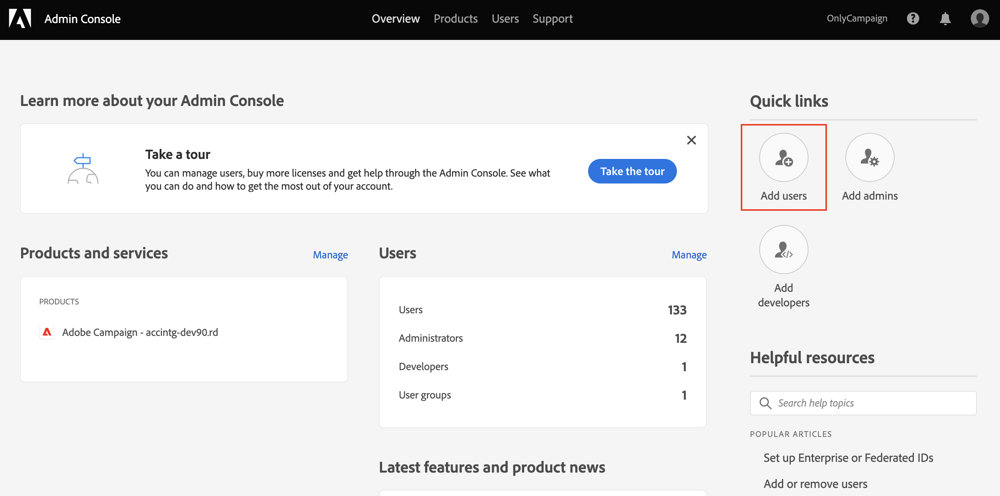
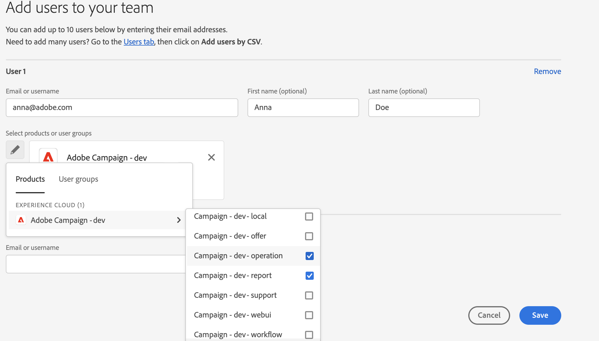
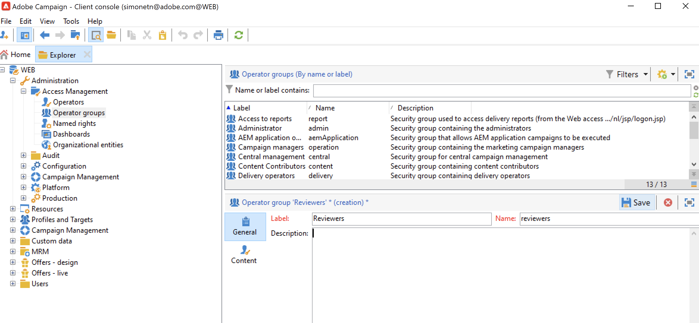
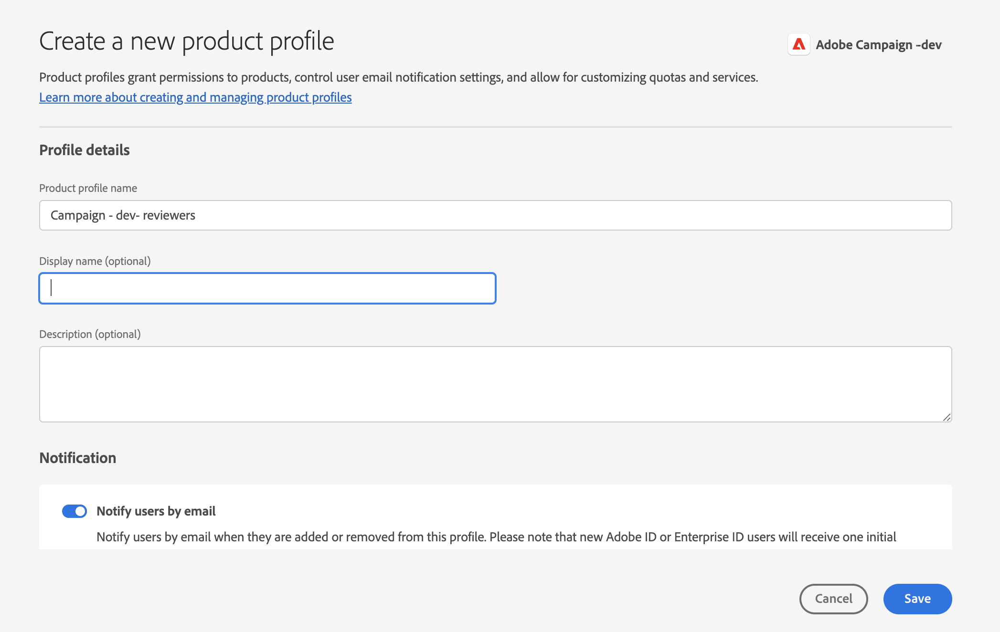
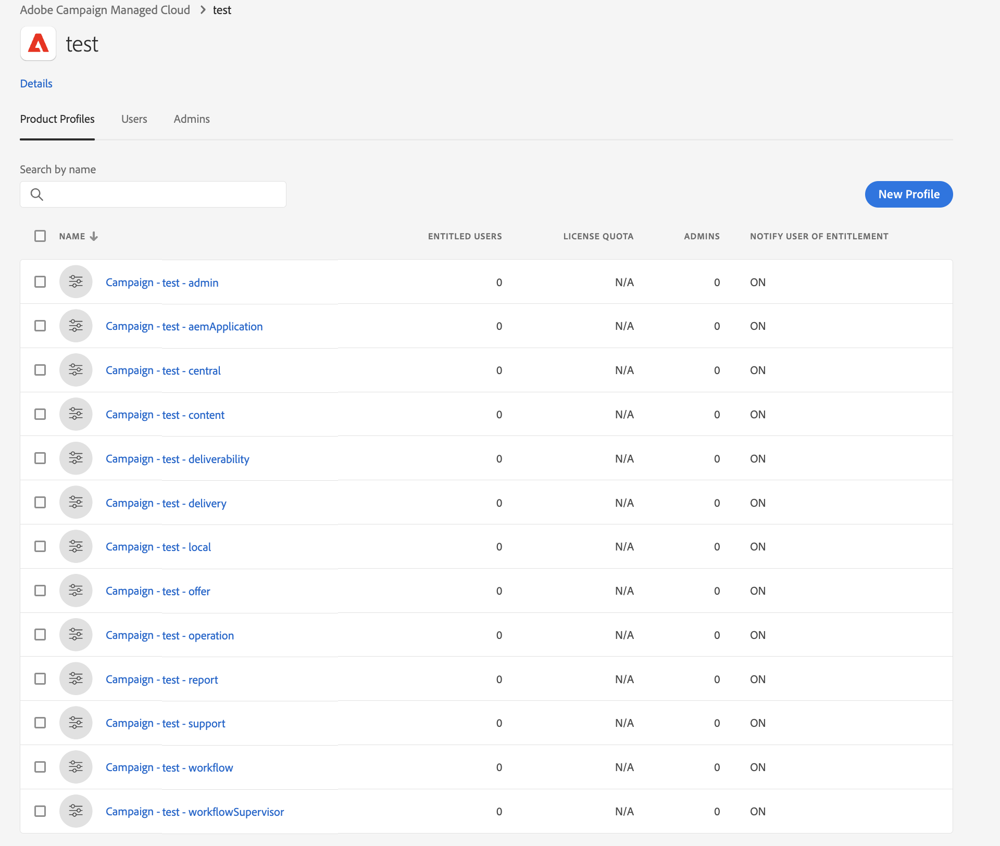

# Gestire le autorizzazioni utente{#manage-permissions}

## Aggiungere utenti {#add-users}

In qualità di amministratore di prodotto, puoi aggiungere utenti e concedere l’accesso a Campaign.

Per aggiungere un utente, effettua le seguenti operazioni:

1. Nella home page di [Admin Console](https://adminconsole.adobe.com/enterprise){target="_blank"}, seleziona **Aggiungi utenti**.

   

1. Inserisci l’indirizzo e-mail dell’utente.
1. Utilizza il segno &quot;+&quot; per selezionare i profili di prodotto o i gruppi di utenti da assegnare all’utente.

   

   I profili di prodotto incorporati di Campaign sono elencati in [questa sezione](#ootb-productprofiles).

   Scopri come creare gruppi di utenti in [questa sezione](#user-groups)

1. Fai clic su **Salva**. L’utente viene aggiunto e viene visualizzato nell’elenco Utenti. Se assegni un ruolo di amministratore o un profilo di prodotto agli utenti, questi riceveranno una notifica e-mail. Gli utenti devono seguire il link per completare il loro profilo.

Ulteriori informazioni sulla creazione di utenti in Admin Console in [questa pagina](https://helpx.adobe.com/ie/enterprise/using/manage-users-individually.html){target="_blank"}.

I nuovi utenti [che accedono a Campaign](connect.md) con il proprio Adobe ID vengono aggiunti all&#39;elenco degli operatori Campaign nella console client. Gli operatori di Campaign sono archiviati nella cartella **[!UICONTROL Administration > Access management > Operators]** di Campaign Explorer.

## Utilizzare i profili di prodotto{#product-profiles}

Utilizza i profili di prodotto per autorizzare gli utenti a utilizzare le funzionalità incluse nel prodotto.

* Per ogni prodotto su Admin Console, puoi creare uno o più profili di prodotto.
* In ciascun profilo di prodotto, puoi assegnare utenti e gruppi di utenti (nella tua organizzazione).
* Quando un utente effettua l’accesso con le proprie credenziali come specificato nel profilo di prodotto, gli viene concesso l’accesso alle app e ai servizi del prodotto su cui è basato il profilo di prodotto.

Questi profili di prodotto corrispondono ai gruppi di operatori memorizzati nella cartella **[!UICONTROL Administration > Access management > Operator groups]** di Campaign Explorer.

In Admin Console, i profili di prodotto utilizzano la sintassi seguente:

campaign - `<your instance>` - nome interno del gruppo di operatori

Ad esempio, per il gruppo **Operatore di consegna** nell&#39;istanza &quot;test&quot;, il profilo di prodotto in Admin Console è:

campaign - test - delivery

Puoi utilizzare profili di prodotto predefiniti o crearne di nuovi.

### Creare un profilo di prodotto{#create-product-profile}

Per aggiungere un nuovo profilo di prodotto ad Adobe, devi prima crearlo nella console client di Campaign, quindi aggiungerlo nell’Admin Console.

Ad esempio, per creare un profilo di prodotto &quot;revisori&quot;, segui i passaggi seguenti.

#### Creare il gruppo di operatori in Campaign{#create-op-group}

1. Connettersi a Campaign, aprire Esplora risorse e individuare **[!UICONTROL Administration > Access management > Operator groups]**.
1. Fare clic su **[!UICONTROL New]**, definire il nome del gruppo di operatori e impostarne il nome interno (&#39;revisori&#39;).
   
1. Definisci le autorizzazioni associate selezionando i diritti denominati. I diritti denominati sono descritti in [questa sezione](#use-named-rights)
1. Salva il nuovo gruppo di operatori.

#### Creare il profilo di prodotto in Admin Console{#create-profile-in-admin-console}

1. Connetti a [Admin Console](https://adminconsole.adobe.com/enterprise){target="_blank"}.
1. Dalla sezione **Prodotto e servizi** della home page, apri il prodotto Campaign.
1. Fai clic su **Nuovo profilo** e immetti il nome del profilo di prodotto da creare, con la sintassi esatta corretta come spiegato [qui](#product-profiles). Nel nostro esempio, immettiamo: campaign - `<your-instance-name>` - reviewers

   

1. Salva le modifiche.

Ora puoi aggiungere utenti a questo nuovo profilo di prodotto, come spiegato in [questa sezione](#add-users).

Si consiglia di assegnare profili di prodotto a gruppi di utenti. La gestione delle autorizzazioni da parte dell’utente non è un modello sostenibile.

### Profili di prodotto e gruppi di operatori predefiniti {#ootb-productprofiles}

Adobe Campaign viene fornito con **profili di prodotto** incorporati che sono definiti quando Adobe abilita l&#39;ambiente.

Questi profili di prodotto corrispondono ai **gruppi di operatori** della campagna. I gruppi di operatori predefiniti e i relativi [diritti denominati](#use-named-rights) sono elencati di seguito:

1. **[!UICONTROL Administrator]** (amministratore)

   Gli operatori di questo gruppo hanno accesso completo all’istanza. Gli amministratori sono utenti che possono accedere alle parti più tecniche dell’interfaccia utente.

   Questo gruppo contiene i seguenti diritti denominati:

   * **[!UICONTROL ADMINISTRATION]**: diritto di eseguire/creare/modificare/eliminare qualsiasi oggetto come flusso di lavoro, consegna, script e così via.

   >[!IMPORTANT]
   >
   >Il ruolo **[!UICONTROL Administrator]** concede l&#39;accesso al Pannello di controllo Campaign Campaign. Qualsiasi profilo di prodotto nel Adobe Admin Console che contenga la parola &quot;admin&quot; nel suo nome (come &quot;Administrators&quot;, &quot;admin&quot;, &quot;admins&quot;, &quot;approval admin&quot;, ecc.) concederà l&#39;accesso al Pannello di controllo Campaign. Ulteriori informazioni sulla [gestione dell&#39;accesso al Pannello di controllo Campaign](https://experienceleague.adobe.com/docs/control-panel/using/discover-control-panel/managing-permissions.html){target="_blank"}.

1. **[!UICONTROL Delivery operators]** (consegna)

   Gli operatori di questo gruppo sono responsabili della gestione delle consegne: consentono l’accesso alle risorse principali necessarie per la creazione e la preparazione delle consegne (tipologie di campagne, mappature di consegna, modelli predefiniti, blocchi di personalizzazione, ecc.).

   Questo gruppo contiene i seguenti diritti denominati:

   * **[!UICONTROL PREPARE DELIVERIES]**: diritto di creare, modificare e avviare l&#39;analisi della consegna,
   * **[!UICONTROL START DELIVERIES]**: diritto di approvare le consegne analizzate in precedenza.

1. **[!UICONTROL Campaign managers]** (operazione)

   Gli operatori di questo gruppo possono gestire le campagne di marketing: ti consente di accedere agli oggetti collegati alle campagne (piani, programmi, flussi di lavoro, budget, ecc.) nel framework di **[!UICONTROL Campaign]** (modulo Adobe Campaign opzionale).

   Questo gruppo contiene i seguenti diritti denominati:

   * **[!UICONTROL INSERT FOLDERS]**: diritto di inserire cartelle nella struttura Adobe Campaign (a condizione di disporre dei diritti di modifica per i rami interessati),
   * **[!UICONTROL WORKFLOW]**: diritto di utilizzare i flussi di lavoro.

   >[!NOTE]
   >
   >Questo gruppo non consente agli operatori di avviare le consegne.

1. **[!UICONTROL Content contributors]** (contenuto)

   Gli utenti di questo gruppo possono accedere alle cartelle dei contenuti nel contesto del componente aggiuntivo **[!UICONTROL Content management]**. Questo gruppo non concede autorizzazioni aggiuntive.

1. **[!UICONTROL Access to reports]** (rapporto)

   Questo gruppo è riservato agli operatori esterni, per accedere ai report di consegna tramite un [accesso Web](../start/campaign-ui.md#web-browser).

1. **[!UICONTROL Workflow execution]** (flusso di lavoro)

   Il gruppo **[!UICONTROL Workflow execution]** consente di controllare l&#39;esecuzione e l&#39;approvazione dei flussi di lavoro di targeting: il flusso di lavoro denominato right è mappato agli operatori di questo gruppo. È richiesto per tutte le azioni sui flussi di lavoro, oltre ai diritti di accesso ai file di dati. Per impostazione predefinita, il gruppo **[!UICONTROL Workflow execution]** ha accesso in sola lettura ai file di flusso di lavoro di targeting standard e ai modelli di flusso di lavoro. Gli operatori di questo gruppo dispongono inoltre dell&#39;accesso in lettura e scrittura al file di approvazione in sospeso.

1. **[!UICONTROL Workflow supervisors]** (workflowSupervisor)

   Gli utenti di questo gruppo gestiscono le approvazioni dei flussi di lavoro e ricevono una notifica e-mail in caso di avvisi relativi ai flussi di lavoro delle campagne.

1. **Gestione locale / centrale** (centrale / locale)

   Gli utenti di questo gruppo possono utilizzare il componente aggiuntivo **[!UICONTROL Distributed marketing]**.

1. **[!UICONTROL Offer managers]** (offerta)

   Gli operatori di questo gruppo possono creare e gestire le offerte quando utilizzano il componente aggiuntivo Interazione. [Ulteriori informazioni](../interaction/interaction-operators.md).

   Questo gruppo contiene i seguenti diritti denominati:

   * **[!UICONTROL INSERT FOLDERS]**: diritto di inserire cartelle nella struttura Adobe Campaign (a condizione di disporre dei diritti di modifica per i rami interessati),
   * **[!UICONTROL EDIT FOLDERS]**: diritto di modificare le proprietà della cartella come nome interno, etichetta, immagine associata, ordine delle sottocartelle e così via.

   Le autorizzazioni assegnate ai gestori delle offerte consentono loro di eseguire le seguenti attività:

   * Modificare gli ambienti **[!UICONTROL Design]**.
   * Visualizza gli ambienti **[!UICONTROL Live]**.
   * Configurare le funzioni di amministrazione (spazi e filtri predefiniti).
   * Crea e aggiorna le categorie.
   * Creare le offerte.
   * Configurare l’idoneità per le offerte.
   * Approvare le offerte.

   >[!NOTE]
   >
   >**I responsabili delle offerte** possono approvare un&#39;offerta solo se non è specificato alcun revisore o se sono stati impostati come revisori nel modello di offerta.

   La matrice delle autorizzazioni di Gestione offerte per ogni ambiente è disponibile in [questa pagina](../interaction/interaction-operators.md#recap-of-rights-according-to-operator).

## Utilizzare i gruppi di utenti{#user-groups}

Puoi utilizzare Admin Console per creare gruppi di utenti e assegnarvi utenti.

Un gruppo di utenti è una raccolta di utenti diversi a cui deve essere assegnato un set condiviso di autorizzazioni. Scopri come creare gruppi di utenti in [questa sezione](https://helpx.adobe.com/ie/enterprise/using/user-groups.html){target="_blank"}.

Puoi assegnare profili di prodotto a gruppi di utenti. In questo modo, tutti gli utenti del gruppo riceveranno lo stesso set di autorizzazioni per il prodotto.

## Diritti denominati{#use-named-rights}

Adobe Campaign viene fornito con un set di diritti denominati che ti consentono di definire le autorizzazioni assegnate a utenti e gruppi di utenti. Questi diritti possono essere modificati dalla cartella **[!UICONTROL Administration > Access management > Named rights]** di Campaign Explorer.

I diritti denominati concedono le autorizzazioni a:

* Eseguire operazioni
Ad esempio, il pulsante **Analizza** nell&#39;editor di recapito è attivato per i membri del gruppo **Operatore di recapito** che dispongono del diritto denominato **Prepara recapito**

* Accesso alle cartelle
L&#39;appartenenza ai gruppi di operatori può concedere o limitare i diritti di accesso alle cartelle modificando le impostazioni di protezione delle cartelle. [Ulteriori informazioni](folder-permissions.md#restrict-access-to-a-folder).

  Ad esempio, può influire su: **Accesso in scrittura** per creare nuove entità (come consegne, profili e così via), **Accesso in lettura** per utilizzare le entità, **Accesso in eliminazione** per eliminare le entità.

I diritti denominati predefiniti in Adobe Campaign sono:

* **[!UICONTROL ADMINISTRATION]**: gli operatori con il diritto **[!UICONTROL ADMINISTRATION]** dispongono dell&#39;accesso completo all&#39;istanza. Gli utenti amministratori possono eseguire/creare/modificare/eliminare qualsiasi oggetto, ad esempio flusso di lavoro, consegna, script e così via. **Nota:** i profili di prodotto in Adobe Admin Console contenenti la parola &quot;admin&quot; concedono l&#39;accesso al Pannello di controllo Campaign Campaign.

* **[!UICONTROL APPROVAL ADMINISTRATION]**: è possibile impostare più passaggi di approvazione all&#39;interno dei flussi di lavoro e delle consegne per assicurarsi che lo stato corrente sia stato approvato da un operatore o un gruppo assegnato. Gli utenti con il diritto **[!UICONTROL APPROVAL ADMINISTRATION]** possono impostare i passaggi di approvazione e assegnare un operatore o un gruppo di operatori che deve approvare tali passaggi. **Nota:** i profili di prodotto contenenti la parola &quot;admin&quot; (ad esempio &quot;approval admin&quot;) concedono l&#39;accesso al Pannello di controllo Campaign Campaign.

* **[!UICONTROL CENTRAL]**: diritto per la gestione centrale (Marketing distribuito).

* **[!UICONTROL DELETE FOLDER]**: diritto di eliminare le cartelle. Con questo diritto, gli utenti possono eliminare cartelle dalla visualizzazione Esplora risorse.

* **[!UICONTROL EDIT FOLDERS]**: diritto di modificare le proprietà della cartella come nome interno, etichetta, immagine associata, ordine delle sottocartelle e così via.

* **[!UICONTROL EXPORT]**: gli utenti possono esportare i dati dalle proprie istanze Adobe Campaign in un file sul server o sul computer locale utilizzando l&#39;attività del flusso di lavoro **[!UICONTROL EXPORT]**.

* **[!UICONTROL FILES ACCESS]**: diritto di accesso in lettura e scrittura per i file tramite uno script che può essere scritto nell&#39;attività del flusso di lavoro **[!UICONTROL JavaScript]** per la lettura/scrittura di file su un server.

* **[!UICONTROL IMPORT]**: diritto per l&#39;importazione di dati generici. **[!UICONTROL IMPORT]** consente di importare dati in qualsiasi altra tabella, mentre il diritto **[!UICONTROL RECIPIENT IMPORT]** consente di importare solo nella tabella dei destinatari.

* **[!UICONTROL INSERT FOLDERS]**: diritto di inserire cartelle. Gli utenti con il diritto **[!UICONTROL INSERT FOLDERS]** possono creare nuove cartelle nella struttura cartelle in visualizzazione Esplora risorse.

* **[!UICONTROL LOCAL]**: diritto per la gestione locale (Marketing distribuito).

* **[!UICONTROL MERGE]**: diritto di unire i record selezionati in uno. Se i destinatari esistono come duplicati, il diritto **[!UICONTROL MERGE]** consente all&#39;utente di selezionare i duplicati e unirli in un destinatario primario.

* **[!UICONTROL PREPARE DELIVERIES]**: diritto di creare, modificare e salvare una consegna. Gli utenti con il diritto **[!UICONTROL PREPARE DELIVERIES]** possono anche avviare il processo di analisi della consegna.

* **[!UICONTROL PRIVACY DATA RIGHT]**: diritto di raccogliere ed eliminare dati sulla privacy. [Ulteriori informazioni](privacy.md).

* **[!UICONTROL PROGRAM EXECUTION]**: diritto di eseguire comandi in vari linguaggi di programmazione.

* **[!UICONTROL RECIPIENT IMPORT]**: diritto di importare i destinatari. Gli utenti con questo diritto possono importare un file locale nella tabella dei destinatari.**[!UICONTROL RECIPIENT IMPORT]**

* **[!UICONTROL SQL SCRIPT EXECUTION]** Diritto di eseguire qualsiasi comando SQL direttamente sul database.

* **[!UICONTROL START DELIVERIES]**: diritto di approvare le consegne analizzate in precedenza. Dopo l’analisi della consegna, la consegna viene sospesa in vari passaggi di approvazione e deve essere approvata per riprendere. Gli utenti con il diritto **[!UICONTROL START DELIVERIES]** possono approvare le consegne.

* **[!UICONTROL USE SQL DATA MANAGEMENT ACTIVITY]**: diritto di scrivere script SQL personalizzati utilizzando l&#39;attività Gestione dati SQL per creare e popolare tabelle di lavoro. [Ulteriori informazioni](../../automation/workflow/sql-data-management.md).

* **[!UICONTROL WORKFLOW]**: questo diritto denominato è specifico dei flussi di lavoro e consente di creare, avviare e arrestare i flussi di lavoro. Affinché il diritto denominato sia applicabile, è necessario disporre dei diritti di lettura per il file del flusso di lavoro. Per i flussi di lavoro di targeting, è necessario disporre del diritto di lettura sulla cartella **[!UICONTROL Profiles and Targets]**.

* **[!UICONTROL WEBAPP]**: diritto all&#39;utilizzo di applicazioni Web.

>[!NOTE]
>
>Questo elenco può variare a seconda dei componenti aggiuntivi installati nell&#39;ambiente.

## Risorse aggiuntive{#additional-res}

* [Gestire le autorizzazioni per i flussi di lavoro](../../automation/workflow/managing-rights.md)
* [Gestire le autorizzazioni per il marketing distribuito](../../automation/distributed-marketing/about-distributed-marketing.md#operators)
* [Gestire le autorizzazioni per il modulo di interazione](../interaction/interaction-operators.md)
* [Filtrare l’accesso agli schemi](../dev/filter-schema.md)
* [Limitare la visualizzazione di dati personali](../dev/restrict-pi-view.md)
