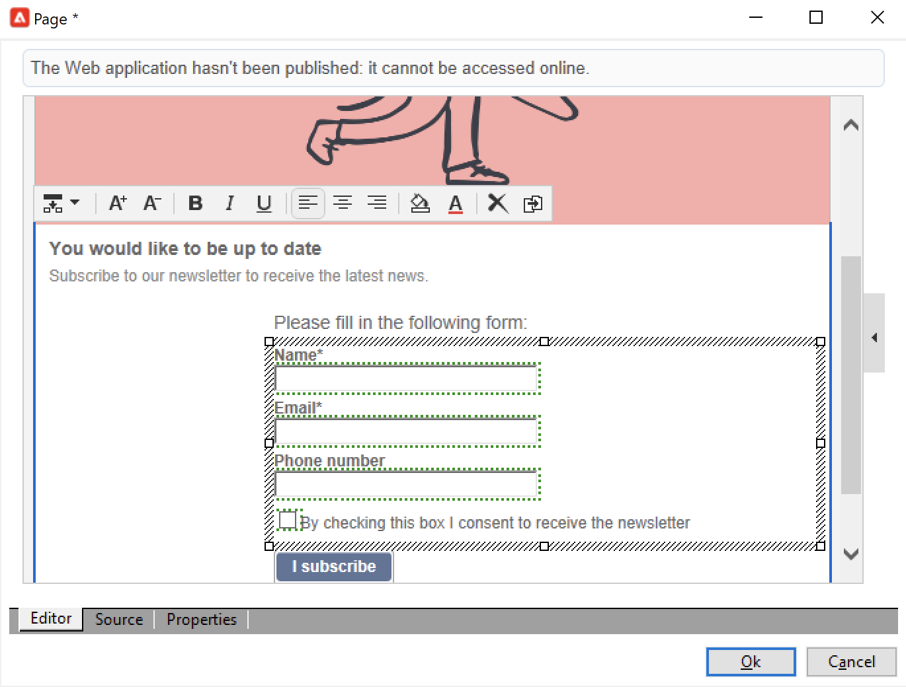

# Gestione di abbonamenti e annullamenti di abbonamenti{#optin-optout}

Utilizza Adobe Campaign per creare e monitorare i tuoi servizi informativi, come le newsletter, e per gestire gli abbonamenti/i loro annullamenti. È possibile definire in parallelo diversi servizi, ad esempio: newsletter specializzate per determinate categorie di prodotti, temi o aree di un sito web, abbonamenti a vari tipi di messaggi di avviso e notifiche in tempo reale. Consulta Gestione abbonamenti .

 Scopri come creare un servizio informazioni, inviare una newsletter e gestire l’opt-in e l’opt-out nella documentazione di  [Campaign Classic v7](https://experienceleague.adobe.com/docs/campaign-classic/using/sending-messages/subscriptions-and-referrals/managing-subscriptions.html){target=&quot;_blank&quot;}

Per abbonarti (opt-in) a un profilo di un servizio, le opzioni disponibili sono:

* Aggiungi manualmente il servizio al profilo destinatario: a questo scopo, dalla scheda **[!UICONTROL Subscriptions]** del profilo, fai clic su **[!UICONTROL Add]** e seleziona il servizio informazioni interessato.

   

    Ulteriori informazioni sono disponibili nella [documentazione di Campaign Classic v7](https://experienceleague.adobe.com/docs/campaign-classic/using/getting-started/profile-management/editing-a-profile.html?lang=en#deliveries-tab){target=&quot;_blank&quot;}

* Iscriviti automaticamente al servizio un set di destinatari. L’elenco dei destinatari può provenire da un’operazione di filtro, da un gruppo, da una cartella, da un’importazione o da una selezione diretta manuale. Per sottoscrivere questi destinatari, seleziona i profili e fai clic con il pulsante destro del mouse su di essi. Seleziona **[!UICONTROL Actions > Subscribe selection to a service...]**.

   

   Selezionare il servizio interessato e avviare l&#39;operazione.

   

    Ulteriori informazioni sono disponibili nella [documentazione di Campaign Classic v7](https://experienceleague.adobe.com/docs/campaign-classic/using/getting-started/profile-management/editing-a-profile.html?lang=en#deliveries-tab){target=&quot;_blank&quot;}

* Importa i destinatari e abbonali automaticamente a un servizio di informazioni. A questo scopo, seleziona il servizio interessato nell’ultimo passaggio della procedura guidata di importazione.

    Ulteriori informazioni sono disponibili nella [documentazione di Campaign Classic v7](https://experienceleague.adobe.com/docs/campaign-classic/using/getting-started/importing-and-exporting-data/generic-imports-exports/executing-import-jobs.html?lang=en#step-5---additional-step-when-importing-recipients){target=&quot;_blank&quot;}

* Utilizza un modulo web per consentire ai destinatari di iscriversi a un servizio.

   

   Campaign viene fornito con un modulo web predefinito per gestire l’opt-in. Puoi personalizzarlo e mappare i dati del profilo.

   

    Ulteriori informazioni sono disponibili nella [documentazione di Campaign Classic v7](https://experienceleague.adobe.com/docs/campaign-classic/using/designing-content/web-forms/use-cases--web-forms.html?lang=en#create-a-subscription--form-with-double-opt-in){target=&quot;_blank&quot;}

* Crea un flusso di lavoro di targeting e utilizza un’attività **[!UICONTROL Subscription service]** .

   

    Ulteriori informazioni sono disponibili nella [documentazione di Campaign Classic v7](https://experienceleague.adobe.com/docs/campaign-classic/using/automating-with-workflows/targeting-activities/subscription-services.html?lang=en#example--subscribe-a-list-of-recipients-to-a-newsletter){target=&quot;_blank&quot;}

Per annullare l’abbonamento (opt-out) a un profilo da un servizio, le opzioni disponibili sono:

**Annullamento manuale della sottoscrizione**

* Collegamento o modulo web personalizzato per l’annullamento dell’abbonamento
* Cancellazione manuale di un servizio di informazione
* Cancellazione manuale dei destinatari da un particolare servizio di abbonamento

**Annullamento automatico della sottoscrizione**

* Specifica un limite di durata del servizio informazioni: i destinatari verranno automaticamente annullati alla scadenza del periodo di validità. Questo periodo è specificato nella scheda Modifica delle proprietà del servizio. Viene espresso in giorni.
* Imposta un flusso di lavoro di annullamento dell’abbonamento per una popolazione.

 Ulteriori informazioni sono disponibili nella [documentazione di Campaign Classic v7](https://experienceleague.adobe.com/docs/campaign-classic/using/sending-messages/subscriptions-and-referrals/managing-subscriptions.html?lang=en#unsubscribing-a-recipient-from-a-service){target=&quot;_blank&quot;}

>[!CAUTION]
>
>Gli abbonamenti e i loro annullamenti sono **processi asincroni**. Le richieste di consenso e rinuncia vengono elaborate ogni ora. [Ulteriori informazioni](../dev/new-apis.md#sub-apis)

Puoi anche abilitare i destinatari della consegna a inoltrare i messaggi a un amico. A questo scopo, inserisci i collegamenti rilevanti nella consegna. Puoi quindi tenere traccia di questo processo di condivisione e del numero di visite alle pagine interessate.

 Per ulteriori informazioni su questa funzionalità, consulta la documentazione [ di ](https://experienceleague.adobe.com/docs/campaign-classic/using/sending-messages/subscriptions-and-referrals/viral-and-social-marketing.html?lang=en#viral-marketing--forward-to-a-friend)Campaign Classic v7{target=&quot;_blank&quot;}
