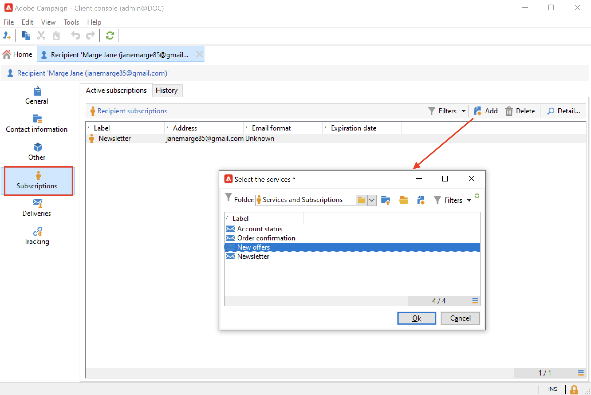
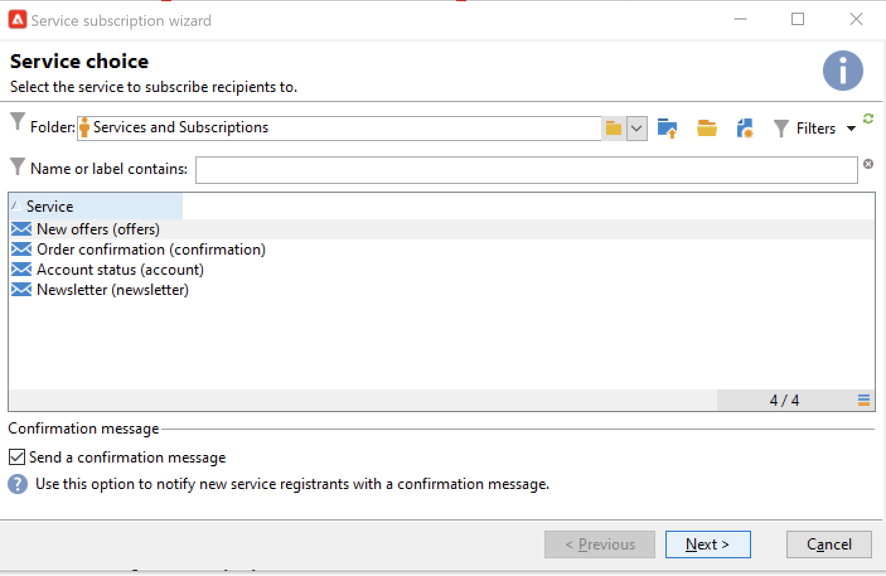

# Gestire gli abbonamenti e il loro annullamento {#optin-optout}

Utilizza Adobe Campaign per creare e monitorare i tuoi servizi di informazioni, come le newsletter, e per gestire gli abbonamenti/annullamenti degli abbonamenti a tali servizi. È possibile definire in parallelo diversi servizi, ad esempio newsletter specializzate per determinate categorie di prodotti, temi o aree di un sito Web, abbonamenti a vari tipi di messaggi di avviso e notifiche in tempo reale.

Scopri come creare un servizio di informazioni, inviare newsletter e gestire consenso e rinuncia nella [documentazione di Campaign Classic v7](https://experienceleague.adobe.com/docs/campaign-classic/using/sending-messages/subscriptions-and-referrals/managing-subscriptions.html?lang=it){target="_blank"}

Per abbonare (opt-in) un profilo a un servizio, le opzioni disponibili sono:

* Aggiungi manualmente il servizio al profilo del destinatario: a tale scopo, dalla scheda **[!UICONTROL Subscriptions]** del profilo, fai clic su **[!UICONTROL Add]** e seleziona il servizio informazioni interessato.

  

  Ulteriori informazioni sono disponibili nella [documentazione di Campaign Classic v7](https://experienceleague.adobe.com/docs/campaign-classic/using/getting-started/profile-management/editing-a-profile.html?lang=it#deliveries-tab){target="_blank"}

* Iscrizione automatica di un set di destinatari al servizio. L’elenco dei destinatari può provenire da un’operazione di filtro, un gruppo, una cartella, un’importazione o una selezione manuale diretta. Per sottoscrivere questi destinatari, seleziona i profili e fai clic con il pulsante destro del mouse. Seleziona **[!UICONTROL Actions > Subscribe selection to a service...]**.

  

  Selezionare il servizio interessato e avviare l&#39;operazione.

  

  Ulteriori informazioni sono disponibili nella [documentazione di Campaign Classic v7](https://experienceleague.adobe.com/docs/campaign-classic/using/getting-started/profile-management/editing-a-profile.html?lang=it#deliveries-tab){target="_blank"}

* Importa i destinatari e abbonali automaticamente a un servizio di informazioni. A questo scopo, seleziona il servizio interessato nell’ultimo passaggio della procedura guidata di importazione.

  Ulteriori informazioni sono disponibili nella [documentazione di Campaign Classic v7](https://experienceleague.adobe.com/docs/campaign-classic/using/getting-started/importing-and-exporting-data/generic-imports-exports/executing-import-jobs.html?lang=it#step-5---additional-step-when-importing-recipients){target="_blank"}.

* Utilizza un modulo web in modo che i destinatari possano abbonarsi a un servizio.

  

  Campaign viene fornito con un modulo web predefinito per gestire l’opt-in. Puoi personalizzarlo e mappare i dati del profilo.

  

  Ulteriori informazioni sono disponibili nella [documentazione di Campaign Classic v7](https://experienceleague.adobe.com/docs/campaign-classic/using/designing-content/web-forms/use-cases--web-forms.html?lang=it#create-a-subscription--form-with-double-opt-in){target="_blank"}.

* Creare un flusso di lavoro di targeting e utilizzare un&#39;attività **[!UICONTROL Subscription service]**.

  

  Per ulteriori informazioni, consulta [questa pagina](https://experienceleague.adobe.com/docs/campaign/automation/workflows/wf-activities/targeting-activities/subscription-services.html?lang=it){target="_blank"}.

Per annullare l’abbonamento (rinuncia) di un profilo da un servizio, le opzioni disponibili sono:

**Annullamento manuale dell&#39;abbonamento**

* Collegamento o modulo web di annullamento dell’iscrizione personalizzato
* Eliminazione manuale di un servizio di informazione
* Eliminazione manuale dei destinatari da un particolare servizio di abbonamento

**Annullamento automatico dell&#39;abbonamento**

* Specifica un limite di durata per il servizio informazioni: i destinatari verranno automaticamente disabbonati alla scadenza del periodo di validità. Questo periodo è specificato nella scheda Modifica delle proprietà del servizio. È espresso in giorni.
* Imposta un flusso di lavoro di annullamento dell’abbonamento per una popolazione.

Ulteriori informazioni sono disponibili nella [documentazione di Campaign Classic v7](https://experienceleague.adobe.com/docs/campaign-classic/using/sending-messages/subscriptions-and-referrals/managing-subscriptions.html?lang=it#unsubscribing-a-recipient-from-a-service){target="_blank"}.

>[!CAUTION]
>
>Nel contesto di una distribuzione [Enterprise (FFDA)](../architecture/enterprise-deployment.md), le sottoscrizioni e gli annullamenti delle sottoscrizioni sono **processi asincroni**. Le richieste di consenso e rinuncia vengono elaborate ogni ora. [Ulteriori informazioni](../architecture/new-apis.md#sub-apis)

<!--
You can also enable your delivery recipients to forward messages to a friend. To do this, insert the relevant links into your delivery. You may then track this sharing process as well as the number of visits to the concerned pages. 

For more on this capability, refer to [Campaign Classic v7 documentation](https://experienceleague.adobe.com/docs/campaign-classic/using/sending-messages/subscriptions-and-referrals/viral-and-social-marketing.html?lang=it#viral-marketing--forward-to-a-friend){target="_blank"}
-->
